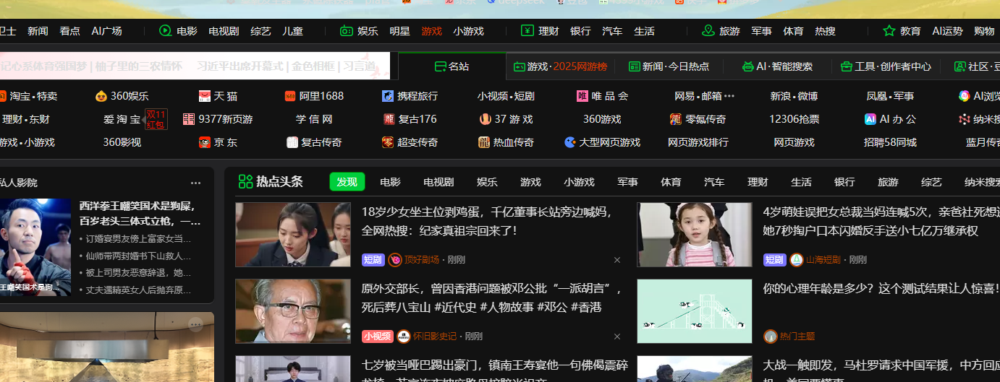

# 第一章 C语言

## 一 数据类型

<u>【--功能作用--】</u>

<u>【-工作原理--】</u>

<u>【-操作实践--】</u>

<u>【--适用范围--】</u>

# 第二章 C++

# 第三章 MFC

# 第四章 X86汇编语言

# 第五章 X86-64汇编语言

# 第五章 反编译

# 第六章 OD

# 第七章 CE

# 第八章 IDA

# 第九章 XDBG

# 第十章 

# 第十一章 LUA语言

# 第十二章 

# 第十三章 实战应用

## 一 诛仙2

### 1 登录功能

### 2 人物角色及线路选取

## 二 魔兽世界怀旧

## 三 诛仙3

## 四 逆水寒

