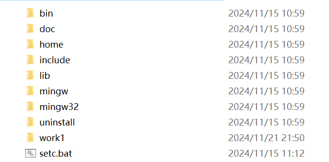
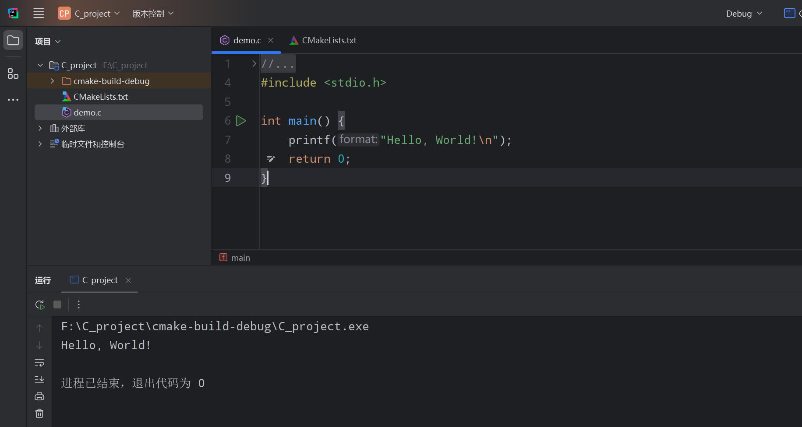
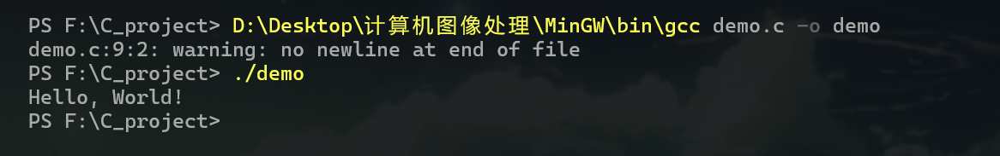

# <u>【--正向编程基础--】</u>

# 第一章 C语言


## 1. C语言简介

### 1.1 什么是C语言

C语言是一种**通用型**、**结构化**的编程语言，由丹尼斯·里奇（Dennis Ritchie）于1972年在贝尔实验室开发。它是计算机科学中的一种基础语言，被广泛用于系统编程（如操作系统）、嵌入式开发、应用软件开发等。
 简单来说，C语言是一种可以直接控制硬件、运行效率高的编程语言，适合用来编写高效、稳定的程序。

------

### 1.2 C语言的特点

1. **简单灵活**：C语言的语法简单易学，功能强大。通过较少的关键字就能实现复杂的功能。
2. **运行高效**：C语言程序直接接近底层硬件，执行效率非常高。
3. **移植性强**：C语言代码可以在不同的计算机和操作系统上运行，只需少量修改。
4. **功能全面**：支持数据处理、文件操作、指针操作等多种编程需求。
5. **模块化设计**：支持函数和模块化设计，有助于程序分工和维护。
6. **广泛支持**：几乎所有的计算机和嵌入式设备都支持C语言开发。

------

### 1.3 C语言的应用领域

1. **操作系统开发**：如Linux、Windows的部分核心模块都是用C语言编写的。
2. **嵌入式系统**：在嵌入式开发中，C语言常用于开发芯片程序和控制系统。
3. **系统工具**：许多编译器、数据库管理系统等工具都用C语言实现。
4. **应用程序开发**：如图形界面应用、网络应用等也可以用C语言编写。
5. **游戏开发**：部分游戏引擎底层也是用C语言实现的。
6. **科学计算**：C语言在高性能计算和数学建模中有广泛应用。

------

### 1.4 C语言的历史与发展

- **1972年**：C语言诞生，由丹尼斯·里奇在贝尔实验室开发，用于开发UNIX操作系统。
- **1978年**：第一本C语言书籍《C程序设计语言》出版，奠定了C语言的标准。
- **1989年**：ANSI（美国国家标准协会）制定了C语言标准，即ANSI C。
- **1990年**：ISO（国际标准化组织）通过了ANSI C标准，使其成为国际标准。
- **1999年**：发布C99标准，引入更多现代特性，如变量声明更灵活、内置数据类型扩展等。
- **2011年**：发布C11标准，引入多线程支持和其他改进。

------

### 1.5 学习C语言的意义

1. **基础语言**：C语言是许多编程语言的基础，如C++、Java、Python等。学好C语言可以更容易理解其他语言。
2. **接近底层**：C语言能直接操作内存和硬件，有助于理解计算机的工作原理。
3. **提升编程能力**：C语言注重逻辑思维和代码优化，有助于培养编程能力和解决问题的能力。
4. **广泛应用**：掌握C语言可以从事多种开发工作，如嵌入式开发、系统开发、算法实现等。
5. **高效工具**：C语言编写的程序执行速度快，特别适合对性能要求高的领域。

### 1.6 占位符

​		%d:输出有符号十进制整型
​		%hd:短整数 short int
​		%hu:无符号短整数
​		%o:输出八进制整型
​		%x：输出小写十六进制
​		%X:输出大写十六进制
​		%u:输出无符号十进制整型
​		%f:输出浮点型，默认保留小数6位
​		%.2f:输出浮点型，保留2位小数
​		%lf:输出double
​		%p：以16进制显示内存地址，并且显示的变量必须加取址符&符号
​		%e:按照科学计数法打印数字，如3200会被打印为3.2e+03
​			科学计数法：
​			float a = 3.2e3f = 3200
​			float b = 3.2e-1f = 0.32
​		%c:字符
​		%s:字符串
​		%p:十六进制形式输出指针，即内存地址
​		%%:输出百分号
​		printf附加格式：
​			l:附加在d,u,x,o表示长整数
​			-：左对齐
​			m：表示最小宽度
​			0：表示用0补全，沾满宽度
​			m,n:m表示输入所占字符数，n表示精度，小数点

### 1.7 进制转换

十进制：1-9开头
			十进制转二进制：除二反序取余
			十进制转八进制：除八反序取余
			十进制转十六进制：除十六反序取余
			十进制小数转二进制：小数部分乘以2，取整数，不足1取0，超过1取1，每次相乘都是小数部分，顺序看取整后的数就是在转化后的结果
		八进制：0开头如0123
			八进制转二进制：八进制的每个数转3位二进制，反8421法则


		十六进制:0x开头如0x123
		二进制：C不允许直接定义二进制
			二进制转十进制：权值法:如011111111 = 2^0*1+2^1*1+...，也是8421法则 1 2 4 8 16 32 64 。。
			二进制转八进制：8421法则，将二进制的三位合在一起，如 011111111 = 011 111 111 = 0377
			二进制转十六进制：8421法则，将二进制的四位合在一起，如 011111111 = 0 1111 1111 = 0xff
		八进制转十六进制：先转二进制，再转十六进制
		
		结论：二进制是所有进制互转的基础

### 1.8 原码反码补码

原码特点：
			最高位是符号位，0正1负
			数值部分就是数值本身的绝对值
			负数的补码就是绝对值基础上最高位变1
		补码作用：
			让减法变加法，
			计算机数值一律用补码存储
			统一了0的编码
			将符号位和其他位统一处理
			两个补码表示的数相加时，如果最高位有进位，舍去

		正数：
			原码补码反码相同
	
		负数：
			反码：符号位不变，其他取反，0变1，1变0
			补码：反码加1
		+0表示0
		-0表示区域最小值比如-128。

## 2. C语言开发环境

C语言的开发环境包括编译器、开发工具和操作系统的支持。不同平台的环境搭建有所不同，选择合适的工具可以让学习和开发更加高效。

------

### 2.1 常见开发环境介绍

#### 2.1.1 Windows开发环境

在Windows系统上，C语言开发环境的选择非常多。推荐以下几种：

1. MinGW（Minimalist GNU for Windows）

   - 一个轻量级的Windows开发工具，包含GCC编译器，可以在Windows系统上编译C程序。
   - 搭配VS Code或Notepad++使用效果很好。

   **这个工具我给大家提供了，用法也很简单**，下面就是MinGW的目录，工具都放在bin目录下，大家可以把MinGW/bin添加到环境变量

   

   用的时候直接可以gcc -o test test.c   (把你写的test.c编译成可执行的test.exe程序)

   因为我是没有配置环境变量，所以我用的是绝对路径；

   

2. Code::Blocks

   - 一个免费的IDE，集成了MinGW编译器，非常适合初学者。

3. Visual Studio

   - 微软推出的强大开发工具，支持C/C++开发，提供直观的调试功能。

#### 2.1.2 Linux开发环境

Linux系统天然支持C语言开发，C语言本身是为Unix系统开发的，所以Linux开发环境配置非常简单。常用工具包括：

1. GCC（GNU Compiler Collection）
   - 最流行的开源C语言编译器，几乎所有Linux发行版都自带。
2. 文本编辑器
   - 可选择简单的编辑器如Vim、Nano，也可以使用强大的IDE如CLion或VS Code。
3. Make工具
   - 用于自动化管理项目的编译过程，尤其是多文件项目。

#### 2.1.3 MacOS开发环境

MacOS也提供良好的C语言开发支持。推荐工具如下：

1. Xcode
   - 苹果官方的开发工具，支持C/C++开发，但更适合iOS和macOS应用开发。
2. Homebrew安装GCC
   - 通过Homebrew安装GCC，配合VS Code等编辑器进行开发。
3. Clang
   - Clang编译器通常与macOS自带的Xcode工具链一起使用。

------

### 2.2 开发工具与编译器选择

#### 2.2.1 GCC与Clang

- GCC

  ：GNU编译器集合，支持多种语言，是Linux系统默认的C编译器。

  - 优点：跨平台、开源、功能强大。

  - 使用方法：

    ```bash
    gcc -o program program.c
    ./program
    ```

- Clang

  ：由LLVM项目开发的编译器，与GCC相比，生成的错误提示更清晰。

  - 优点：更快的编译速度和清晰的诊断信息。

  - 使用方法与GCC类似：

    ```bash
    clang -o program program.c
    ./program
    ```

#### 2.2.2 Code::Blocks

- 一个轻量级的集成开发环境（IDE），非常适合初学者。
  - 优点：免费开源、跨平台、自带编译器。
  - 特点：内置调试器，适合快速上手。

#### 2.2.3 Visual Studio

- 微软提供的强大IDE，适合专业开发者。
  - 优点：功能全面，支持C/C++、多线程调试、代码补全等。
  - 缺点：体积较大，学习曲线稍高。

#### 2.2.4 在线编译器

- 适合无需本地配置环境的用户，推荐以下网站：
  1. **OnlineGDB**：支持C语言调试功能。
  2. **JDoodle**：支持C语言代码编译和运行。
  3. **Replit**：一个强大的在线开发平台，支持团队协作。

------

### 2.3 环境配置与安装步骤

#### 2.3.1 Windows环境配置

1. 安装MinGW
   - 下载地址：[MinGW官网](https://sourceforge.net/projects/mingw/)
   - 配置环境变量：将`bin`目录添加到系统`PATH`中。
   - 测试：在命令行中运行`gcc --version`，如果显示版本信息，则配置成功。
2. 安装Code::Blocks
   - 下载地址：[Code::Blocks官网](http://www.codeblocks.org/downloads)
   - 安装时选择包含MinGW的版本。
3. 安装Visual Studio
   - 下载地址：[Visual Studio官网](https://visualstudio.microsoft.com/)
   - 选择“C++开发工作负载”，安装后即可开始使用。

#### 2.3.2 Linux环境配置

1. 安装GCC

   - Ubuntu系统：

     ```bash
     sudo apt update
     sudo apt install gcc
     ```

   - CentOS系统：

     ```bash
     sudo yum install gcc
     ```

2. 安装文本编辑器

   - 推荐使用Vim或VS Code。

3. 测试安装

   - 创建文件

     ```
     hello.c
     ```

     ，然后运行：

     ```bash
     gcc hello.c -o hello
     ./hello
     ```

#### 2.3.3 MacOS环境配置

1. 安装Xcode

   - 从App Store下载并安装Xcode。

2. 安装Command Line Tools

   - 在终端运行：

     ```bash
     xcode-select --install
     ```

3. 安装GCC（可选）

   - 使用Homebrew安装：

     ```bash
     brew install gcc
     ```

4. 测试安装

   - 编写简单程序并运行。

------

### 2.4 编写和运行第一个C程序

#### 2.4.1 编写第一个程序

创建文件`hello.c`，输入以下代码：

```c
#include <stdio.h>

int main() {
    printf("Hello, World!\n");
    return 0;
}
```



上面我用的是Clion（是一种编辑器）写的代码

#### 2.4.2 编译和运行

1. 使用GCC编译

   

   因为我是没有配置环境变量，所以用的绝对路径，大家配置环境变量的话可以直接用相对路径

   ```bash
   gcc demo.c -o demo
   ./demo
   ```

2. 使用IDE运行

   - 在IDE中创建新项目，添加代码，点击运行按钮。

## 3. C语言的基本结构

C语言程序有明确的结构，每个部分在程序中都有特定的作用。掌握这些基础结构对于编写有效、可维护的C程序至关重要。

------

### 3.1 C程序的基本组成部分

C语言程序一般由以下几个主要部分组成：

1. **头文件部分**

   - 头文件包含了库函数的声明和宏定义，是程序中必须引用的外部功能部分。

   - 示例：

     ```c
     #include <stdio.h>   // 引入标准输入输出库
     #include <stdlib.h>  // 引入标准库函数
     ```

2. **宏定义部分**（可选）

   - 宏定义可以用于定义常量或函数宏，通常在程序的开头进行定义。

   - 示例：

     ```c
     #define PI 3.14159  // 定义常量PI
     #define SQUARE(x) ((x) * (x))  // 定义宏函数
     ```

3. **全局变量声明部分**（可选）

   - 如果程序需要多个函数访问同一个变量，可以声明为全局变量。

   - 示例：

     ```c
     int count = 0;  // 全局变量
     ```

4. **主函数部分**

   - `main`函数是C程序的入口点。所有C程序的执行都从`main`函数开始。

   - 示例：

     ```c
     int main() {
         // 程序代码
         return 0;  // 返回值0表示正常退出
     }
     ```

5. **用户定义函数部分**（可选）

   - 用户可以根据需要定义自己的函数，封装某些特定的功能。

   - 示例：

     ```c
     void sayHello() {
         printf("Hello, World!\n");
     }
     ```

------

### 3.2 标准库与头文件

C语言的标准库包含了一些通用的功能，这些功能通过头文件提供给程序使用。

#### 常见标准库头文件

- **`<stdio.h>`**：包含输入输出相关的函数，如`printf`、`scanf`等。
- **`<stdlib.h>`**：包含内存管理、随机数生成、程序退出等函数，如`malloc`、`free`、`rand`等。
- **`<string.h>`**：包含字符串处理函数，如`strcpy`、`strlen`、`strcat`等。
- **`<math.h>`**：包含数学运算函数，如`sin`、`cos`、`sqrt`等。

#### 示例：标准库函数的使用

```c
#include <stdio.h>  // 引入标准输入输出库
#include <stdlib.h> // 引入标准库

int main() {
    int num = 5;
    printf("The square of %d is %d\n", num, num * num);  // 使用printf输出
    int *arr = (int *)malloc(10 * sizeof(int));  // 动态分配内存
    if (arr == NULL) {
        printf("Memory allocation failed\n");
        return 1;
    }
    free(arr);  // 释放动态分配的内存
    return 0;
}
```

------

### 3.3 main函数的作用

`main`函数是C程序的起点，程序执行时总是从`main`函数开始。`main`函数的返回值通常表示程序的退出状态，返回值`0`通常表示程序正常结束，非零值表示出现了错误。

#### main函数的两种常见写法

1. **无参数版本**：

   ```c
   int main() {
       printf("Hello, World!\n");
       return 0;
   }
   ```

   - 这是最简单的`main`函数，不接受任何命令行参数。

2. **带参数版本**：

   ```c
   int main(int argc, char *argv[]) {
       // argc：命令行参数个数
       // argv：命令行参数数组
       printf("Program Name: %s\n", argv[0]);  // 打印程序名称
       printf("Number of arguments: %d\n", argc);
       return 0;
   }
   ```

   - `argc`表示命令行参数的个数，`argv`是一个字符指针数组，存储每个参数的值。
   - 例如：如果执行`./program arg1 arg2`，则`argc`为3，`argv[0]`为`./program`，`argv[1]`为`arg1`，`argv[2]`为`arg2`。

------

### 3.4 注释的类型与作用

注释是程序中对代码的解释，目的是提高代码的可读性，便于自己或他人理解代码的逻辑和目的。

#### 注释的两种类型

1. **单行注释**：

   - 单行注释以`//`开始，注释内容只会出现在`//`后面的部分，直到该行结束。

   - 示例：

     ```c
     // 这是一个单行注释
     printf("Hello, World!\n");  // 输出问候语
     ```

2. **多行注释**：

   - 多行注释由`/*`和`*/`包围，可以跨越多行。

   - 示例：

     ```c
     /*
     这是一个多行注释，
     可以跨越多行。
     */
     printf("This is a multi-line comment example\n");
     ```

#### 注释的作用

- **提高可读性**：注释帮助程序员理解复杂的代码或设计意图。
- **调试和优化**：可以注释掉不需要执行的代码，帮助调试。
- **版本控制和说明**：记录代码的修改历史或功能解释。

#### 示例：注释的合理使用

```c
#include <stdio.h>

int main() {
    // 变量初始化
    int num = 10;  // 设置num的值为10
    
    /*
     * 如果num大于5，则输出"num is greater than 5"
     * 否则输出"num is less than or equal to 5"
     */
    if (num > 5) {
        printf("num is greater than 5\n");
    } else {
        printf("num is less than or equal to 5\n");
    }

    return 0;
}
```

------

### 3.5 编码风格与规范

良好的编码风格使代码更加清晰易懂，便于团队协作和后期维护。C语言没有强制性的编码规范，但遵循常见的编码风格可以避免很多潜在的错误。

#### 常见的编码规范

1. **缩进与对齐**

   - 使用统一的缩进风格（推荐使用4个空格或1个Tab）。

   - 每个代码块（如`if`语句、`for`循环等）都要缩进，增加可读性。

   - 示例：

     ```c
     if (x > 0) {
         printf("Positive\n");
     } else {
         printf("Negative\n");
     }
     ```

2. **命名规则**

   - **变量和函数**：使用有意义的名称，能够准确反映其作用。
   - **驼峰命名法**：`totalAmount`、`getUserInput`。
   - **下划线命名法**：`total_amount`、`get_user_input`。
   - 避免使用单个字母作为变量名，除非是循环变量（如`i`、`j`）。

3. **大括号风格**

   - C语言中大括号的使用风格可以有两种常见选择：

     - K&R风格

       ：

       ```c
       if (x > 0) {
           printf("Positive\n");
       }
       ```

     - Allman风格

       ：

       ```c
       if (x > 0)
       {
           printf("Positive\n");
       }
       ```

   - 保持一致性，选择一种风格并在整个项目中统一使用。

4. **空格和空行**

   - 合理使用空格和空行分隔逻辑块，增强代码可读性。

   - 示例：

     ```c
     int main() {
         int x = 10;  // 声明并初始化变量
     
         if (x > 0) {
             printf("Positive\n");
         }
     }
     ```

5. **函数的长度**

   - 每个函数应该尽量简短，只做一件事。避免写过长的函数，长函数难以理解和维护。

#### 避免常见错误

- **混用缩进方式**：空格和Tab的混用可能导致不同环境下显示不同的效果。
- **不合理的命名**：变量名和函数名过短或没有意义会让代码难以理解，减少可维护性。


## 4. 数据类型与变量

在C语言中，**数据类型**用于定义变量或函数返回值所能存储的数据的类型。理解不同的数据类型以及如何定义和使用变量，是掌握C语言编程的基础。

------

### 4.1 C语言的数据类型

C语言提供了多种数据类型，分为基本数据类型和用户自定义数据类型。基本数据类型包括整型、浮点型、字符型、枚举类型和`void`类型等。

#### 4.1.1 整型

**整型**用于表示整数。C语言提供了多种整型，分别用于存储不同范围的整数。

- **基本整型**：
  - `int`：标准整数类型，通常占用4个字节（32位）。
  - `short`：短整数类型，通常占用2个字节（16位）。
  - `long`：长整数类型，通常占用4个或8个字节（32位或64位，取决于系统）。
  - `long long`：更长的整数类型，通常占用8个字节（64位）。
- **有符号与无符号**：
  - 默认情况下，整型是有符号的（`signed`），可以表示正数、负数和零。
  - 使用`unsigned`关键字可以定义无符号整型，只表示零和正数，范围更大。

**示例**：

```c
#include <stdio.h>

int main() {
    int a = 10;              // 有符号整型
    unsigned int b = 20;     // 无符号整型
    short c = -5;            // 有符号短整型
    long d = 100000L;        // 有符号长整型
    long long e = 10000000000LL; // 有符号长长整型

    printf("int a = %d\n", a);
    printf("unsigned int b = %u\n", b);
    printf("short c = %d\n", c);
    printf("long d = %ld\n", d);
    printf("long long e = %lld\n", e);

    return 0;
}
```

**输出**：

```
int a = 10
unsigned int b = 20
short c = -5
long d = 100000
long long e = 10000000000
```

#### 4.1.2 浮点型

**浮点型**用于表示带有小数部分的实数。C语言提供了几种浮点类型，以支持不同的精度需求。

- `float`：单精度浮点数，通常占用4个字节。
- `double`：双精度浮点数，通常占用8个字节。
- `long double`：更高精度的浮点数，通常占用12或16个字节，具体取决于编译器和系统。

**示例**：

```c
#include <stdio.h>

int main() {
    float pi = 3.14f;          // 单精度浮点数
    double e = 2.718281828;    // 双精度浮点数
    long double phi = 1.61803398875L; // 长双精度浮点数

    printf("float pi = %.2f\n", pi);
    printf("double e = %.9lf\n", e);
    printf("long double phi = %.11Lf\n", phi);

    return 0;
}
```

**输出**：

```
float pi = 3.14
double e = 2.718281828
long double phi = 1.61803398875
```

#### 4.1.3 字符型

**字符型**用于存储单个字符。C语言提供了`char`类型来表示字符，同时也可以用于存储小整数（因为`char`实际上是一个整数类型）。

- `char`：占用1个字节（8位），可以表示ASCII字符。
- `unsigned char`：无符号字符类型，范围从0到255。
- `signed char`：有符号字符类型，范围从-128到127。

**示例**：

```c
#include <stdio.h>

int main() {
    char letter = 'A';          // 字符'A'
    unsigned char uchar = 200;  // 无符号字符
    signed char schar = -100;   // 有符号字符

    printf("char letter = %c\n", letter);
    printf("unsigned char uchar = %u\n", uchar);
    printf("signed char schar = %d\n", schar);

    return 0;
}
```

**输出**：

```
char letter = A
unsigned char uchar = 200
signed char schar = -100
```

#### 4.1.4 枚举类型

**枚举类型（`enum`）**用于定义一组具名的整数常量，使代码更加易读和易维护。通过`enum`可以为相关的常量赋予有意义的名字。

**示例**：

```c
#include <stdio.h>

// 定义枚举类型Day
enum Day {
    SUNDAY,    // 0
    MONDAY,    // 1
    TUESDAY,   // 2
    WEDNESDAY, // 3
    THURSDAY,  // 4
    FRIDAY,    // 5
    SATURDAY   // 6
};

int main() {
    enum Day today = WEDNESDAY;

    printf("Today is day number %d\n", today);

    if (today == WEDNESDAY) {
        printf("It's the middle of the week!\n");
    }

    return 0;
}
```

**输出**：

```
Today is day number 3
It's the middle of the week!
```

**扩展**：

可以为枚举类型指定具体的值：

```c
enum ErrorCode {
    SUCCESS = 0,
    ERROR_NOT_FOUND = 404,
    ERROR_SERVER = 500
};

int main() {
    enum ErrorCode code = ERROR_NOT_FOUND;

    printf("Error Code: %d\n", code);

    return 0;
}
```

**输出**：

```
Error Code: 404
```

#### 4.1.5 void类型

**`void`类型**表示“无类型”，用于指示没有数据类型或没有返回值。它常用于函数的返回类型或指针类型。

- **函数返回类型**：当函数不返回任何值时，使用`void`作为返回类型。
- **指针类型**：`void*`指针可以指向任何类型的数据，但在使用前需要转换为具体的指针类型。

**示例**：

```c
#include <stdio.h>

// 无返回值的函数
void greet() {
    printf("Hello from greet function!\n");
}

int main() {
    greet(); // 调用无返回值的函数

    // 使用void指针
    int a = 10;
    void *ptr = &a; // void指针指向整数a

    // 需要转换为具体类型后才能使用
    printf("Value pointed by ptr: %d\n", *(int*)ptr);

    return 0;
}
```

**输出**：

```
Hello from greet function!
Value pointed by ptr: 10
```

------

### 4.2 变量的定义与初始化

**变量**是用于存储数据的内存位置，每个变量都有特定的数据类型，决定了它可以存储的数据种类和大小。

#### 变量的定义

变量定义时需要指定数据类型和变量名，语法如下：

```c
数据类型 变量名;
```

**示例**：

```c
#include <stdio.h>

int main() {
    int age;          // 定义一个整型变量age
    float salary;     // 定义一个浮点型变量salary
    char grade;       // 定义一个字符型变量grade

    // 赋值
    age = 25;
    salary = 55000.50f;
    grade = 'A';

    // 输出变量值
    printf("Age: %d\n", age);
    printf("Salary: %.2f\n", salary);
    printf("Grade: %c\n", grade);

    return 0;
}
```

**输出**：

```
Age: 25
Salary: 55000.50
Grade: A
```

#### 变量的初始化

变量在定义时可以同时赋予初始值，这被称为**初始化**。初始化可以确保变量在使用前具有确定的值。

**语法**：

```c
数据类型 变量名 = 初始值;
```

**示例**：

```c
#include <stdio.h>

int main() {
    int count = 100;             // 定义并初始化整型变量
    double temperature = 36.6;   // 定义并初始化双精度浮点型变量
    char initial = 'B';          // 定义并初始化字符型变量

    printf("Count: %d\n", count);
    printf("Temperature: %.1lf\n", temperature);
    printf("Initial: %c\n", initial);

    return 0;
}
```

**输出**：

```
Count: 100
Temperature: 36.6
Initial: B
```

**注意事项**：


- **未初始化变量**：如果变量在定义时未被初始化，其值是未定义的，可能导致不可预测的结果。

  **示例**：

  ```c
  #include <stdio.h>
  
  int main() {
      int x; // 未初始化
      printf("Value of x: %d\n", x); // 输出未定义的值
      return 0;
  }
  ```

  **输出**（结果可能不同）：

  ```
  Value of x: 32767
  ```

- **初始化顺序**：初始化必须在定义时进行，不能在定义后进行。

  **错误示例**：

  ```c
  int main() {
      int a;
      a = 10; // 正确，赋值
      int b = a; // 正确，初始化b为a的值
      return 0;
  }
  ```

------

### 4.3 常量的定义

**常量**是程序中值不可以改变的数据。C语言提供了两种方式定义常量：**宏定义**（`#define`）和**`const`关键字**。

#### 4.3.1 `#define`

**`#define`**是预处理指令，用于定义宏常量或宏函数。在编译前，预处理器会将所有的宏定义替换为其对应的值。

- **定义常量**：

  ```c
  #define 常量名 值
  ```

- **示例**：

  ```c
  #include <stdio.h>
  
  #define PI 3.14159
  #define MAX_SIZE 100
  
  int main() {
      float area;
      float radius = 5.0f;
  
      area = PI * radius * radius; // 使用宏常量PI
      printf("Area of the circle: %.2f\n", area);
  
      int array[MAX_SIZE]; // 使用宏常量MAX_SIZE
      printf("Size of the array: %d\n", MAX_SIZE);
  
      return 0;
  }
  ```

  **输出**：

  ```
  Area of the circle: 78.54
  Size of the array: 100
  ```

- **宏函数**：

  `#define`也可以用于定义宏函数，实现简单的代码复用。

  ```c
  #define SQUARE(x) ((x) * (x))
  ```

  **示例**：

  ```c
  #include <stdio.h>
  
  #define SQUARE(x) ((x) * (x))
  
  int main() {
      int num = 4;
      int result = SQUARE(num + 1); // 注意宏展开
  
      printf("Square of %d is %d\n", num + 1, result); // (4 + 1) * (4 + 1) = 25
  
      return 0;
  }
  ```

  **输出**：

  ```
  Square of 5 is 25
  ```

  **注意**：在定义宏函数时，使用括号可以避免运算优先级问题。

#### 4.3.2 `const`

**`const`**关键字用于声明常量，表示变量的值在初始化后不能被修改。与`#define`不同，`const`定义的常量具有类型，可以进行类型检查。

- **语法**：

  ```c
  const 数据类型 常量名 = 值;
  ```

- **示例**：

  ```c
  #include <stdio.h>
  
  int main() {
      const double PI = 3.14159;
      const int MAX_USERS = 50;
  
      // PI = 3.14; // 错误：不能修改const变量
      // MAX_USERS = 100; // 错误：不能修改const变量
  
      printf("PI: %.5lf\n", PI);
      printf("Max Users: %d\n", MAX_USERS);
  
      return 0;
  }
  ```

  **输出**：

  ```
  PI: 3.14159
  Max Users: 50
  ```

- **优点**：

  - **类型安全**：编译器会进行类型检查，防止类型错误。
  - **调试友好**：调试时可以看到常量的类型和值。

- **示例**：

  ```c
  #include <stdio.h>
  
  const int DAYS_IN_WEEK = 7;
  
  int main() {
      printf("There are %d days in a week.\n", DAYS_IN_WEEK);
  
      // 尝试修改常量会导致编译错误
      // DAYS_IN_WEEK = 8; // 错误
  
      return 0;
  }
  ```

  **输出**：

  ```
  There are 7 days in a week.
  ```

------

### 4.4 数据类型的取值范围

不同的数据类型在内存中占用的字节数不同，因此它们能够表示的数值范围也不同。了解数据类型的取值范围有助于选择合适的类型以节省内存和防止溢出。

**常见数据类型的取值范围**（以32位系统为例，具体范围可能因系统和编译器而异）：

| 数据类型      | 大小（字节） | 有符号范围                                                   | 无符号范围                                                   |
| ------------- | ------------ | ------------------------------------------------------------ | ------------------------------------------------------------ |
| `char`        | 1            | -128 to 127                                                  | 0 to 255                                                     |
| `short`       | 2            | -32,768 to 32,767                                            | 0 to 65,535                                                  |
| `int`         | 4            | -2,147,483,648 to 2,147,483,647                              | 0 to 4,294,967,295                                           |
| `long`        | 4 或 8       | -2,147,483,648 to 2,147,483,647（32位）-9,223,372,036,854,775,808 to 9,223,372,036,854,775,807（64位） | 0 to 4,294,967,295（32位）0 to 18,446,744,073,709,551,615（64位） |
| `long long`   | 8            | -9,223,372,036,854,775,808 to 9,223,372,036,854,775,807      | 0 to 18,446,744,073,709,551,615                              |
| `float`       | 4            | 大约 ±3.4E−38 至 ±3.4E+38 (6 位小数)                         | -                                                            |
| `double`      | 8            | 大约 ±1.7E−308 至 ±1.7E+308 (15 位小数)                      | -                                                            |
| `long double` | 12 或 16     | 更大的范围和更高的精度                                       | -                                                            |

**示例**：

```c
#include <stdio.h>
#include <limits.h>
#include <float.h>

int main() {
    printf("char:\n");
    printf("  Signed char: %d to %d\n", SCHAR_MIN, SCHAR_MAX);
    printf("  Unsigned char: 0 to %u\n\n", UCHAR_MAX);

    printf("short:\n");
    printf("  Signed short: %d to %d\n", SHRT_MIN, SHRT_MAX);
    printf("  Unsigned short: 0 to %u\n\n", USHRT_MAX);

    printf("int:\n");
    printf("  Signed int: %d to %d\n", INT_MIN, INT_MAX);
    printf("  Unsigned int: 0 to %u\n\n", UINT_MAX);

    printf("long:\n");
    printf("  Signed long: %ld to %ld\n", LONG_MIN, LONG_MAX);
    printf("  Unsigned long: 0 to %lu\n\n", ULONG_MAX);

    printf("long long:\n");
    printf("  Signed long long: %lld to %lld\n", LLONG_MIN, LLONG_MAX);
    printf("  Unsigned long long: 0 to %llu\n\n", ULLONG_MAX);

    printf("float:\n");
    printf("  Range: %e to %e\n", FLT_MIN, FLT_MAX);
    printf("  Precision: %d digits\n\n", FLT_DIG);

    printf("double:\n");
    printf("  Range: %e to %e\n", DBL_MIN, DBL_MAX);
    printf("  Precision: %d digits\n\n", DBL_DIG);

    printf("long double:\n");
    printf("  Range: %Le to %Le\n", LDBL_MIN, LDBL_MAX);
    printf("  Precision: %d digits\n", LDBL_DIG);

    return 0;
}
```

**输出**（具体数值可能因系统和编译器而异）：

```
char:
  Signed char: -128 to 127
  Unsigned char: 0 to 255

short:
  Signed short: -32768 to 32767
  Unsigned short: 0 to 65535

int:
  Signed int: -2147483648 to 2147483647
  Unsigned int: 0 to 4294967295

long:
  Signed long: -2147483648 to 2147483647
  Unsigned long: 0 to 4294967295

long long:
  Signed long long: -9223372036854775808 to 9223372036854775807
  Unsigned long long: 0 to 18446744073709551615

float:
  Range: 1.175494e-38 to 3.402823e+38
  Precision: 6 digits

double:
  Range: 2.225074e-308 to 1.797693e+308
  Precision: 15 digits

long double:
  Range: 3.362103e-4932 to 1.189731e+4932
  Precision: 18 digits
```

**注意**：

- 使用`<limits.h>`和`<float.h>`头文件可以获取各种数据类型的限制常量，如`INT_MAX`、`FLT_MAX`等。
- 不同系统和编译器可能有不同的数据类型大小，尤其是`long`和`long double`。

------

### 4.5 类型转换与强制类型转换

**类型转换**是将一种数据类型的值转换为另一种数据类型的过程。C语言支持隐式类型转换和强制类型转换。

#### 4.5.1 隐式类型转换

**隐式类型转换**是由编译器自动完成的，无需程序员显式地指定。这通常发生在表达式中不同类型的数据一起使用时。

**示例**：

```c
#include <stdio.h>

int main() {
    int a = 5;
    double b = 2.5;
    double result;

    // 隐式类型转换：int a 自动转换为 double
    result = a + b; // 5 (int) -> 5.0 (double)
    printf("Result of a + b: %.2lf\n", result); // 输出 7.50

    return 0;
}
```

**输出**：

```
Result of a + b: 7.50
```

**规则**：

- 如果表达式中有不同类型的数据，C语言会按照一定的规则进行转换，通常将较低精度的类型转换为较高精度的类型，以避免数据丢失。
- 整型会被提升为浮点型（`float`或`double`）时，整型数据会被转换为对应的浮点数。

#### 4.5.2 强制类型转换

**强制类型转换**（**显式类型转换**）是程序员明确指定将一种类型转换为另一种类型。这通过在要转换的值前加上目标类型的形式实现。

**语法**：

```c
(目标类型) 值
```

**示例**：

```c
#include <stdio.h>

int main() {
    double pi = 3.14159;
    int intPi;
    float floatPi;

    // 强制类型转换为int
    intPi = (int)pi;
    printf("pi as int: %d\n", intPi); // 输出 3

    // 强制类型转换为float
    floatPi = (float)pi;
    printf("pi as float: %.5f\n", floatPi); // 输出 3.14159

    // 强制类型转换中的表达式
    int a = 10;
    int b = 3;
    double division;

    division = (double)a / b; // a 被转换为 double，结果为 3.333333
    printf("Division result: %.6lf\n", division);

    return 0;
}
```

**输出**：

```
pi as int: 3
pi as float: 3.14159
Division result: 3.333333
```

**应用场景**：

1. **消除精度丢失**：在需要保留浮点数的精度时，将整数转换为浮点数。

   ```c
   int a = 7, b = 2;
   double result;
   
   result = (double)a / b; // 将a转换为double，避免整数除法
   printf("Result: %.2lf\n", result); // 输出 3.50
   ```

2. **内存优化**：当需要节省内存时，可以将较大的数据类型转换为较小的数据类型。

   ```c
   double largeNumber = 123456.789;
   short smallNumber;
   
   smallNumber = (short)largeNumber; // 强制转换为short，可能导致数据溢出
   printf("Small number: %d\n", smallNumber); // 输出不可预测的结果
   ```

   **注意**：强制类型转换可能导致数据丢失或溢出，应谨慎使用。

3. **指针类型转换**：在处理不同类型的指针时，需要进行强制类型转换。

   ```c
   #include <stdio.h>
   
   int main() {
       int a = 10;
       void *ptr = &a; // void指针可以指向任何类型
   
       // 强制类型转换为int指针，然后解引用
       printf("Value pointed by ptr: %d\n", *(int*)ptr);
   
       return 0;
   }
   ```

   **输出**：

   ```
   Value pointed by ptr: 10
   ```

**示例**：

```c
#include <stdio.h>

int main() {
    // 隐式类型转换示例
    int x = 10;
    double y = 3.5;
    double sum = x + y; // x 被隐式转换为 double
    printf("Sum: %.2lf\n", sum); // 输出 13.50

    // 强制类型转换示例
    double pi = 3.14159;
    int intPi = (int)pi; // 强制转换为 int，截断小数部分
    printf("Integer part of pi: %d\n", intPi); // 输出 3

    // 强制转换中的表达式示例
    int a = 5, b = 2;
    double division = (double)a / b; // a 被强制转换为 double
    printf("Division: %.2lf\n", division); // 输出 2.50

    // 指针类型转换示例
    int num = 100;
    void *ptr = &num;
    printf("Value via void pointer: %d\n", *(int*)ptr); // 输出 100

    return 0;
}
```

**输出**：

```
Sum: 13.50
Integer part of pi: 3
Division: 2.50
Value via void pointer: 100
```

## 5. 运算符与表达式

运算符是C语言中用于执行各种操作的符号或关键字。运算符与操作数结合形成**表达式**，表达式可以计算出一个值。理解各种运算符及其优先级与结合性，是编写正确和高效C程序的基础。

------

### 5.1 算术运算符

**算术运算符**用于执行基本的数学计算，包括加、减、乘、除和取模（余数）等操作。

#### 常见算术运算符

| 运算符 | 描述         | 示例    | 解释                                   |
| ------ | ------------ | ------- | -------------------------------------- |
| `+`    | 加法         | `a + b` | 将两个操作数相加                       |
| `-`    | 减法         | `a - b` | 从第一个操作数中减去第二个操作数       |
| `*`    | 乘法         | `a * b` | 将两个操作数相乘                       |
| `/`    | 除法         | `a / b` | 将第一个操作数除以第二个操作数         |
| `%`    | 取模（余数） | `a % b` | 计算第一个操作数除以第二个操作数的余数 |

#### 示例与详细解释

```c
#include <stdio.h>

int main() {
    int a = 15;
    int b = 4;
    int sum, difference, product, quotient, remainder;

    // 加法
    sum = a + b; // 15 + 4 = 19
    printf("a + b = %d\n", sum);

    // 减法
    difference = a - b; // 15 - 4 = 11
    printf("a - b = %d\n", difference);

    // 乘法
    product = a * b; // 15 * 4 = 60
    printf("a * b = %d\n", product);

    // 除法
    quotient = a / b; // 15 / 4 = 3 （整数除法，舍去小数部分）
    printf("a / b = %d\n", quotient);

    // 取模
    remainder = a % b; // 15 % 4 = 3
    printf("a %% b = %d\n", remainder);

    return 0;
}
```

**输出**：

```
a + b = 19
a - b = 11
a * b = 60
a / b = 3
a % b = 3
```

#### 注意事项

1. **整数除法**：当两个整数相除时，结果也是一个整数，任何小数部分都会被舍去。
2. **取模运算**：取模运算仅适用于整数类型，计算两个整数相除后的余数。

#### 更多示例

```c
#include <stdio.h>

int main() {
    float x = 5.5;
    float y = 2.2;
    float result;

    // 加法
    result = x + y; // 5.5 + 2.2 = 7.7
    printf("x + y = %.1f\n", result);

    // 减法
    result = x - y; // 5.5 - 2.2 = 3.3
    printf("x - y = %.1f\n", result);

    // 乘法
    result = x * y; // 5.5 * 2.2 = 12.1
    printf("x * y = %.1f\n", result);

    // 除法
    result = x / y; // 5.5 / 2.2 = 2.5
    printf("x / y = %.1f\n", result);

    return 0;
}
```

**输出**：

```
x + y = 7.7
x - y = 3.3
x * y = 12.1
x / y = 2.5
```

------

### 5.2 关系运算符

**关系运算符**用于比较两个值，结果是一个布尔值（真或假）。这些运算符常用于条件判断和循环控制。

#### 常见关系运算符

| 运算符 | 描述     | 示例     | 解释                          |
| ------ | -------- | -------- | ----------------------------- |
| `==`   | 等于     | `a == b` | 如果a等于b，结果为真（1）     |
| `!=`   | 不等于   | `a != b` | 如果a不等于b，结果为真（1）   |
| `>`    | 大于     | `a > b`  | 如果a大于b，结果为真（1）     |
| `<`    | 小于     | `a < b`  | 如果a小于b，结果为真（1）     |
| `>=`   | 大于等于 | `a >= b` | 如果a大于等于b，结果为真（1） |
| `<=`   | 小于等于 | `a <= b` | 如果a小于等于b，结果为真（1） |

#### 示例与详细解释

```c
#include <stdio.h>

int main() {
    int a = 10;
    int b = 20;

    // 等于
    if (a == b) {
        printf("a 等于 b\n");
    } else {
        printf("a 不等于 b\n");
    }

    // 不等于
    if (a != b) {
        printf("a 不等于 b\n");
    }

    // 大于
    if (a > b) {
        printf("a 大于 b\n");
    } else {
        printf("a 不大于 b\n");
    }

    // 小于
    if (a < b) {
        printf("a 小于 b\n");
    }

    // 大于等于
    if (a >= 10) {
        printf("a 大于等于 10\n");
    }

    // 小于等于
    if (b <= 20) {
        printf("b 小于等于 20\n");
    }

    return 0;
}
```

**输出**：

```
a 不等于 b
a 不大于 b
a 小于 b
a 大于等于 10
b 小于等于 20
```

#### 更多示例

```c
#include <stdio.h>

int main() {
    int x = 5;
    int y = 5;
    int z = 10;

    // 使用关系运算符进行比较
    printf("x == y: %d\n", x == y); // 1（真）
    printf("x != z: %d\n", x != z); // 1（真）
    printf("z > y: %d\n", z > y);   // 1（真）
    printf("x < z: %d\n", x < z);   // 1（真）
    printf("y >= x: %d\n", y >= x); // 1（真）
    printf("z <= 10: %d\n", z <= 10); // 1（真）

    return 0;
}
```

**输出**：

```
x == y: 1
x != z: 1
z > y: 1
x < z: 1
y >= x: 1
z <= 10: 1
```

#### 注意事项

- **布尔值**：C语言中，真用`1`表示，假用`0`表示。
- **类型兼容性**：在比较时，操作数应尽量类型一致，避免隐式类型转换带来的问题。

------

### 5.3 逻辑运算符

**逻辑运算符**用于连接两个或多个条件表达式，产生一个布尔值结果。这些运算符在条件判断和控制结构中尤为重要。

#### 常见逻辑运算符

| 运算符                     | 描述          | 示例     | 解释                                               |
| -------------------------- | ------------- | -------- | -------------------------------------------------- |
| `&&`                       | 逻辑与（AND） | `a && b` | 如果a和b都为真，结果为真（1）                      |
| `      |               | ` | 逻辑或（OR）  |          |                                                    |
| `!`                        | 逻辑非（NOT） | `!a`     | 如果a为假，结果为真（1）；如果a为真，结果为假（0） |

#### 示例与详细解释

```c
#include <stdio.h>

int main() {
    int a = 10;
    int b = 20;
    int c = 30;

    // 逻辑与运算
    if (a < b && b < c) {
        printf("a < b 且 b < c\n");
    }

    // 逻辑或运算
    if (a > b || b < c) {
        printf("a > b 或 b < c\n");
    }

    // 逻辑非运算
    if (!(a > b)) {
        printf("!(a > b) 即 a <= b\n");
    }

    return 0;
}
```

**输出**：

```
a < b 且 b < c
a > b 或 b < c
!(a > b) 即 a <= b
```

#### 更多示例

```c
#include <stdio.h>

int main() {
    int x = 5;
    int y = 10;

    // 逻辑与
    if (x > 0 && y > 0) {
        printf("x 和 y 都是正数\n");
    }

    // 逻辑或
    if (x < 0 || y > 0) {
        printf("x 是负数 或 y 是正数\n");
    }

    // 逻辑非
    if (!(x == y)) {
        printf("x 不等于 y\n");
    }

    return 0;
}
```

**输出**：

```
x 和 y 都是正数
x 是负数 或 y 是正数
x 不等于 y
```

#### 注意事项

- **短路评估**：逻辑与和逻辑或运算符具有短路特性。例如，`a && b`，如果a为假，b将不再被计算。
- **优先级**：逻辑运算符的优先级低于关系运算符，高于赋值运算符。使用括号可以明确运算顺序。

------

### 5.4 位运算符

**位运算符**用于对整数类型的位（0和1）进行操作。这些运算符在底层编程、硬件控制和高效算法实现中非常有用。

#### 常见位运算符

| 运算符     | 描述     | 示例     | 解释                          |
| ---------- | -------- | -------- | ----------------------------- |
| `&`        | 按位与   | `a & b`  | 对应位都为1时结果为1，否则为0 |
| `      | ` | 按位或   | `a | b`  |                               |
| `^`        | 按位异或 | `a ^ b`  | 对应位不同则为1，相同则为0    |
| `~`        | 按位取反 | `~a`     | 对每一位取反，即0变1，1变0    |
| `<<`       | 左移     | `a << 2` | 将位向左移动指定的位数        |
| `>>`       | 右移     | `a >> 2` | 将位向右移动指定的位数        |

#### 示例与详细解释

```c
#include <stdio.h>

int main() {
    unsigned char a = 5;    // 二进制：00000101
    unsigned char b = 9;    // 二进制：00001001
    unsigned char result;

    // 按位与
    result = a & b; // 00000101 & 00001001 = 00000001
    printf("a & b = %d\n", result); // 输出 1

    // 按位或
    result = a | b; // 00000101 | 00001001 = 00001101
    printf("a | b = %d\n", result); // 输出 13

    // 按位异或
    result = a ^ b; // 00000101 ^ 00001001 = 00001100
    printf("a ^ b = %d\n", result); // 输出 12

    // 按位取反
    result = ~a; // ~00000101 = 11111010
    printf("~a = %d\n", result); // 输出 250（对于unsigned char）

    // 左移
    result = a << 2; // 00000101 << 2 = 00010100
    printf("a << 2 = %d\n", result); // 输出 20

    // 右移
    result = b >> 2; // 00001001 >> 2 = 00000010
    printf("b >> 2 = %d\n", result); // 输出 2

    return 0;
}
```

**输出**：

```
a & b = 1
a | b = 13
a ^ b = 12
~a = 250
a << 2 = 20
b >> 2 = 2
```

#### 更多示例

```c
#include <stdio.h>

int main() {
    unsigned int x = 12; // 二进制：00001100
    unsigned int y = 5;  // 二进制：00000101
    unsigned int z;

    // 按位与
    z = x & y; // 00001100 & 00000101 = 00000100 (4)
    printf("x & y = %u\n", z);

    // 按位或
    z = x | y; // 00001100 | 00000101 = 00001101 (13)
    printf("x | y = %u\n", z);

    // 按位异或
    z = x ^ y; // 00001100 ^ 00000101 = 00001001 (9)
    printf("x ^ y = %u\n", z);

    // 按位取反
    z = ~x; // ~00001100 = 11110011... (对于unsigned int, 结果依系统而定)
    printf("~x = %u\n", z);

    // 左移
    z = x << 1; // 00001100 << 1 = 00011000 (24)
    printf("x << 1 = %u\n", z);

    // 右移
    z = y >> 1; // 00000101 >> 1 = 00000010 (2)
    printf("y >> 1 = %u\n", z);

    return 0;
}
```

**输出**：

```
x & y = 4
x | y = 13
x ^ y = 9
~x = 4294967283
x << 1 = 24
y >> 1 = 2
```

#### 应用场景

1. **位掩码**：使用按位与操作提取特定位的数据。

   ```c
   #include <stdio.h>
   
   int main() {
       unsigned char flags = 0b10101100; // 假设这是一个标志位
       unsigned char mask = 0b00001000;  // 掩码，提取第四位
   
       unsigned char result = flags & mask;
       if (result) {
           printf("第四位是1\n");
       } else {
           printf("第四位是0\n");
       }
   
       return 0;
   }
   ```

   **输出**：

   ```
   第四位是1
   ```

2. **设置、清除和切换位**：

   ```c
   #include <stdio.h>
   
   int main() {
       unsigned char flags = 0b00000000; // 初始状态
   
       // 设置第三位
       flags |= 0b00000100; // 00000000 | 00000100 = 00000100
       printf("设置第三位后: %u\n", flags); // 输出 4
   
       // 清除第三位
       flags &= ~0b00000100; // 00000100 & 11111011 = 00000000
       printf("清除第三位后: %u\n", flags); // 输出 0
   
       // 切换第二位
       flags ^= 0b00000010; // 00000000 ^ 00000010 = 00000010
       printf("切换第二位后: %u\n", flags); // 输出 2
   
       // 再次切换第二位
       flags ^= 0b00000010; // 00000010 ^ 00000010 = 00000000
       printf("再次切换第二位后: %u\n", flags); // 输出 0
   
       return 0;
   }
   ```

   **输出**：

   ```
   设置第三位后: 4
   清除第三位后: 0
   切换第二位后: 2
   再次切换第二位后: 0
   ```

#### 注意事项

- **优先级**：位运算符的优先级低于算术运算符，高于赋值运算符。使用括号可以明确运算顺序。
- **类型**：位运算符仅适用于整数类型（`int`、`char`、`long`等）。

------

### 5.5 赋值运算符束庆乐

**赋值运算符**用于将右侧的值赋给左侧的变量。C语言提供了多种赋值运算符，以简化变量的赋值操作。

#### 常见赋值运算符

| 运算符      | 描述           | 示例      | 解释                |
| ----------- | -------------- | --------- | ------------------- |
| `=`         | 简单赋值       | `a = b`   | 将b的值赋给a        |
| `+=`        | 加后赋值       | `a += b`  | 等价于 `a = a + b`  |
| `-=`        | 减后赋值       | `a -= b`  | 等价于 `a = a - b`  |
| `*=`        | 乘后赋值       | `a *= b`  | 等价于 `a = a * b`  |
| `/=`        | 除后赋值       | `a /= b`  | 等价于 `a = a / b`  |
| `%=`        | 取模后赋值     | `a %= b`  | 等价于 `a = a % b`  |
| `<<=`       | 左移后赋值     | `a <<= 2` | 等价于 `a = a << 2` |
| `>>=`       | 右移后赋值     | `a >>= 2` | 等价于 `a = a >> 2` |
| `&=`        | 按位与后赋值   | `a &= b`  | 等价于 `a = a & b`  |
| `      | =` | 按位或后赋值   | `a        |                     |
| `^=`        | 按位异或后赋值 | `a ^= b`  | 等价于 `a = a ^ b`  |

#### 示例与详细解释

```c
#include <stdio.h>

int main() {
    int a = 10;
    int b = 5;

    // 简单赋值
    printf("初始值: a = %d, b = %d\n", a, b);

    // 加后赋值
    a += b; // a = a + b => 10 + 5 = 15
    printf("a += b 后: a = %d\n", a);

    // 减后赋值
    a -= b; // a = a - b => 15 - 5 = 10
    printf("a -= b 后: a = %d\n", a);

    // 乘后赋值
    a *= b; // a = a * b => 10 * 5 = 50
    printf("a *= b 后: a = %d\n", a);

    // 除后赋值
    a /= b; // a = a / b => 50 / 5 = 10
    printf("a /= b 后: a = %d\n", a);

    // 取模后赋值
    a %= 3; // a = a % 3 => 10 % 3 = 1
    printf("a %%= 3 后: a = %d\n", a);

    // 左移后赋值
    a <<= 2; // a = a << 2 => 1 << 2 = 4
    printf("a <<= 2 后: a = %d\n", a);

    // 右移后赋值
    a >>= 1; // a = a >> 1 => 4 >> 1 = 2
    printf("a >>= 1 后: a = %d\n", a);

    // 按位与后赋值
    a &= b; // a = a & b => 2 & 5 = 0
    printf("a &= b 后: a = %d\n", a);

    // 按位或后赋值
    a |= b; // a = a | b => 0 | 5 = 5
    printf("a |= b 后: a = %d\n", a);

    // 按位异或后赋值
    a ^= b; // a = a ^ b => 5 ^ 5 = 0
    printf("a ^= b 后: a = %d\n", a);

    return 0;
}
```

**输出**：

```
初始值: a = 10, b = 5
a += b 后: a = 15
a -= b 后: a = 10
a *= b 后: a = 50
a /= b 后: a = 10
a %= 3 后: a = 1
a <<= 2 后: a = 4
a >>= 1 后: a = 2
a &= b 后: a = 0
a |= b 后: a = 5
a ^= b 后: a = 0
```

#### 注意事项

- **操作顺序**：赋值运算符具有从右到左的结合性。
- **优先级**：赋值运算符的优先级较低，通常与括号结合使用以确保正确的运算顺序。

------

### 5.6 条件运算符

**条件运算符**（又称三元运算符）是一种简洁的条件判断方法，语法形式为`条件 ? 表达式1 : 表达式2`。根据条件的真假，选择执行表达式1或表达式2。

#### 条件运算符的语法

```c
条件 ? 表达式1 : 表达式2
```

- **条件**：一个布尔表达式，如果为真（非零），则执行表达式1；否则执行表达式2。
- **表达式1** 和 **表达式2**：可以是任何类型的表达式。

#### 示例与详细解释

```c
#include <stdio.h>

int main() {
    int a = 10;
    int b = 20;
    int max;

    // 使用条件运算符找出较大值
    max = (a > b) ? a : b; // 如果a > b为真，则max = a；否则max = b
    printf("较大的数是: %d\n", max);

    // 另一个示例
    int num = 15;
    char *result;

    // 判断num是否为偶数
    result = (num % 2 == 0) ? "偶数" : "奇数";
    printf("num 是 %s\n", result);

    return 0;
}
```

**输出**：

```
较大的数是: 20
num 是 奇数
```

#### 更多示例

```c
#include <stdio.h>

int main() {
    int x = 5;
    int y = 10;
    int z;

    // 条件运算符嵌套
    z = (x > y) ? x : (y > 0 ? y : -1);
    printf("z = %d\n", z); // 输出 10

    // 使用条件运算符简化赋值
    int age = 18;
    char *status;

    status = (age >= 18) ? "成年人" : "未成年人";
    printf("年龄 %d 是 %s\n", age, status);

    // 结合算术运算符使用
    int a = 7;
    int b = 3;
    int result;

    result = (a > b) ? (a - b) : (b - a);
    printf("差值: %d\n", result); // 输出 4

    return 0;
}
```

**输出**：

```
z = 10
年龄 18 是 成年人
差值: 4
```

#### 注意事项

- **可读性**：虽然条件运算符可以简化代码，但过度使用或嵌套使用可能会降低代码的可读性。应在保持简洁的同时，确保代码清晰易懂。
- **类型一致性**：条件运算符的两个表达式（表达式1和表达式2）应尽量类型一致，以避免不必要的类型转换。

------

### 5.7 运算符优先级与结合性

在C语言中，**运算符优先级**决定了表达式中不同运算符的计算顺序，而**结合性**决定了当具有相同优先级的运算符出现在表达式中时，运算的方向。

#### 运算符优先级

不同运算符具有不同的优先级。优先级高的运算符会先被计算。以下是常见运算符的优先级列表（从高到低）。

| 优先级 | 运算符                                                    | 描述                         |
| ------ | --------------------------------------------------------- | ---------------------------- |
| 1      | `()` `[]` `->` `.`                                        | 函数调用、数组下标、成员访问 |
| 2      | `!` `~` `++` `--` `-` `+` `*` `&`                         | 单目运算符                   |
| 3      | `*` `/` `%`                                               | 乘法、除法、取模             |
| 4      | `+` `-`                                                   | 加法、减法                   |
| 5      | `<<` `>>`                                                 | 左移、右移                   |
| 6      | `<` `<=` `>` `>=`                                         | 关系运算符                   |
| 7      | `==` `!=`                                                 | 相等运算符                   |
| 8      | `&`                                                       | 按位与                       |
| 9      | `^`                                                       | 按位异或                     |
| 10     | `                                                    | `  |                              |
| 11     | `&&`                                                      | 逻辑与                       |
| 12     | `                                                         |                              |
| 13     | `?:`                                                      | 条件运算符（三元运算符）     |
| 14     | `=` `+=` `-=` `*=` `/=` `%=` `<<=` `>>=` `&=` `^=` ` | =` |                              |
| 15     | `,`                                                       | 逗号运算符                   |

#### 运算符结合性

**结合性**决定了当表达式中存在多个相同优先级的运算符时，运算的顺序。

| 结合性   | 运算符                                                   |
| -------- | -------------------------------------------------------- |
| 从左到右 | `()` `[]` `->` `.`、算术运算符、关系运算符、逻辑运算符等 |
| 从右到左 | 赋值运算符、条件运算符（三元运算符）等                   |

#### 示例与详细解释

##### 示例1：优先级高的运算符先计算

```c
#include <stdio.h>

int main() {
    int a = 5;
    int b = 10;
    int c;

    // 运算符优先级示例
    c = a + b * 2; // 先计算 b * 2，再加 a
    printf("a + b * 2 = %d\n", c); // 输出 25

    c = (a + b) * 2; // 使用括号改变优先级，先计算 a + b，再乘以2
    printf("(a + b) * 2 = %d\n", c); // 输出 30

    return 0;
}
```

**输出**：

```
a + b * 2 = 25
(a + b) * 2 = 30
```

##### 示例2：结合性示例

```c
#include <stdio.h>

int main() {
    int x = 1;
    int y = 2;
    int z = 3;
    int a, b;

    // 从左到右结合性
    a = x = y + z; // y + z = 5, x = 5, a = 5
    printf("a = %d, x = %d\n", a, x); // 输出 a = 5, x = 5

    // 赋值运算符的右到左结合性
    b = a = x = 10; // x = 10, a = 10, b = 10
    printf("a = %d, b = %d, x = %d\n", a, b, x); // 输出 a = 10, b = 10, x = 10

    return 0;
}
```

**输出**：

```
a = 5, x = 5
a = 10, b = 10, x = 10
```

##### 示例3：条件运算符的优先级与结合性

```c
#include <stdio.h>

int main() {
    int a = 5, b = 10, c = 15;
    int result;

    // 条件运算符的优先级较低，需要使用括号确保运算顺序
    result = a > b ? a : b > c ? b : c;
    // 等价于: result = (a > b) ? a : (b > c ? b : c)
    printf("Result: %d\n", result); // 输出 15

    return 0;
}
```

**输出**：

```
Result: 15
```

#### 运算符优先级表

以下是C语言中常见运算符的优先级和结合性列表，便于查阅和参考。

| 优先级 | 运算符                                                       | 描述                         | 结合性   |
| ------ | ------------------------------------------------------------ | ---------------------------- | -------- |
| 1      | `()` `[]` `->` `.`                                           | 函数调用、数组下标、成员访问 | 从左到右 |
| 2      | `!` `~` `++` `--` `-` `+` `*` `&`                            | 单目运算符                   | 从右到左 |
| 3      | `*` `/` `%`                                                  | 乘法、除法、取模             | 从左到右 |
| 4      | `+` `-`                                                      | 加法、减法                   | 从左到右 |
| 5      | `<<` `>>`                                                    | 左移、右移                   | 从左到右 |
| 6      | `<` `<=` `>` `>=`                                            | 关系运算符                   | 从左到右 |
| 7      | `==` `!=`                                                    | 相等运算符                   | 从左到右 |
| 8      | `&`                                                          | 按位与                       | 从左到右 |
| 9      | `^`                                                          | 按位异或                     | 从左到右 |
| 10     | `                                                    | `     | 按位或                       |          |
| 11     | `&&`                                                         | 逻辑与                       | 从左到右 |
| 12     | `                                                    |                              | ` |                              |          |
| 13     | `?:`                                                         | 条件运算符（三元运算符）     | 从右到左 |
| 14     | `=` `+=` `-=` `*=` `/=` `%=` `<<=` `>>=` `&=` `^=` ` | =`    | 赋值运算符                   |          |
| 15     | `,`                                                          | 逗号运算符                   | 从左到右 |

------

### 5.8 总结

运算符与表达式是C语言编程中的核心概念。通过理解不同运算符的功能、优先级和结合性，能够编写出逻辑正确且高效的代码。以下是本节的关键点：

1. **算术运算符**：用于基本的数学计算，如加、减、乘、除和取模。
2. **关系运算符**：用于比较两个值，返回布尔值（真或假）。
3. **逻辑运算符**：用于连接多个条件表达式，产生布尔值结果。
4. **位运算符**：用于对整数类型的位进行操作，适用于底层编程和高效算法。
5. **赋值运算符**：用于将值赋给变量，提供多种简化赋值的方式。
6. **条件运算符**：一种简洁的条件判断方法，通常用于简化`if-else`语句。
7. **运算符优先级与结合性**：决定表达式中运算的顺序和方向，确保代码按预期执行。

## 6. 控制语句

控制语句是C语言中用于控制程序执行流程的结构。通过控制语句，可以根据条件执行不同的代码块，或者重复执行某些操作，从而实现复杂的逻辑和功能。掌握控制语句是编写有效和高效C程序的关键。

------

### 6.1 条件控制

条件控制语句用于根据某些条件来决定程序的执行路径。C语言提供了多种条件控制结构，包括`if`语句、`else if`语句和`switch`语句。

#### 6.1.1 `if`语句

`if`语句用于在条件为真时执行特定的代码块。它是最基本的条件控制语句。

**语法**：

```c
if (条件) {
    // 条件为真时执行的代码
}
```

**示例与详细说明**：

```c
#include <stdio.h>

int main() {
    int num = 10;

    // 使用if语句判断num是否为正数
    if (num > 0) {
        printf("num 是一个正数。\n");
    }

    return 0;
}
```

**输出**：

```
num 是一个正数。
```

**详细解释**：

- **条件表达式**：`num > 0`，如果`num`大于0，条件为真（1），则执行`if`块中的代码。

- 执行流程

  ：

  1. 计算条件`num > 0`。
  2. 如果条件为真，执行大括号 `{}` 内的代码。
  3. 如果条件为假，跳过`if`块中的代码。

**更多示例**：

```c
#include <stdio.h>

int main() {
    int age = 18;

    // 判断是否成年
    if (age >= 18) {
        printf("你已成年，可以投票。\n");
    }

    return 0;
}
```

**输出**：

```
你已成年，可以投票。
```

#### 6.1.2 `else if`语句

`else if`语句用于在第一个`if`条件不满足时，提供多个条件判断的可能性。它允许在多个条件之间进行选择。

**语法**：

```c
if (条件1) {
    // 条件1为真时执行的代码
} else if (条件2) {
    // 条件2为真时执行的代码
} else {
    // 所有条件都不满足时执行的代码
}
```

**示例与详细说明**：

```c
#include <stdio.h>

int main() {
    int score = 85;

    // 使用if-else if-else结构判断成绩等级
    if (score >= 90) {
        printf("成绩等级：A\n");
    } else if (score >= 80) {
        printf("成绩等级：B\n");
    } else if (score >= 70) {
        printf("成绩等级：C\n");
    } else if (score >= 60) {
        printf("成绩等级：D\n");
    } else {
        printf("成绩等级：F\n");
    }

    return 0;
}
```

**输出**：

```
成绩等级：B
```

**详细解释**：

- **条件判断顺序**：
  1. 判断`score >= 90`，如果为真，输出`A`并跳过后续条件。
  2. 如果上一个条件为假，判断`score >= 80`，如果为真，输出`B`。
  3. 依此类推，直到最后的`else`块。
- **执行流程**：
  1. 依次检查每个`if`和`else if`的条件。
  2. 当某个条件为真时，执行对应的代码块，并跳过剩余的条件检查。
  3. 如果所有条件都不满足，执行`else`块中的代码。

**更多示例**：

```c
#include <stdio.h>

int main() {
    int temperature = 30;

    // 判断天气情况
    if (temperature > 30) {
        printf("天气非常热，适合游泳。\n");
    } else if (temperature > 20) {
        printf("天气温暖，适合户外活动。\n");
    } else if (temperature > 10) {
        printf("天气稍凉，适合散步。\n");
    } else {
        printf("天气寒冷，建议在室内活动。\n");
    }

    return 0;
}
```

**输出**：

```
天气温暖，适合户外活动。
```

#### 6.1.3 `switch`语句

`switch`语句用于基于一个变量的不同值来执行不同的代码块。它通常用于替代多个`if-else if`条件判断，使代码更加简洁和易读。

**语法**：

```c
switch (表达式) {
    case 值1:
        // 当表达式等于值1时执行的代码
        break;
    case 值2:
        // 当表达式等于值2时执行的代码
        break;
    // 可以有任意多个case
    default:
        // 当表达式不匹配任何case时执行的代码
}
```

**示例与详细说明**：

```c
#include <stdio.h>

int main() {
    int day = 3;

    // 使用switch语句判断星期几
    switch (day) {
        case 1:
            printf("星期一\n");
            break;
        case 2:
            printf("星期二\n");
            break;
        case 3:
            printf("星期三\n");
            break;
        case 4:
            printf("星期四\n");
            break;
        case 5:
            printf("星期五\n");
            break;
        case 6:
            printf("星期六\n");
            break;
        case 7:
            printf("星期日\n");
            break;
        default:
            printf("无效的星期数\n");
    }

    return 0;
}
```

**输出**：

```
星期三
```

**详细解释**：

- **表达式**：`day`的值为3。

- case匹配

  ：

  1. 检查`case 1`，不匹配。
  2. 检查`case 2`，不匹配。
  3. 检查`case 3`，匹配，执行`printf("星期三\n");`，然后遇到`break`跳出`switch`语句。

- **`break`语句**：用于终止`switch`语句的执行，防止“贯穿”到下一个`case`。

- **`default`语句**：当表达式的值不匹配任何`case`时执行的代码块。

**更多示例**：

```c
#include <stdio.h>

int main() {
    char grade = 'B';

    // 使用switch语句判断成绩等级
    switch (grade) {
        case 'A':
            printf("优秀\n");
            break;
        case 'B':
            printf("良好\n");
            break;
        case 'C':
            printf("及格\n");
            break;
        case 'D':
            printf("不及格\n");
            break;
        default:
            printf("无效的成绩等级\n");
    }

    return 0;
}
```

**输出**：

```
良好
```

**注意事项**：

- **`break`的重要性**：如果在`case`后不使用`break`，程序会继续执行后续的`case`，这通常不是期望的行为，称为“贯穿”。

  **示例**：

  ```c
  #include <stdio.h>
  
  int main() {
      int num = 2;
  
      switch (num) {
          case 1:
              printf("一\n");
          case 2:
              printf("二\n");
          case 3:
              printf("三\n");
          default:
              printf("无效的数字\n");
      }
  
      return 0;
  }
  ```

  **输出**：

  ```
  二
  三
  无效的数字
  ```

  **解释**：由于缺少`break`，`case 2`匹配后，继续执行`case 3`和`default`中的代码。束庆乐

- **`default`的可选性**：`default`块不是必须的，但建议在需要时使用，以处理所有未被`case`覆盖的情况。

- **表达式类型**：`switch`语句的表达式必须是整型或枚举类型，不能是浮点型或其他类型。

------

### 6.2 循环控制

循环控制语句用于重复执行某段代码，直到满足特定条件。C语言提供了多种循环结构，包括`for`循环、`while`循环和`do-while`循环。

#### 6.2.1 `for`循环

`for`循环是一种计数循环，适用于已知循环次数的场景。它包括初始化、条件判断和迭代表达式三个部分。

**语法**：

```c
for (初始化; 条件; 迭代) {
    // 循环体
}
```

**示例与详细说明**：

```c
#include <stdio.h>

int main() {
    int i;

    // 使用for循环打印1到5
    for (i = 1; i <= 5; i++) {
        printf("i = %d\n", i);
    }

    return 0;
}
```

**输出**：

```
i = 1
i = 2
i = 3
i = 4
i = 5
```

**详细解释**：

- **初始化**：`i = 1`，在循环开始前执行一次。

- **条件**：`i <= 5`，每次循环前检查条件是否为真。

- **迭代**：`i++`，每次循环结束后执行，通常用于更新循环变量。

- 执行流程

  ：

  1. 执行初始化`i = 1`。
  2. 检查条件`i <= 5`，如果为真，执行循环体。
  3. 执行循环体中的代码`printf("i = %d\n", i);`。
  4. 执行迭代`i++`，使`i`递增。
  5. 重复步骤2，直到条件为假。

**更多示例**：

```c
#include <stdio.h>

int main() {
    int sum = 0;

    // 使用for循环计算1到10的和
    for (int i = 1; i <= 10; i++) {
        sum += i; // sum = sum + i
    }

    printf("1到10的和是: %d\n", sum);

    return 0;
}
```

**输出**：

```
1到10的和是: 55
```

**嵌套for循环示例**：

```c
#include <stdio.h>

int main() {
    int rows = 5;

    // 使用嵌套for循环打印星号三角形
    for (int i = 1; i <= rows; i++) { // 控制行数
        for (int j = 1; j <= i; j++) { // 控制每行的星号数量
            printf("* ");
        }
        printf("\n"); // 换行
    }

    return 0;
}
```

**输出**：

```
* 
* * 
* * * 
* * * * 
* * * * * 
```

**注意事项**：

- **无限循环**：如果循环条件永远为真，`for`循环会无限执行。例如：

  ```c
  for (;;) {
      // 无限循环
  }
  ```

- **循环变量作用域**：在`for`循环中声明的变量，其作用域仅限于循环内部。

  ```c
  for (int i = 0; i < 5; i++) {
      // 使用i
  }
  // i在此处不可用
  ```

------

#### 6.2.2 `while`循环

`while`循环是一种条件循环，适用于循环次数不确定，直到满足特定条件为止的场景。

**语法**：

```c
while (条件) {
    // 循环体
}
```

**示例与详细说明**：

```c
#include <stdio.h>

int main() {
    int count = 1;

    // 使用while循环打印1到5
    while (count <= 5) {
        printf("count = %d\n", count);
        count++; // 更新循环变量
    }

    return 0;
}
```

**输出**：

```
count = 1
count = 2
count = 3
count = 4
count = 5
```

**详细解释**：

- **条件**：`count <= 5`，每次循环前检查条件是否为真。

- 执行流程

  ：

  1. 检查条件`count <= 5`，如果为真，执行循环体。
  2. 执行循环体中的代码`printf("count = %d\n", count);`。
  3. 执行循环变量更新`count++`。
  4. 重复步骤1，直到条件为假。

**更多示例**：

```c
#include <stdio.h>

int main() {
    int number = 10;
    int factorial = 1;

    // 使用while循环计算10的阶乘
    while (number > 1) {
        factorial *= number; // factorial = factorial * number
        number--;
    }

    printf("10的阶乘是: %d\n", factorial);

    return 0;
}
```

**输出**：

```
10的阶乘是: 3628800
```

**无限循环示例**：

```c
#include <stdio.h>

int main() {
    int num = 0;

    // 无限循环，直到num等于5
    while (1) { // 条件永远为真
        printf("num = %d\n", num);
        if (num == 5) {
            break; // 退出循环
        }
        num++;
    }

    return 0;
}
```

**输出**：

```
num = 0
num = 1
num = 2
num = 3
num = 4
num = 5
```

**注意事项**：

- **循环条件**：确保循环条件能够在某个时刻变为假，以避免无限循环。
- **循环变量更新**：在循环体中适当更新循环变量，避免条件永远为真。

------

#### 6.2.3 `do-while`循环

`do-while`循环类似于`while`循环，但它至少会执行一次循环体，因为条件判断在循环体之后进行。

**语法**：

```c
do {
    // 循环体
} while (条件);
```

**示例与详细说明**：

```c
#include <stdio.h>

int main() {
    int number = 1;

    // 使用do-while循环打印1到5
    do {
        printf("number = %d\n", number);
        number++;
    } while (number <= 5);

    return 0;
}
```

**输出**：

```
number = 1
number = 2
number = 3
number = 4
number = 5
```

**详细解释**：

- **执行流程**：
  1. 先执行循环体中的代码。
  2. 然后检查条件`number <= 5`。
  3. 如果条件为真，继续执行循环体；否则，退出循环。
- **至少执行一次**：即使初始条件为假，`do-while`循环也会执行一次循环体。

**更多示例**：

```c
#include <stdio.h>

int main() {
    int password;
    int correctPassword = 1234;
    int attempts = 0;
    int maxAttempts = 3;
    int accessGranted = 0;

    // 使用do-while循环验证密码
    do {
        printf("请输入密码: ");
        scanf("%d", &password);
        attempts++;

        if (password == correctPassword) {
            accessGranted = 1;
            printf("密码正确，访问授权。\n");
            break;
        } else {
            printf("密码错误。\n");
        }

    } while (attempts < maxAttempts);

    if (!accessGranted) {
        printf("尝试次数过多，访问被拒绝。\n");
    }

    return 0;
}
```

**示例输出**（用户输入错误密码两次，第三次正确）：

```
请输入密码: 1111
密码错误。
请输入密码: 2222
密码错误。
请输入密码: 1234
密码正确，访问授权。
```

**注意事项**：

- **至少执行一次**：`do-while`循环适用于需要至少执行一次的场景，如菜单驱动的程序。
- **循环条件位置**：条件判断在循环体之后，因此可以确保循环体至少执行一次。

------

### 6.3 跳转语句

跳转语句用于在程序执行过程中改变控制流程，直接跳转到程序的某个部分。这些语句包括`break`、`continue`和`goto`。

#### 6.3.1 `break`语句

`break`语句用于立即终止最近的`for`、`while`、`do-while`循环或`switch`语句，并跳出循环或`switch`块。

**语法**：

```c
break;
```

**示例与详细说明**：

```c
#include <stdio.h>

int main() {
    int i;

    // 使用for循环查找第一个偶数并跳出循环
    for (i = 1; i <= 10; i++) {
        if (i % 2 == 0) {
            printf("找到第一个偶数: %d\n", i);
            break; // 终止循环
        }
    }

    // 循环结束后继续执行
    printf("循环已终止。\n");

    return 0;
}
```

**输出**：

```
找到第一个偶数: 2
循环已终止。
```

**详细解释**：

- 执行流程

  ：

  1. 循环从`i = 1`开始，逐步递增。
  2. 当`i`等于2时，条件`i % 2 == 0`为真，执行`printf`输出，并使用`break`跳出循环。
  3. 循环终止，执行`printf("循环已终止。\n");`。

**更多示例**：

```c
#include <stdio.h>

int main() {
    int number;

    // 使用while循环读取用户输入，遇到负数时跳出循环
    while (1) { // 无限循环
        printf("请输入一个正整数（输入负数退出）: ");
        scanf("%d", &number);

        if (number < 0) {
            printf("收到负数，退出循环。\n");
            break; // 终止循环
        }

        printf("你输入的数是: %d\n", number);
    }

    return 0;
}
```

**示例输出**：

```
请输入一个正整数（输入负数退出）: 5
你输入的数是: 5
请输入一个正整数（输入负数退出）: 10
你输入的数是: 10
请输入一个正整数（输入负数退出）: -3
收到负数，退出循环。
```

**注意事项**：

- **跳出嵌套循环**：`break`只能终止最近的一个循环或`switch`语句，无法直接跳出多层嵌套的循环。
- **使用场景**：适用于在满足特定条件时提前退出循环，如查找元素、验证输入等。

------

#### 6.3.2 `continue`语句

`continue`语句用于跳过当前循环的剩余部分，立即开始下一次循环迭代。它不终止循环，只是提前进入下一轮循环。

**语法**：

```c
continue;
```

**示例与详细说明**：

```c
#include <stdio.h>

int main() {
    int i;

    // 使用for循环打印1到10中不等于5的数字
    for (i = 1; i <= 10; i++) {
        if (i == 5) {
            continue; // 跳过数字5
        }
        printf("i = %d\n", i);
    }

    return 0;
}
```

**输出**：

```
i = 1
i = 2
i = 3
i = 4
i = 6
i = 7
i = 8
i = 9
i = 10
```

**详细解释**：

- 执行流程

  ：

  1. 循环从`i = 1`开始，逐步递增。
  2. 当`i`等于5时，执行`continue`，跳过当前循环体中剩余的代码，进入下一次循环迭代。
  3. 其他情况下，执行`printf`输出当前的`i`值。

**更多示例**：

```c
#include <stdio.h>

int main() {
    int num;

    // 使用while循环打印1到10中偶数
    num = 0;
    while (num < 10) {
        num++;
        if (num % 2 != 0) {
            continue; // 如果是奇数，跳过
        }
        printf("偶数: %d\n", num);
    }

    return 0;
}
```

**输出**：

```
偶数: 2
偶数: 4
偶数: 6
偶数: 8
偶数: 10
```

**注意事项**：

- **跳过循环体**：`continue`会立即跳过循环体中剩余的代码，进行条件判断和迭代更新。
- **使用场景**：适用于需要跳过某些特定条件下的循环体执行，如过滤数据、跳过错误输入等。

------

#### 6.3.3 `goto`语句

`goto`语句用于无条件地跳转到程序中的特定标签。它可以用于实现复杂的控制流程，但滥用`goto`可能导致“意大利面条代码”（代码结构混乱，难以维护）。

**语法**：

```c
goto 标签;

...

标签:
    // 跳转到此处执行的代码
```

**示例与详细说明**：

```c
#include <stdio.h>

int main() {
    int num;

    printf("请输入一个正整数: ");
    scanf("%d", &num);

    // 使用goto检查输入
    if (num <= 0) {
        printf("输入无效，请输入一个正整数。\n");
        goto end; // 跳转到标签'end'
    }

    printf("你输入的数是: %d\n", num);

end:
    printf("程序结束。\n");

    return 0;
}
```

**示例输出**：

```
请输入一个正整数: -5
输入无效，请输入一个正整数。
程序结束。
```

**详细解释**：

- **标签**：`end:`是一个标签，标识程序中的某个位置。

- **跳转**：当条件`num <= 0`为真时，执行`goto end;`，跳转到`end`标签处执行代码。

- 执行流程

  ：

  1. 用户输入一个数，如果该数为正数，程序继续执行`printf("你输入的数是: %d\n", num);`。
  2. 如果输入的数不是正数，程序输出错误信息，并跳转到`end`标签处，输出`程序结束。`。

**更多示例**：

```c
#include <stdio.h>

int main() {
    int i = 0;

    // 使用goto实现循环
loop_start:
    if (i >= 5) {
        goto loop_end; // 跳出循环
    }

    printf("i = %d\n", i);
    i++;
    goto loop_start; // 继续循环

loop_end:
    printf("循环结束。\n");

    return 0;
}
```

**输出**：

```
i = 0
i = 1
i = 2
i = 3
i = 4
循环结束。
```

**注意事项**：

- **代码可读性**：过度使用`goto`会使代码难以理解和维护，建议尽量避免。
- **替代方案**：大多数情况下，`for`、`while`等循环和`break`、`continue`等跳转语句可以满足需求，减少对`goto`的依赖。
- **异常处理**：在某些情况下，如深层嵌套的循环或复杂的错误处理，`goto`可能提供简洁的解决方案，但应谨慎使用。

------

### 6.4 总结

控制语句是C语言中用于管理程序执行流程的关键工具。通过合理使用条件控制和循环控制语句，可以实现复杂的逻辑判断和重复操作。同时，跳转语句在特定场景下提供了灵活的控制能力。掌握这些控制语句的使用方法和应用场景，是编写高效、可维护C程序的基础。

- **条件控制**：
  - `if`语句用于基本的条件判断。
  - `else if`语句用于多条件判断。
  - `switch`语句用于基于变量值的多分支选择。
- **循环控制**：
  - `for`循环适用于已知循环次数的场景。
  - `while`循环适用于循环次数不确定，基于条件的场景。
  - `do-while`循环保证循环体至少执行一次，适用于需要先执行再判断条件的场景。
- **跳转语句**：
  - `break`用于终止最近的循环或`switch`语句。
  - `continue`用于跳过当前循环的剩余部分，进入下一次循环迭代。
  - `goto`用于无条件跳转到程序中的特定标签，需谨慎使用以保持代码的可读性和结构清晰。

## 7. 数组与字符串

数组和字符串是C语言中用于存储和处理数据的重要数据结构。掌握数组和字符串的定义、使用以及相关操作函数，是编写高效和功能丰富的C程序的基础。

------

### 7.1 一维数组的定义与使用

**一维数组**是一组相同数据类型元素的集合，每个元素可以通过索引访问。数组在内存中是连续存储的，便于高效地访问和操作数据。

#### 数组的定义

**语法**：

```c
数据类型 数组名[数组大小];
```

- **数据类型**：数组中元素的类型，如`int`、`float`等。
- **数组名**：数组的名称，用于引用数组。
- **数组大小**：数组中元素的个数，必须是一个常量表达式。

**示例**：

```c
#include <stdio.h>

int main() {
    int numbers[5]; // 定义一个包含5个整数的数组
    return 0;
}
```

#### 数组的初始化

数组可以在定义时进行初始化，赋予每个元素初始值。如果未完全初始化，未赋值的元素会被自动初始化为零。

**语法**：

```c
数据类型 数组名[数组大小] = {元素1, 元素2, ..., 元素n};
```

**示例**：

```c
#include <stdio.h>

int main() {
    int numbers[5] = {1, 2, 3, 4, 5}; // 完全初始化
    int scores[5] = {90, 85}; // 部分初始化，剩余元素自动为0

    // 输出数组元素
    for (int i = 0; i < 5; i++) {
        printf("scores[%d] = %d\n", i, scores[i]);
    }

    return 0;
}
```

**输出**：

```
scores[0] = 90
scores[1] = 85
scores[2] = 0
scores[3] = 0
scores[4] = 0
```

#### 访问和修改数组元素

数组元素通过索引访问，索引从`0`开始。可以通过索引读取或修改特定位置的元素。

**示例**：

```c
#include <stdio.h>

int main() {
    int numbers[5] = {10, 20, 30, 40, 50};

    // 访问数组元素
    printf("第一个元素: %d\n", numbers[0]); // 输出 10
    printf("第三个元素: %d\n", numbers[2]); // 输出 30

    // 修改数组元素
    numbers[1] = 25; // 将第二个元素修改为25
    printf("修改后的第二个元素: %d\n", numbers[1]); // 输出 25

    return 0;
}
```

**输出**：

```
第一个元素: 10
第三个元素: 30
修改后的第二个元素: 25
```

#### 数组的遍历

遍历数组意味着依次访问数组中的每个元素，通常使用`for`循环实现。

**示例**：

```c
#include <stdio.h>

int main() {
    int numbers[5] = {1, 2, 3, 4, 5};
    int sum = 0;

    // 使用for循环遍历数组
    for (int i = 0; i < 5; i++) {
        printf("numbers[%d] = %d\n", i, numbers[i]);
        sum += numbers[i]; // 累加元素值
    }

    printf("数组元素之和: %d\n", sum); // 输出 15

    return 0;
}
```

**输出**：

```
numbers[0] = 1
numbers[1] = 2
numbers[2] = 3
numbers[3] = 4
numbers[4] = 5
数组元素之和: 15
```

#### 多种数组初始化方式

1. 部分初始化

   ：

   ```c
   int numbers[5] = {1, 2}; // numbers = {1, 2, 0, 0, 0}
   ```

2. 不指定大小，由初始化列表决定

   ：

   ```c
   int numbers[] = {1, 2, 3, 4, 5}; // 自动推断数组大小为5
   ```

3. 全部元素初始化为零

   ：

   ```c
   int numbers[5] = {0}; // numbers = {0, 0, 0, 0, 0}
   ```

**示例**：

```c
#include <stdio.h>

int main() {
    int a[5] = {1, 2}; // 部分初始化
    int b[] = {3, 4, 5}; // 自动推断大小为3
    int c[5] = {0}; // 全部初始化为0

    // 输出数组a
    printf("数组a: ");
    for (int i = 0; i < 5; i++) {
        printf("%d ", a[i]);
    }
    printf("\n");

    // 输出数组b
    printf("数组b: ");
    for (int i = 0; i < 3; i++) {
        printf("%d ", b[i]);
    }
    printf("\n");

    // 输出数组c
    printf("数组c: ");
    for (int i = 0; i < 5; i++) {
        printf("%d ", c[i]);
    }
    printf("\n");

    return 0;
}
```

**输出**：

```
数组a: 1 2 0 0 0 
数组b: 3 4 5 
数组c: 0 0 0 0 0 
```

#### 注意事项

- **数组越界**：访问数组时，索引必须在`0`到`数组大小-1`之间。越界访问会导致未定义行为，可能引发程序崩溃或数据损坏。

  **示例**：

  ```c
  #include <stdio.h>
  
  int main() {
      int numbers[3] = {1, 2, 3};
      printf("第四个元素: %d\n", numbers[3]); // 未定义行为
      return 0;
  }
  ```

  **输出**：

  ```
  第四个元素: [随机值或程序崩溃]
  ```

- **数组大小固定**：一旦定义，数组的大小不能动态改变。如果需要动态数组，请使用指针和动态内存分配函数。

------

### 7.2 多维数组的定义与使用

**多维数组**是多个一维数组的集合，最常见的是二维数组。多维数组用于表示表格、矩阵等复杂数据结构。

#### 二维数组的定义

**语法**：

```c
数据类型 数组名[行数][列数];
```

- **行数**：二维数组的行数。
- **列数**：二维数组每行的元素个数。

**示例**：

```c
#include <stdio.h>

int main() {
    int matrix[3][4]; // 定义一个3行4列的二维数组
    return 0;
}
```

#### 二维数组的初始化

二维数组可以在定义时进行初始化，每行用一对花括号`{}`包围，元素用逗号分隔。

**语法**：

```c
数据类型 数组名[行数][列数] = {
    {元素11, 元素12, ..., 元素1n},
    {元素21, 元素22, ..., 元素2n},
    ...
    {元素m1, 元素m2, ..., 元素mn}
};
```

**示例**：

```c
#include <stdio.h>

int main() {
    // 定义并初始化一个3行3列的矩阵
    int matrix[3][3] = {
        {1, 2, 3}, // 第一行
        {4, 5, 6}, // 第二行
        {7, 8, 9}  // 第三行
    };

    // 输出二维数组元素
    for (int i = 0; i < 3; i++) { // 行循环
        for (int j = 0; j < 3; j++) { // 列循环
            printf("%d ", matrix[i][j]);
        }
        printf("\n"); // 换行
    }

    return 0;
}
```

**输出**：

```
1 2 3 
4 5 6 
7 8 9 
```

#### 访问和修改二维数组元素

通过行索引和列索引访问特定的元素，语法为`数组名[行][列]`。

**示例**：

```c
#include <stdio.h>

int main() {
    int matrix[2][3] = {
        {10, 20, 30},
        {40, 50, 60}
    };

    // 访问元素
    printf("matrix[0][1] = %d\n", matrix[0][1]); // 输出 20
    printf("matrix[1][2] = %d\n", matrix[1][2]); // 输出 60

    // 修改元素
    matrix[0][1] = 25; // 将第1行第2列的元素修改为25
    printf("修改后的 matrix[0][1] = %d\n", matrix[0][1]); // 输出 25

    return 0;
}
```

**输出**：

```
matrix[0][1] = 20
matrix[1][2] = 60
修改后的 matrix[0][1] = 25
```

#### 二维数组的遍历

遍历二维数组需要嵌套循环，外层循环遍历行，内层循环遍历列。

**示例**：

```c
#include <stdio.h>

int main() {
    int matrix[2][3] = {
        {1, 2, 3},
        {4, 5, 6}
    };
    int sum = 0;

    // 遍历二维数组并计算元素之和
    for (int i = 0; i < 2; i++) { // 行循环
        for (int j = 0; j < 3; j++) { // 列循环
            printf("matrix[%d][%d] = %d\n", i, j, matrix[i][j]);
            sum += matrix[i][j];
        }
    }

    printf("二维数组元素之和: %d\n", sum); // 输出 21

    return 0;
}
```

**输出**：

```
matrix[0][0] = 1
matrix[0][1] = 2
matrix[0][2] = 3
matrix[1][0] = 4
matrix[1][1] = 5
matrix[1][2] = 6
二维数组元素之和: 21
```

#### 三维数组的定义与使用（扩展）

除了二维数组，C语言还支持多维数组，如三维数组。三维数组可用于表示立体结构的数据，如3D图形中的坐标点。

**示例**：

```c
#include <stdio.h>

int main() {
    int threeD[2][3][4] = {
        {
            {1, 2, 3, 4},
            {5, 6, 7, 8},
            {9, 10, 11, 12}
        },
        {
            {13, 14, 15, 16},
            {17, 18, 19, 20},
            {21, 22, 23, 24}
        }
    };

    // 输出三维数组元素
    for (int i = 0; i < 2; i++) { // 第一维
        for (int j = 0; j < 3; j++) { // 第二维
            for (int k = 0; k < 4; k++) { // 第三维
                printf("threeD[%d][%d][%d] = %d\n", i, j, k, threeD[i][j][k]);
            }
            printf("\n"); // 换行
        }
        printf("\n"); // 换行
    }

    return 0;
}
```

**输出**：

```
threeD[0][0][0] = 1
threeD[0][0][1] = 2
threeD[0][0][2] = 3
threeD[0][0][3] = 4

threeD[0][1][0] = 5
threeD[0][1][1] = 6
threeD[0][1][2] = 7
threeD[0][1][3] = 8

threeD[0][2][0] = 9
threeD[0][2][1] = 10
threeD[0][2][2] = 11
threeD[0][2][3] = 12


threeD[1][0][0] = 13
threeD[1][0][1] = 14
threeD[1][0][2] = 15
threeD[1][0][3] = 16

threeD[1][1][0] = 17
threeD[1][1][1] = 18
threeD[1][1][2] = 19
threeD[1][1][3] = 20

threeD[1][2][0] = 21
threeD[1][2][1] = 22
threeD[1][2][2] = 23
threeD[1][2][3] = 24
```

#### 注意事项

- **数组索引从0开始**：第一个元素的索引为`0`，最后一个元素的索引为`数组大小-1`。
- **内存连续**：数组在内存中是连续存储的，便于快速访问，但也意味着一次性分配较大的内存可能导致内存浪费。
- **不可变长度**：数组大小在编译时必须确定，不能在运行时动态改变。如果需要动态数组，请使用指针和动态内存分配函数（如`malloc`、`calloc`等）。

------

### 7.3 字符数组与字符串的区别

**字符数组**和**字符串**在C语言中紧密相关，但它们并不完全相同。理解它们的区别有助于正确地处理文本数据。

#### 字符数组

**字符数组**是一个数组，其元素类型为`char`，用于存储一组字符。

**定义与初始化**：

```c
char chars[5] = {'H', 'e', 'l', 'l', 'o'};
```

**特点**：

- 可以存储任意字符，包括不以`'\0'`结尾的字符序列。
- 不具备字符串的特殊性质，不能直接作为字符串函数的参数使用，除非以`'\0'`结尾。

**示例**：

```c
#include <stdio.h>

int main() {
    char chars[5] = {'A', 'B', 'C', 'D', 'E'};

    // 输出字符数组
    for (int i = 0; i < 5; i++) {
        printf("chars[%d] = %c\n", i, chars[i]);
    }

    return 0;
}
```

**输出**：

```
chars[0] = A
chars[1] = B
chars[2] = C
chars[3] = D
chars[4] = E
```

#### 字符串

**字符串**在C语言中是一种特殊的字符数组，用于存储文本数据。字符串以空字符`'\0'`结尾，标志着字符串的结束。

**定义与初始化**：

```c
char str1[6] = {'H', 'e', 'l', 'l', 'o', '\0'};
char str2[] = "Hello"; // 自动添加'\0'
```

**特点**：

- 以`'\0'`结尾，表示字符串的结束。
- 可以直接作为字符串函数（如`printf`、`strlen`等）的参数使用。
- 字符串常量（如`"Hello"`）实际上是一个字符数组，包含`'\0'`。

**示例**：

```c
#include <stdio.h>

int main() {
    char str1[6] = {'H', 'e', 'l', 'l', 'o', '\0'};
    char str2[] = "World"; // 自动添加'\0'

    // 输出字符串
    printf("str1: %s\n", str1); // 使用%s格式说明符
    printf("str2: %s\n", str2);

    return 0;
}
```

**输出**：

```
str1: Hello
str2: World
```

#### 字符数组与字符串的区别

| 特性       | 字符数组                               | 字符串                                             |
| ---------- | -------------------------------------- | -------------------------------------------------- |
| 定义方式   | `char arr[size]`                       | `char str[size] = "text"` 或 `char str[] = "text"` |
| 结束标志   | 无（除非手动添加`'\0'`）               | 自动包含`'\0'`作为结束标志                         |
| 使用场景   | 存储单个字符或固定长度的字符序列       | 存储文本数据，并与字符串函数配合使用               |
| 函数兼容性 | 需要手动添加`'\0'`后才能作为字符串使用 | 直接兼容字符串函数                                 |

**示例比较**：

```c
#include <stdio.h>

int main() {
    char charArray[5] = {'T', 'e', 's', 't', '1'};
    char string1[6] = {'T', 'e', 's', 't', '2', '\0'};
    char string2[] = "Test3";

    // 尝试使用字符串函数
    printf("charArray as string: %s\n", charArray); // 未定义行为，缺少'\0'
    printf("string1: %s\n", string1); // 正常输出
    printf("string2: %s\n", string2); // 正常输出

    return 0;
}
```

**输出**（`charArray as string` 可能导致未定义行为）：

```
charArray as string: Test1
string1: Test2
string2: Test3
```

**注意**：

- 当使用字符串函数（如`printf`的`%s`）时，必须确保字符数组以`'\0'`结尾，否则可能导致内存泄漏或程序崩溃。
- 字符数组用于存储不需要以`'\0'`结尾的字符序列，而字符串用于存储以`'\0'`结尾的文本数据。

------

### 7.4 字符串的常用操作函数

C语言通过标准库提供了一系列函数，用于处理和操作字符串。这些函数定义在`<string.h>`头文件中。以下是一些常用的字符串操作函数，包括`strlen`、`strcpy`、`strcat`和`strcmp`。

#### 7.4.1 `strlen`

**功能**：计算字符串的长度（不包括终止的空字符`'\0'`）。

**原型**：

```c
size_t strlen(const char *str);
```

**示例与详细说明**：

```c
#include <stdio.h>
#include <string.h>

int main() {
    char str[] = "Hello, World!";
    size_t length;

    // 使用strlen函数计算字符串长度
    length = strlen(str);
    printf("字符串 \"%s\" 的长度是: %zu\n", str, length); // 输出 13

    return 0;
}
```

**输出**：

```
字符串 "Hello, World!" 的长度是: 13
```

**详细解释**：

- `strlen`函数从字符串的开始位置依次计数，直到遇到`'\0'`为止，返回计数值。
- `size_t`是无符号整数类型，适用于表示大小和长度。

**更多示例**：

```c
#include <stdio.h>
#include <string.h>

int main() {
    char emptyStr[] = ""; // 空字符串
    char singleChar[] = "A"; // 单字符字符串
    char sentence[] = "C语言学习笔记";

    printf("emptyStr 的长度: %zu\n", strlen(emptyStr)); // 输出 0
    printf("singleChar 的长度: %zu\n", strlen(singleChar)); // 输出 1
    printf("sentence 的长度: %zu\n", strlen(sentence)); // 输出 7

    return 0;
}
```

**输出**：

```
emptyStr 的长度: 0
singleChar 的长度: 1
sentence 的长度: 7
```

#### 7.4.2 `strcpy`

**功能**：将一个字符串复制到另一个字符串。

**原型**：

```c
char *strcpy(char *dest, const char *src);
```

- **`dest`**：目标字符串，必须有足够的空间存放源字符串及其终止符。
- **`src`**：源字符串。

**示例与详细说明**：

```c
#include <stdio.h>
#include <string.h>

int main() {
    char source[] = "Hello, C!";
    char destination[20]; // 确保有足够的空间

    // 使用strcpy函数复制字符串
    strcpy(destination, source);
    printf("源字符串: %s\n", source);
    printf("目标字符串: %s\n", destination);

    return 0;
}
```

**输出**：

```
源字符串: Hello, C!
目标字符串: Hello, C!
```

**详细解释**：

- `strcpy`函数将`source`字符串的内容复制到`destination`字符串，包括终止的`'\0'`。
- **注意**：目标数组必须有足够的空间容纳源字符串，否则会导致缓冲区溢出，产生安全漏洞。

**更多示例**：

```c
#include <stdio.h>
#include <string.h>

int main() {
    char src1[] = "First String";
    char src2[] = "Second String";
    char dest1[20];
    char dest2[20];

    // 复制不同的源字符串到不同的目标字符串
    strcpy(dest1, src1);
    strcpy(dest2, src2);

    printf("dest1: %s\n", dest1); // 输出 "First String"
    printf("dest2: %s\n", dest2); // 输出 "Second String"

    return 0;
}
```

**输出**：

```
dest1: First String
dest2: Second String
```

#### 7.4.3 `strcat`

**功能**：将一个字符串连接到另一个字符串的末尾。

**原型**：

```c
char *strcat(char *dest, const char *src);
```

- **`dest`**：目标字符串，必须有足够的空间存放源字符串的内容。
- **`src`**：源字符串。

**示例与详细说明**：

```c
#include <stdio.h>
#include <string.h>

int main() {
    char dest[20] = "Hello, ";
    char src[] = "World!";

    // 使用strcat函数连接字符串
    strcat(dest, src);
    printf("连接后的字符串: %s\n", dest); // 输出 "Hello, World!"

    return 0;
}
```

**输出**：

```
连接后的字符串: Hello, World!
```

**详细解释**：

- `strcat`函数将`src`字符串的内容追加到`dest`字符串的末尾，并添加终止的`'\0'`。
- **注意**：目标数组必须有足够的空间容纳追加的字符串，否则会导致缓冲区溢出。

**更多示例**：

```c
#include <stdio.h>
#include <string.h>

int main() {
    char greeting[50] = "Good ";
    char timeOfDay[] = "Morning";
    char name[] = ", Alice!";

    // 连接多个字符串
    strcat(greeting, timeOfDay); // "Good Morning"
    strcat(greeting, name); // "Good Morning, Alice!"

    printf("完整的问候语: %s\n", greeting); // 输出 "Good Morning, Alice!"

    return 0;
}
```

**输出**：

```
完整的问候语: Good Morning, Alice!
```

#### 7.4.4 `strcmp`

**功能**：比较两个字符串的大小关系。

**原型**：

```c
int strcmp(const char *str1, const char *str2);
```

- **`str1`** 和 **`str2`**：要比较的两个字符串。

**返回值**：

- **0**：两个字符串相等。
- **正数**：`str1`大于`str2`。
- **负数**：`str1`小于`str2`。

**示例与详细说明**：

```c
#include <stdio.h>
#include <string.h>

int main() {
    char str1[] = "Apple";
    char str2[] = "Banana";
    char str3[] = "Apple";

    // 比较str1和str2
    int result1 = strcmp(str1, str2);
    if (result1 < 0) {
        printf("\"%s\" 小于 \"%s\"\n", str1, str2);
    } else if (result1 > 0) {
        printf("\"%s\" 大于 \"%s\"\n", str1, str2);
    } else {
        printf("\"%s\" 等于 \"%s\"\n", str1, str2);
    }

    // 比较str1和str3
    int result2 = strcmp(str1, str3);
    if (result2 < 0) {
        printf("\"%s\" 小于 \"%s\"\n", str1, str3);
    } else if (result2 > 0) {
        printf("\"%s\" 大于 \"%s\"\n", str1, str3);
    } else {
        printf("\"%s\" 等于 \"%s\"\n", str1, str3);
    }

    return 0;
}
```

**输出**：

```
"Apple" 小于 "Banana"
"Apple" 等于 "Apple"
```

**详细解释**：

- `strcmp`函数逐字符比较两个字符串，直到找到不同的字符或到达字符串末尾。
- 比较是基于字符的ASCII值，字母的大小写会影响比较结果。

**更多示例**：

```c
#include <stdio.h>
#include <string.h>

int main() {
    char a[] = "hello";
    char b[] = "hello";
    char c[] = "world";
    char d[] = "Hello"; // 注意大写 'H'

    // 比较相同字符串
    printf("strcmp(a, b) = %d\n", strcmp(a, b)); // 输出 0

    // 比较不同字符串
    printf("strcmp(a, c) = %d\n", strcmp(a, c)); // 输出 <0 因为 'h' < 'w'

    // 比较大小写不同的字符串
    printf("strcmp(a, d) = %d\n", strcmp(a, d)); // 输出 >0 因为 'h' > 'H'

    return 0;
}
```

**输出**：

```
strcmp(a, b) = 0
strcmp(a, c) = -15
strcmp(a, d) = 32
```

**注意事项**：

- `strcmp`比较的是字符的ASCII值，大小写不同会影响结果（例如，`'A'` < `'a'`）。
- 为了进行不区分大小写的比较，可以使用`strcasecmp`函数（POSIX标准，不在C标准库中）。

------

### 7.5 字符数组与指针的关系（扩展）

虽然用户没有明确请求此小节，但理解字符数组与指针的关系对于深入学习字符串处理非常有帮助。

**字符数组**和**字符指针**在很多情况下可以互换使用，但它们在内存分配和操作方式上存在差异。

#### 字符数组

- **内存分配**：字符数组在栈上分配固定的内存空间。
- **不可变长度**：数组大小在定义时确定，无法动态改变。
- **独立存储**：字符数组存储自己的数据，复制或修改不影响其他数组。

**示例**：

```c
#include <stdio.h>

int main() {
    char arr1[] = "Hello";
    char arr2[] = "Hello";

    // 修改arr1
    arr1[0] = 'h';
    printf("arr1: %s\n", arr1); // 输出 "hello"
    printf("arr2: %s\n", arr2); // 输出 "Hello"

    return 0;
}
```

**输出**：

```
arr1: hello
arr2: Hello
```

#### 字符指针

- **内存分配**：字符指针可以指向字符串常量或动态分配的内存。
- **可变指向**：指针可以指向不同的字符串或内存位置。
- **共享存储**：多个指针可以指向同一字符串，修改一个指针指向的内容会影响所有指向该内容的指针（如果内容可修改）。

**示例**：

```c
#include <stdio.h>

int main() {
    char *ptr1 = "Hello";
    char *ptr2 = "Hello";

    // 修改ptr1指向的内容（未定义行为，字符串常量通常存储在只读内存）
    // ptr1[0] = 'h'; // 错误：尝试修改只读内存

    // 指针指向不同的字符串
    ptr1 = "Hi";
    printf("ptr1: %s\n", ptr1); // 输出 "Hi"
    printf("ptr2: %s\n", ptr2); // 输出 "Hello"

    return 0;
}
```

**输出**：

```
ptr1: Hi
ptr2: Hello
```

**注意事项**：

- **只读存储**：字符串常量（如`"Hello"`）通常存储在只读内存中，尝试修改会导致未定义行为。
- **动态分配**：如果需要修改字符串内容，应使用字符数组或动态内存分配函数（如`malloc`）分配可写内存。

**示例**（使用动态内存分配）：

```c
#include <stdio.h>
#include <stdlib.h>
#include <string.h>

int main() {
    // 分配内存并复制字符串
    char *ptr = (char *)malloc(6 * sizeof(char)); // 分配6个字节
    if (ptr == NULL) {
        printf("内存分配失败\n");
        return 1;
    }

    strcpy(ptr, "Hello"); // 复制字符串到动态分配的内存
    printf("ptr: %s\n", ptr); // 输出 "Hello"

    // 修改内容
    ptr[0] = 'h';
    printf("修改后的ptr: %s\n", ptr); // 输出 "hello"

    // 释放内存
    free(ptr);

    return 0;
}
```

**输出**：

```
ptr: Hello
修改后的ptr: hello
```

------

### 7.6 总结

本节详细介绍了一维数组和多维数组的定义、初始化、访问和遍历方法，阐述了字符数组与字符串的区别，并深入讲解了字符串的常用操作函数，包括`strlen`、`strcpy`、`strcat`和`strcmp`。通过多个实例和详细的注释，帮助你理解和掌握数组与字符串在C语言中的使用方法。这些知识对于处理数据、构建复杂的数据结构和开发功能丰富的应用程序至关重要。

- **一维数组**：用于存储同类型数据的线性集合，通过索引访问和修改元素。
- **多维数组**：扩展了一维数组的概念，适用于表示表格、矩阵等多维数据结构。
- **字符数组与字符串**：了解它们的区别和联系，有助于正确处理文本数据。
- **字符串操作函数**：掌握常用的字符串函数，提高字符串处理的效率和准确性。

## 8. 函数

函数是C语言中用于组织和封装代码的基本单位。通过函数，可以将复杂的问题分解为更小、更易管理的部分，提高代码的可重用性、可读性和可维护性。理解函数的定义、调用、参数传递、返回值以及作用域等概念，是编写高效和结构化C程序的关键。

------

### 8.1 函数的定义与调用

函数是完成特定任务的一段代码块。C语言允许程序员自定义函数，以便在多个地方重复使用相同的代码逻辑。

#### 函数的定义

**语法**：

```c
返回类型 函数名(参数列表) {
    // 函数体
    // 可选的返回语句
}
```

- **返回类型**：函数执行完毕后返回的数据类型，如`int`、`float`、`void`等。
- **函数名**：函数的名称，用于在程序中调用该函数。
- **参数列表**：函数接受的输入参数，可以是零个或多个，每个参数由类型和名称组成，用逗号分隔。
- **函数体**：包含函数执行的具体代码。

**示例**：

```c
#include <stdio.h>

// 函数定义：打印欢迎信息
void greet() {
    printf("欢迎使用C语言程序！\n");
}

int main() {
    // 函数调用
    greet(); // 输出: 欢迎使用C语言程序！
    return 0;
}
```

**输出**：

```
欢迎使用C语言程序！
```

**详细解释**：

- `void greet()`: 定义了一个名为`greet`的函数，返回类型为`void`，表示该函数不返回任何值。
- 在`main`函数中，通过`greet();`调用了`greet`函数，执行其内部的`printf`语句。

#### 函数的调用

函数调用是指在程序的某个位置执行已定义的函数。通过函数名和参数（如果有）来调用函数。

**示例**：

```c
#include <stdio.h>

// 函数定义：计算两个整数的和
int add(int a, int b) {
    return a + b;
}

int main() {
    int num1 = 5;
    int num2 = 10;
    int sum;

    // 调用add函数，传递num1和num2作为参数
    sum = add(num1, num2);
    printf("num1 + num2 = %d\n", sum); // 输出: num1 + num2 = 15

    return 0;
}
```

**输出**：

```
num1 + num2 = 15
```

**详细解释**：

- `int add(int a, int b)`: 定义了一个名为`add`的函数，接受两个`int`类型的参数，返回它们的和。
- 在`main`函数中，通过`add(num1, num2)`调用`add`函数，将`num1`和`num2`的值传递给`add`函数，并将返回值赋给`sum`变量。

#### 更多示例

1. **无参数且有返回值的函数**：

   ```c
   #include <stdio.h>
   
   // 函数定义：返回固定值
   int getNumber() {
       return 42;
   }
   
   int main() {
       int number = getNumber();
       printf("获得的数字是: %d\n", number); // 输出: 获得的数字是: 42
       return 0;
   }
   ```

   **输出**：

   ```
   获得的数字是: 42
   ```

2. **带参数且无返回值的函数**：

   ```c
   #include <stdio.h>
   
   // 函数定义：打印两数之和
   void printSum(int a, int b) {
       int sum = a + b;
       printf("a + b = %d\n", sum);
   }
   
   int main() {
       int x = 7;
       int y = 3;
       printSum(x, y); // 输出: a + b = 10
       return 0;
   }
   ```

   **输出**：

   ```
   a + b = 10
   ```

3. **函数嵌套调用**：

   ```c
   #include <stdio.h>
   
   // 函数定义：计算平方
   int square(int num) {
       return num * num;
   }
   
   // 函数定义：计算立方
   int cube(int num) {
       return num * square(num); // 调用square函数
   }
   
   int main() {
       int number = 4;
       int result = cube(number);
       printf("number的立方是: %d\n", result); // 输出: number的立方是: 64
       return 0;
   }
   ```

   **输出**：

   ```
   number的立方是: 64
   ```

#### 注意事项

- **函数名唯一性**：在同一作用域内，函数名必须唯一，不能与其他变量或函数重名。
- **返回类型一致性**：函数的返回类型必须与函数体内的`return`语句返回的类型一致。
- **参数类型匹配**：函数调用时传递的参数类型应与函数定义中的参数类型匹配，否则可能导致隐式类型转换或错误。

------

### 8.2 函数参数与返回值

函数参数和返回值是函数与外界交互的主要方式。通过参数传递数据给函数，通过返回值将结果传递回调用者。

#### 函数参数

函数参数是函数接受的输入数据，用于在函数内部执行特定操作。参数可以是基本数据类型、数组、指针等。

**传值与传址**：

- **传值（Call by Value）**：将参数的值复制一份传递给函数，函数内部对参数的修改不会影响外部变量。
- **传址（Call by Reference）**：传递参数的地址（指针），函数内部通过指针可以修改外部变量的值。

**示例**：

1. **传值示例**：

   ```c
   #include <stdio.h>
   
   // 函数定义：交换两个数的值（传值）
   void swapByValue(int a, int b) {
       int temp = a;
       a = b;
       b = temp;
       printf("函数内部: a = %d, b = %d\n", a, b); // 输出交换后的值
   }
   
   int main() {
       int x = 5;
       int y = 10;
   
       printf("调用前: x = %d, y = %d\n", x, y); // 输出: x = 5, y = 10
       swapByValue(x, y);
       printf("调用后: x = %d, y = %d\n", x, y); // 输出: x = 5, y = 10
   
       return 0;
   }
   ```

   **输出**：

   ```
   调用前: x = 5, y = 10
   函数内部: a = 10, b = 5
   调用后: x = 5, y = 10
   ```

   **解释**：

   - 在`swapByValue`函数中，`a`和`b`是`x`和`y`的副本，函数内部的交换不影响`main`函数中的`x`和`y`。

2. **传址示例**：

   ```c
   #include <stdio.h>
   
   // 函数定义：交换两个数的值（传址）
   void swapByReference(int *a, int *b) {
       int temp = *a;
       *a = *b;
       *b = temp;
       printf("函数内部: a = %d, b = %d\n", *a, *b); // 输出交换后的值
   }
   
   int main() {
       int x = 5;
       int y = 10;
   
       printf("调用前: x = %d, y = %d\n", x, y); // 输出: x = 5, y = 10
       swapByReference(&x, &y);
       printf("调用后: x = %d, y = %d\n", x, y); // 输出: x = 10, y = 5
   
       return 0;
   }
   ```

   **输出**：

   ```
   调用前: x = 5, y = 10
   函数内部: a = 10, b = 5
   调用后: x = 10, y = 5
   ```

   **解释**：

   - 在`swapByReference`函数中，`a`和`b`是指向`x`和`y`的指针，通过指针修改了`x`和`y`的实际值。

#### 函数返回值

函数可以通过返回值将结果传递回调用者。返回值的类型由函数定义中的返回类型决定。

**示例**：

1. **返回单一值**：

   ```c
   #include <stdio.h>
   
   // 函数定义：计算两个数的和
   int add(int a, int b) {
       return a + b;
   }
   
   int main() {
       int num1 = 7;
       int num2 = 3;
       int sum;
   
       // 调用add函数并接收返回值
       sum = add(num1, num2);
       printf("sum = %d\n", sum); // 输出: sum = 10
   
       return 0;
   }
   ```

   **输出**：

   ```
   sum = 10
   ```

2. **返回多个值（通过指针）**：

   ```c
   #include <stdio.h>
   
   // 函数定义：计算两个数的和与差
   void calculate(int a, int b, int *sum, int *diff) {
       *sum = a + b;
       *diff = a - b;
   }
   
   int main() {
       int x = 15;
       int y = 5;
       int sum, difference;
   
       // 调用calculate函数
       calculate(x, y, &sum, &difference);
       printf("sum = %d, difference = %d\n", sum, difference); // 输出: sum = 20, difference = 10
   
       return 0;
   }
   ```

   **输出**：

   ```
   sum = 20, difference = 10
   ```

   **解释**：

   - 通过传递指针，`calculate`函数可以同时返回多个值（`sum`和`diff`）。

#### 更多示例

1. **函数不返回值**：

   ```c
   #include <stdio.h>
   
   // 函数定义：打印学生信息
   void printStudentInfo(char name[], int age) {
       printf("学生姓名: %s\n", name);
       printf("学生年龄: %d\n", age);
   }
   
   int main() {
       char studentName[] = "张三";
       int studentAge = 20;
   
       // 调用printStudentInfo函数
       printStudentInfo(studentName, studentAge);
       
       return 0;
   }
   ```

   **输出**：

   ```
   学生姓名: 张三
   学生年龄: 20
   ```

2. **函数返回指针**：

   ```c
   #include <stdio.h>
   #include <string.h>
   
   // 函数定义：返回两个字符串中较长的那个
   char* getLongerString(char *str1, char *str2) {
       if (strlen(str1) > strlen(str2)) {
           return str1;
       } else {
           return str2;
       }
   }
   
   int main() {
       char string1[] = "Hello";
       char string2[] = "Hello, World!";
       char *longer;
   
       // 调用getLongerString函数
       longer = getLongerString(string1, string2);
       printf("较长的字符串是: %s\n", longer); // 输出: 较长的字符串是: Hello, World!
   
       return 0;
   }
   ```

   **输出**：

   ```
   较长的字符串是: Hello, World!
   ```

#### 注意事项

- **函数声明**：在函数被调用之前，必须有函数的声明（函数原型），或者将函数定义放在调用之前。否则，编译器无法识别函数，可能导致错误。
- **返回类型一致性**：函数返回的值必须与函数定义中的返回类型一致，否则会产生类型不匹配的错误。
- **指针安全**：在使用指针作为函数参数或返回值时，确保指针指向有效的内存，避免出现悬挂指针或野指针。

------

### 8.3 局部变量与全局变量

变量的作用域决定了变量在程序中的可见范围。C语言中的变量分为**局部变量**和**全局变量**两种类型。

#### 局部变量

**定义**：局部变量是在函数或代码块内部定义的变量，其作用域仅限于定义它的函数或代码块内。

**特点**：

- **作用域有限**：只能在定义它的函数或代码块内部访问。
- **生命周期短**：当函数或代码块执行结束时，局部变量被销毁。
- **命名冲突少**：不同函数可以使用相同的局部变量名，不会互相影响。

**示例**：

```c
#include <stdio.h>

void display() {
    int count = 10; // 局部变量
    printf("count = %d\n", count);
}

int main() {
    display(); // 输出: count = 10

    // printf("count = %d\n", count); // 错误：count在main中不可见
    return 0;
}
```

**输出**：

```
count = 10
```

#### 全局变量

**定义**：全局变量是在所有函数外部定义的变量，其作用域覆盖整个文件，从定义的位置到文件结束。

**特点**：

- **作用域广**：在定义它的文件中的所有函数都可以访问。
- **生命周期长**：程序运行期间全局变量一直存在。
- **易引发命名冲突**：不同文件中的全局变量如果同名，会导致命名冲突，需谨慎管理。

**示例**：

```c
#include <stdio.h>

int globalVar = 100; // 全局变量

void display() {
    printf("globalVar = %d\n", globalVar); // 访问全局变量
}

int main() {
    printf("globalVar 在main中 = %d\n", globalVar); // 输出: 100
    display(); // 输出: 100

    globalVar = 200; // 修改全局变量
    printf("修改后的 globalVar 在main中 = %d\n", globalVar); // 输出: 200
    display(); // 输出: 200

    return 0;
}
```

**输出**：

```
globalVar 在main中 = 100
globalVar = 100
修改后的 globalVar 在main中 = 200
globalVar = 200
```

#### 局部变量与全局变量的区别

| 特性         | 局部变量                     | 全局变量                            |
| ------------ | ---------------------------- | ----------------------------------- |
| **定义位置** | 函数内部或代码块内           | 所有函数外部                        |
| **作用域**   | 仅限于定义它的函数或代码块内 | 整个文件内的所有函数                |
| **生命周期** | 从定义到函数或代码块结束     | 从程序开始到程序结束                |
| **初始化**   | 如果未初始化，默认值不确定   | 如果未初始化，默认值为0（静态存储） |
| **命名冲突** | 低（不同函数可用相同名称）   | 高（同名全局变量会冲突）            |

**示例比较**：

```c
#include <stdio.h>

int global = 50; // 全局变量

void func1() {
    int local = 10; // 局部变量
    printf("func1 - local = %d, global = %d\n", local, global);
}

void func2() {
    // printf("func2 - local = %d\n", local); // 错误：local在func2中不可见
    printf("func2 - global = %d\n", global);
}

int main() {
    int local = 20; // main函数的局部变量
    printf("main - local = %d, global = %d\n", local, global);
    func1();
    func2();
    return 0;
}
```

**输出**：

```
main - local = 20, global = 50
func1 - local = 10, global = 50
func2 - global = 50
```

#### 静态变量与函数

​	静态局部变量只会初始化一次，可以任意赋值，在数据区进行存储，而函数在栈区存储，声明周期和全局变量一致，只能在函数中使用

​	静态全局变量：作用域，可在本文件中使用，不能跨文件，生命周期和全局变量一致，和程序周期一样

​	全局函数：C语言默认所有函数都是全局的，所以在C项目中不同文件的函数名都不能重复

​	静态函数：一旦static修饰函数，这个函数只能在本文件中使用，不同文件可以静态函数名称重复

#### 注意事项

- **命名规范**：为了避免命名冲突和提高代码可读性，建议遵循命名规范。例如，全局变量可以使用前缀`g_`，如`g_counter`。
- **变量的生命周期**：理解变量的生命周期有助于合理地管理内存和资源，避免出现内存泄漏或悬挂指针。
- **避免滥用全局变量**：过多使用全局变量可能导致程序难以维护和调试，建议仅在必要时使用全局变量。

------

### 8.4 递归函数

递归函数是指在函数内部调用自身的函数。递归是一种强大的编程技术，适用于解决可以分解为相似子问题的问题，如阶乘计算、斐波那契数列、树的遍历等。

#### 递归的基本概念

- **基准情形（Base Case）**：递归的终止条件，当满足基准情形时，不再进行递归调用。
- **递归情形（Recursive Case）**：函数通过调用自身来解决问题的一部分，逐步接近基准情形。

#### 递归函数的定义与示例

**示例1：计算阶乘**

阶乘是递归函数的经典示例。阶乘定义为：`n! = n * (n-1)!`，其中`0! = 1`。

```c
#include <stdio.h>

// 函数定义：递归计算阶乘
long factorial(int n) {
    if (n == 0) { // 基准情形
        return 1;
    } else { // 递归情形
        return n * factorial(n - 1);
    }
}

int main() {
    int number = 5;
    long fact = factorial(number);
    printf("%d 的阶乘是: %ld\n", number, fact); // 输出: 5 的阶乘是: 120
    return 0;
}
```

**输出**：

```
5 的阶乘是: 120
```

**详细解释**：

- 当`n`等于`0`时，函数返回`1`，这是递归的终止条件。
- 否则，函数返回`n * factorial(n - 1)`，逐步递减`n`，直到达到基准情形。

**示例2：斐波那契数列**

斐波那契数列的定义为：`F(n) = F(n-1) + F(n-2)`，其中`F(0) = 0`，`F(1) = 1`。

```c
#include <stdio.h>

// 函数定义：递归计算斐波那契数
int fibonacci(int n) {
    if (n == 0) { // 基准情形1
        return 0;
    } else if (n == 1) { // 基准情形2
        return 1;
    } else { // 递归情形
        return fibonacci(n - 1) + fibonacci(n - 2);
    }
}

int main() {
    int term = 10;
    printf("斐波那契数列第 %d 项是: %d\n", term, fibonacci(term)); // 输出: 斐波那契数列第 10 项是: 55
    return 0;
}
```

**输出**：

```
斐波那契数列第 10 项是: 55
```

**详细解释**：

- 当`n`等于`0`或`1`时，函数返回`0`或`1`，作为基准情形。
- 否则，函数递归调用自身，计算前两项的和。

#### 递归的优缺点

**优点**：

- **简洁**：递归可以用简短的代码解决复杂的问题，代码易于理解。
- **适用性强**：适用于分治法、树的遍历、图的搜索等问题。

**缺点**：

- **效率低**：递归调用会增加函数调用栈的开销，可能导致性能下降。
- **栈溢出**：过深的递归调用可能导致栈溢出，程序崩溃。
- **重复计算**：某些递归算法会进行大量重复计算，影响效率（如斐波那契数列）。

#### 优化递归

1. **使用尾递归**：将递归调用放在函数的最后一步，某些编译器可以优化尾递归，减少栈空间使用。
2. **记忆化**：存储已经计算过的结果，避免重复计算。
3. **转换为迭代**：将递归逻辑转换为迭代逻辑，通常更高效。

**示例：使用记忆化优化斐波那契数列**

```c
#include <stdio.h>

// 定义一个数组用于存储已计算的斐波那契数
long memo[100] = {0};

// 函数定义：递归计算斐波那契数（带记忆化）
long fibonacciMemo(int n) {
    if (n == 0) {
        return 0;
    } else if (n == 1) {
        return 1;
    }

    // 如果已经计算过，直接返回结果
    if (memo[n] != 0) {
        return memo[n];
    }

    // 计算并存储结果
    memo[n] = fibonacciMemo(n - 1) + fibonacciMemo(n - 2);
    return memo[n];
}

int main() {
    int term = 50;
    printf("斐波那契数列第 %d 项是: %ld\n", term, fibonacciMemo(term)); // 输出: 斐波那契数列第 50 项是: 12586269025
    return 0;
}
```

**输出**：

```
斐波那契数列第 50 项是: 12586269025
```

**解释**：

- 通过`memo`数组存储已计算的斐波那契数，避免重复计算，大幅提升效率。

#### 注意事项

- **确保基准情形**：递归函数必须有明确的基准情形，避免无限递归。
- **控制递归深度**：避免过深的递归调用，防止栈溢出。
- **理解递归流程**：递归函数的执行流程较为复杂，需仔细分析每一步的调用和返回。

------

### 8.5 函数的声明与分离编译

在大型项目中，函数的声明与定义通常需要分离，以提高代码的组织性和可维护性。C语言通过函数声明（函数原型）和分离编译实现这一目标。

#### 函数的声明（函数原型）

函数声明告诉编译器函数的名称、返回类型和参数类型，但不包含函数的具体实现。函数声明通常放在头文件中，供多个源文件引用。

**语法**：

```c
返回类型 函数名(参数类型1, 参数类型2, ...);
```

**示例**：

```c
// function.h
#ifndef FUNCTION_H
#define FUNCTION_H

// 函数声明
int add(int a, int b);
void greet();

#endif
```

#### 函数的定义

函数定义包含函数的具体实现，通常放在源文件（`.c`文件）中。

**示例**：

```c
// function.c
#include <stdio.h>
#include "function.h"

// 函数定义：计算两个数的和
int add(int a, int b) {
    return a + b;
}

// 函数定义：打印欢迎信息
void greet() {
    printf("欢迎使用C语言函数示例！\n");
}
```

#### 分离编译

分离编译是将代码分为多个源文件和头文件，分别编译，然后链接生成最终的可执行文件。这样可以提高代码的组织性，方便多人协作和代码重用。

**示例项目结构**：

```
project/
│
├── main.c
├── function.c
├── function.h
└── Makefile
```

**main.c**：

```c
#include <stdio.h>
#include "function.h"

int main() {
    int x = 10;
    int y = 20;
    int sum;

    // 调用greet函数
    greet(); // 输出: 欢迎使用C语言函数示例！

    // 调用add函数
    sum = add(x, y);
    printf("sum = %d\n", sum); // 输出: sum = 30

    return 0;
}
```

**function.h**：

```c
#ifndef FUNCTION_H
#define FUNCTION_H

// 函数声明
int add(int a, int b);
void greet();

#endif
```

**function.c**：

```c
#include <stdio.h>
#include "function.h"

// 函数定义：计算两个数的和
int add(int a, int b) {
    return a + b;
}

// 函数定义：打印欢迎信息
void greet() {
    printf("欢迎使用C语言函数示例！\n");
}
```

**Makefile**（用于自动化编译）：

```makefile
# Makefile

CC = gcc
CFLAGS = -Wall -g

# 目标可执行文件
TARGET = main

# 源文件
SRCS = main.c function.c

# 头文件
HEADERS = function.h

# 生成可执行文件
$(TARGET): $(SRCS) $(HEADERS)
	$(CC) $(CFLAGS) -o $(TARGET) $(SRCS)

# 清理编译生成的文件
clean:
	rm -f $(TARGET)
```

**编译与运行**：

在项目目录下，使用以下命令编译项目：

```bash
make
```

然后运行生成的可执行文件：

```bash
./main
```

**输出**：

```
欢迎使用C语言函数示例！
sum = 30
```

#### 优点

- **代码组织性强**：将函数声明和定义分离，代码更易于管理和维护。
- **重用性高**：头文件可以被多个源文件引用，方便代码重用。
- **编译效率高**：修改一个源文件无需重新编译所有文件，只需重新编译受影响的文件。

#### 注意事项

- **头文件保护**：使用预处理指令（如`#ifndef`、`#define`、`#endif`）防止头文件被多次包含，导致重复定义错误。
- **一致性**：确保函数声明和定义中的参数类型、返回类型一致，否则可能导致编译错误或未定义行为。
- **依赖管理**：在使用多个源文件时，确保正确管理文件之间的依赖关系，避免链接错误。

------

### 8.6 内存处理函数

​	memset:

​	对一块连续内存空间进行重置

​		

```c
int* p = (int*) malloc(sizeof(int)*10);
//重置内存空间的值为0（每个字节都是0），最主要还是重置0，重置其他的不适合
memset(p,0,40);
char ch[10];
memset(ch,'a',sizeof(char)*10);
```

​	memcpy:

​		将源指针指向内存空间指定字节拷贝给目标指针指向的内存空间,拷贝和字节相关，不管内容，比如\0,也照常拷贝，不像strcpy遇到\0停止

​		mecpy拷贝区间尽量别重叠，虽然可以拷贝，但是可能出现程序错误

```c
int arr[] = {1,2,3};
int* myarr = (int*) malloc(sizeof(int)*3);
memcpy(myarr,arr, sizeof(int)*3);
for (int i = 0; i < 3; ++i) {
    printf("%d ",myarr[i]);
}
```

​	memmov:

​		和memcpy效果一样，但是效率低，不会出现程序错误


​	memcmp:

​		比较两个指针所指内存空间指定字节长度的内容是否一致	

### 8.7 总结

函数是C语言中组织和封装代码的基本单位，通过函数的定义和调用，可以实现代码的模块化和重用。掌握函数的参数传递、返回值、作用域、递归以及函数声明与分离编译等概念，对于编写高效、可维护的C程序至关重要。

- **函数的定义与调用**：理解如何定义函数，如何在程序中调用函数，确保函数的参数和返回值类型匹配。
- **函数参数与返回值**：掌握传值和传址的区别，了解如何通过函数返回单一值或多个值。
- **局部变量与全局变量**：了解变量的作用域和生命周期，合理使用局部变量和全局变量以提高代码的可读性和安全性。
- **递归函数**：理解递归的基本概念，掌握递归函数的定义和优化方法，避免递归调用导致的性能问题。
- **函数的声明与分离编译**：学会将函数声明放在头文件中，实现分离编译，提高代码的组织性和可维护性。

## 9. 指针

指针是C语言中一个强大而灵活的特性，它允许程序员直接操作内存地址，从而实现高效的数据处理和复杂的数据结构管理。掌握指针的概念、定义与使用方法，对于深入理解C语言及编写高效的C程序至关重要。

------

### 9.1 指针的概念

**指针**是一个变量，用于存储另一个变量的内存地址。通过指针，程序可以间接访问和修改存储在特定内存位置的数据。这种间接访问为动态内存管理、数据结构（如链表、树等）的实现提供了基础。

#### 指针的基本概念

- **内存地址**：每个变量在内存中都有一个唯一的地址，可以通过运算符`&`获取。
- **指针类型**：指针变量必须声明为特定的数据类型，以确保正确地解引用和操作数据。
- **解引用**：通过指针访问其指向的变量的值，使用运算符`*`。

#### 指针的作用

- **动态内存管理**：通过指针动态分配和释放内存。
- **高效数组和字符串操作**：指针可以高效地遍历和操作数组和字符串。
- **实现复杂数据结构**：如链表、树、图等。
- **函数参数传递**：通过指针实现传址调用，提高函数的灵活性和效率。

#### 示例

```c
#include <stdio.h>

int main() {
    int var = 20;    // 声明一个整型变量
    int *ptr;        // 声明一个指向整型的指针变量

    ptr = &var;      // 将变量var的地址赋给指针ptr

    printf("var的值: %d\n", var);          // 输出 var的值
    printf("ptr存储的地址: %p\n", ptr);    // 输出 ptr存储的地址
    printf("*ptr的值: %d\n", *ptr);        // 输出指针ptr指向的值

    return 0;
}
```

**输出**（具体地址可能因系统而异）：

```
var的值: 20
ptr存储的地址: 0x7ffee4b2c89c
*ptr的值: 20
```

**详细解释**：

- `int *ptr;` 声明了一个指向整型的指针变量`ptr`。
- `ptr = &var;` 将变量`var`的内存地址赋给指针`ptr`。
- `*ptr` 表示指针`ptr`指向的变量的值，即`var`的值。

------

### 9.2 指针变量的定义与使用

指针变量是存储内存地址的变量。正确地定义和使用指针变量是理解和掌握指针的关键。

#### 指针变量的定义

**语法**：

```c
数据类型 *指针变量名;
```

- **数据类型**：指针所指向的数据类型，如`int`、`float`、`char`等。
- **`\*`符号**：表示这是一个指针变量。
- **指针变量名**：指针的名称。

**示例**：

```c
#include <stdio.h>

int main() {
    int a = 10;
    float b = 5.5;
    char c = 'A';

    int *ptrA;      // 指向整型的指针
    float *ptrB;    // 指向浮点型的指针
    char *ptrC;      // 指向字符型的指针

    ptrA = &a;      // ptrA存储变量a的地址
    ptrB = &b;      // ptrB存储变量b的地址
    ptrC = &c;      // ptrC存储变量c的地址

    // 输出指针的值（内存地址）
    printf("ptrA 指向的地址: %p\n", ptrA);
    printf("ptrB 指向的地址: %p\n", ptrB);
    printf("ptrC 指向的地址: %p\n", ptrC);

    // 通过指针访问变量的值
    printf("*ptrA = %d\n", *ptrA);
    printf("*ptrB = %.2f\n", *ptrB);
    printf("*ptrC = %c\n", *ptrC);

    return 0;
}
```

**输出**（具体地址可能因系统而异）：

```
ptrA 指向的地址: 0x7ffee4b2c89c
ptrB 指向的地址: 0x7ffee4b2c8a0
ptrC 指向的地址: 0x7ffee4b2c8a1
*ptrA = 10
*ptrB = 5.50
*ptrC = A
```

#### 指针的解引用

解引用是指通过指针访问其指向的变量的值，使用运算符`*`。

**示例**：

```c
#include <stdio.h>

int main() {
    int num = 25;
    int *ptr = &num; // ptr指向num的地址

    printf("num的值: %d\n", num);       // 输出: 25
    printf("*ptr的值: %d\n", *ptr);     // 输出: 25

    *ptr = 30; // 通过指针修改num的值
    printf("修改后的num的值: %d\n", num); // 输出: 30

    return 0;
}
```

**输出**：

```
num的值: 25
*ptr的值: 25
修改后的num的值: 30
```

**详细解释**：

- `*ptr = 30;` 通过指针`ptr`修改了变量`num`的值。
- 解引用操作符`*`用于访问指针所指向的内存位置。

#### 指针的类型

指针类型决定了指针解引用后访问的数据类型。不同类型的指针占用的内存大小可能不同，但在大多数现代系统中，所有指针类型通常占用相同的内存空间（如64位系统中的8字节）。

**示例**：

```c
#include <stdio.h>

int main() {
    int *ptrInt;
    double *ptrDouble;
    char *ptrChar;

    printf("int指针的大小: %zu 字节\n", sizeof(ptrInt));       // 输出: 8
    printf("double指针的大小: %zu 字节\n", sizeof(ptrDouble)); // 输出: 8
    printf("char指针的大小: %zu 字节\n", sizeof(ptrChar));     // 输出: 8

    return 0;
}
```

**输出**（在64位系统中）：

```
int指针的大小: 8 字节
double指针的大小: 8 字节
char指针的大小: 8 字节
```

#### 指针的运算

指针支持有限的运算操作，包括加减整数和指针的比较。指针间的加减操作涉及到指针类型的大小。

**示例**：

```c
#include <stdio.h>

int main() {
    int arr[5] = {10, 20, 30, 40, 50};
    int *ptr = arr; // 指向数组的第一个元素

    printf("ptr = %p\n", ptr);
    printf("ptr + 1 = %p\n", ptr + 1); // 指向下一个整数
    printf("*ptr = %d\n", *ptr);
    printf("*(ptr + 1) = %d\n", *(ptr + 1));

    return 0;
}
```

**输出**（具体地址可能因系统而异）：

```
ptr = 0x7ffee4b2c890
ptr + 1 = 0x7ffee4b2c894
*ptr = 10
*(ptr + 1) = 20
```

**详细解释**：

- `ptr + 1` 指向数组的下一个元素，地址增加了`sizeof(int)`（通常为4字节）。
- 指针运算考虑了数据类型的大小，确保指向正确的内存位置。

------

### 9.3 指针与数组的关系

指针和数组在C语言中有着密切的关系，理解它们之间的联系和区别对于高效地操作数据结构至关重要。

#### 数组名与指针

在大多数情况下，数组名代表数组的首地址，可以被视为指向数组第一个元素的指针。

**示例**：

```c
#include <stdio.h>

int main() {
    int arr[3] = {100, 200, 300};
    int *ptr = arr; // 等同于 int *ptr = &arr[0];

    // 使用指针访问数组元素
    printf("arr[0] = %d, *ptr = %d\n", arr[0], *ptr); // 输出: 100, 100
    printf("arr[1] = %d, *(ptr + 1) = %d\n", arr[1], *(ptr + 1)); // 输出: 200, 200
    printf("arr[2] = %d, *(ptr + 2) = %d\n", arr[2], *(ptr + 2)); // 输出: 300, 300

    return 0;
}
```

**输出**：

```
arr[0] = 100, *ptr = 100
arr[1] = 200, *(ptr + 1) = 200
arr[2] = 300, *(ptr + 2) = 300
```

**详细解释**：

- 数组名`arr`在表达式中通常被解释为指向数组第一个元素的指针。
- `ptr + 1` 指向数组的第二个元素，`*(ptr + 1)`即为`arr[1]`。

#### 指针与数组的区别

尽管指针和数组在很多情况下表现相似，但它们在内存分配、可变性和运算方式上有显著区别。

| 特性         | 数组                                 | 指针                               |
| ------------ | ------------------------------------ | ---------------------------------- |
| **内存分配** | 编译时分配固定大小的内存空间         | 可以指向动态分配或不同的内存区域   |
| **大小**     | `sizeof`运算符返回整个数组的大小     | `sizeof`运算符返回指针本身的大小   |
| **可变性**   | 数组名不可修改，始终指向同一内存位置 | 指针可以修改指向不同的内存位置     |
| **运算方式** | 支持部分指针运算，如`&arr[0]`        | 支持更多指针运算，如算术和逻辑运算 |

**示例比较**：

```c
#include <stdio.h>

int main() {
    int arr[3] = {1, 2, 3};
    int *ptr = arr;

    printf("sizeof(arr) = %zu 字节\n", sizeof(arr));   // 输出数组的总大小
    printf("sizeof(ptr) = %zu 字节\n", sizeof(ptr));   // 输出指针的大小

    // 尝试修改数组名（错误）
    // arr = ptr; // 错误：数组名是不可修改的左值

    // 修改指针指向
    ptr = &arr[1];
    printf("ptr现在指向的值: %d\n", *ptr); // 输出: 2

    return 0;
}
```

**输出**（在64位系统中）：

```
sizeof(arr) = 12 字节
sizeof(ptr) = 8 字节
ptr现在指向的值: 2
```

**注意事项**：

- **数组名不可赋值**：数组名是常量指针，不能通过赋值改变其指向。
- **指针的灵活性**：指针可以指向不同类型的内存区域，如动态分配的内存、其他变量等。

#### 指针作为函数参数传递数组

将数组作为函数参数时，实际上是将数组名（指针）传递给函数，这使得函数能够访问和修改原数组的内容。

**示例**：

```c
#include <stdio.h>

// 函数定义：打印数组元素
void printArray(int *arr, int size) {
    for(int i = 0; i < size; i++) {
        printf("arr[%d] = %d\n", i, arr[i]);
    }
}

int main() {
    int numbers[] = {10, 20, 30, 40, 50};
    int size = sizeof(numbers) / sizeof(numbers[0]);

    // 调用printArray函数
    printArray(numbers, size);

    return 0;
}
```

**输出**：

```
arr[0] = 10
arr[1] = 20
arr[2] = 30
arr[3] = 40
arr[4] = 50
```

**详细解释**：

- `printArray`函数接受一个指向整型的指针`arr`和一个整型参数`size`。
- 在`main`函数中，将数组`numbers`传递给`printArray`，实际上是传递了数组的首地址。

#### 指针与数组的高级用法

- **指针数组**：数组的每个元素都是一个指针。
- **多维数组与指针的关系**：多维数组可以通过指针进行访问和操作。

**示例：指针数组**

```c
#include <stdio.h>

int main() {
    char *fruits[] = {"Apple", "Banana", "Cherry"};
    int size = sizeof(fruits) / sizeof(fruits[0]);

    for(int i = 0; i < size; i++) {
        printf("fruits[%d] = %s\n", i, fruits[i]);
    }

    return 0;
}
```

**输出**：

```
fruits[0] = Apple
fruits[1] = Banana
fruits[2] = Cherry
```

**详细解释**：

- `char *fruits[]` 声明了一个指针数组，每个元素都是指向字符的指针（即字符串）。
- 通过指针数组，可以方便地管理多个字符串。

------

### 9.4 函数指针与指针函数

指针在C语言中不仅可以指向数据，还可以指向函数。理解函数指针和指针函数的区别和用法，是实现回调函数、动态函数调用等高级编程技巧的基础。

#### 函数指针

**函数指针**是一个指针变量，用于存储函数的地址。通过函数指针，可以间接调用函数，实现更灵活的函数调用机制。

##### 函数指针的定义

**语法**：

```c
返回类型 (*指针变量名)(参数类型1, 参数类型2, ...);
```

**示例**：

```c
#include <stdio.h>

// 函数定义：求和
int add(int a, int b) {
    return a + b;
}

// 函数定义：求差
int subtract(int a, int b) {
    return a - b;
}

int main() {
    // 定义函数指针，指向返回int，接受两个int参数的函数
    int (*funcPtr)(int, int);

    // 将add函数的地址赋给函数指针
    funcPtr = add;
    printf("add(10, 5) = %d\n", funcPtr(10, 5)); // 输出: 15

    // 将subtract函数的地址赋给函数指针
    funcPtr = subtract;
    printf("subtract(10, 5) = %d\n", funcPtr(10, 5)); // 输出: 5

    return 0;
}
```

**输出**：

```
add(10, 5) = 15
subtract(10, 5) = 5
```

**详细解释**：

- `int (*funcPtr)(int, int);` 声明了一个函数指针`funcPtr`，指向返回`int`，接受两个`int`参数的函数。
- 通过将不同函数的地址赋给`funcPtr`，可以实现动态函数调用。

##### 函数指针的应用

1. **回调函数**：在某些库函数中，用户可以传递自定义函数作为回调，实现自定义操作。
2. **动态函数调用**：根据程序运行时的条件，动态选择调用不同的函数。
3. **实现多态**：通过函数指针，可以实现类似面向对象编程中的多态性。

**示例：回调函数**

```c
#include <stdio.h>

// 函数定义：执行操作
void executeOperation(int a, int b, int (*operation)(int, int)) {
    int result = operation(a, b);
    printf("操作结果: %d\n", result);
}

// 函数定义：乘法
int multiply(int a, int b) {
    return a * b;
}

int main() {
    int x = 6, y = 7;

    // 使用函数指针作为回调函数
    executeOperation(x, y, multiply); // 输出: 操作结果: 42
    executeOperation(x, y, add);      // 输出: 操作结果: 13

    return 0;
}

// 之前定义的add函数
int add(int a, int b) {
    return a + b;
}
```

**输出**：

```
操作结果: 42
操作结果: 13
```

**详细解释**：

- `executeOperation`函数接受两个整数和一个函数指针作为参数。
- 通过传递不同的函数（如`multiply`和`add`），可以动态执行不同的操作。

#### 指针函数

**指针函数**是指返回指针的函数。它们在返回指向变量、数组或动态分配内存的指针时非常有用。

##### 指针函数的定义

**语法**：

```c
返回类型 *函数名(参数列表) {
    // 函数体
}
```

**示例**：

```c
#include <stdio.h>

// 函数定义：返回指向整型变量的指针
int* getPointer(int *ptr) {
    return ptr;
}

int main() {
    int var = 50;
    int *ptrVar = &var;

    // 调用指针函数
    int *returnedPtr = getPointer(ptrVar);
    printf("var = %d\n", *returnedPtr); // 输出: var = 50

    return 0;
}
```

**输出**：

```
var = 50
```

**详细解释**：

- `int* getPointer(int *ptr)` 定义了一个返回指向整型的指针函数。
- 函数返回传入的指针，使得调用者可以访问和修改原始变量。

##### 指针函数的应用

1. **访问动态分配的内存**：通过指针函数返回动态分配的内存地址，便于管理内存。
2. **操作复杂数据结构**：返回指向结构体或数组的指针，便于访问和修改数据结构中的元素。
3. **实现链式调用**：通过返回指针，可以实现多个函数调用的链式操作。

**示例：返回动态分配的数组**

```c
#include <stdio.h>
#include <stdlib.h>

// 函数定义：动态分配并返回整型数组的指针
int* createArray(int size) {
    int *arr = (int*)malloc(size * sizeof(int));
    if(arr == NULL) {
        printf("内存分配失败\n");
        exit(1);
    }

    // 初始化数组
    for(int i = 0; i < size; i++) {
        arr[i] = i * 10;
    }

    return arr;
}

int main() {
    int size = 5;
    int *myArray = createArray(size);

    // 输出数组元素
    for(int i = 0; i < size; i++) {
        printf("myArray[%d] = %d\n", i, myArray[i]);
    }

    // 释放动态分配的内存
    free(myArray);

    return 0;
}
```

**输出**：

```
myArray[0] = 0
myArray[1] = 10
myArray[2] = 20
myArray[3] = 30
myArray[4] = 40
```

**详细解释**：

- `createArray`函数动态分配一个整型数组，并返回其指针。
- 在`main`函数中，调用`createArray`获取数组指针，并使用该指针访问数组元素。

#### 注意事项

- **区别指针函数与函数指针**：指针函数是返回指针的函数，而函数指针是存储函数地址的指针变量。两者语法不同，易混淆。
- **避免悬挂指针**：确保指针函数返回的指针指向有效的内存，避免返回指向局部变量的指针，因为局部变量在函数返回后会被销毁。

------

### 9.5 动态内存分配与指针

动态内存分配允许在程序运行时根据需要分配和释放内存空间。通过指针，程序可以高效地管理动态内存，适应不同的数据需求。C语言提供了一系列标准库函数用于动态内存管理，主要包括`malloc`、`calloc`、`realloc`和`free`。

#### 9.5.1 `malloc`

**`malloc`**（memory allocation）函数用于在堆内存中分配指定字节数的连续内存空间，返回指向该内存块的指针。分配的内存内容未初始化，可能包含随机值。

**原型**：

```c
void* malloc(size_t size);
```

- **参数**：要分配的内存字节数。
- **返回值**：指向分配内存的指针，如果分配失败，返回`NULL`。

**示例与详细说明**：

```c
#include <stdio.h>
#include <stdlib.h>

int main() {
    int *ptr;
    int n, i;

    printf("请输入要分配的整数个数: ");
    scanf("%d", &n);

    // 使用malloc分配内存
    ptr = (int*)malloc(n * sizeof(int));
    if(ptr == NULL) {
        printf("内存分配失败\n");
        return 1;
    }

    // 初始化数组
    for(i = 0; i < n; i++) {
        ptr[i] = i + 1;
    }

    // 输出数组元素
    printf("分配的数组元素是: ");
    for(i = 0; i < n; i++) {
        printf("%d ", ptr[i]);
    }
    printf("\n");

    // 释放内存
    free(ptr);

    return 0;
}
```

**示例输出**：

```
请输入要分配的整数个数: 5
分配的数组元素是: 1 2 3 4 5 
```

**详细解释**：

- `malloc(n * sizeof(int))` 分配了`n`个整型所需的内存空间。
- 通过指针`ptr`访问和初始化分配的内存。
- 使用`free(ptr)`释放动态分配的内存，避免内存泄漏。

#### 9.5.2 `calloc`

**`calloc`**（contiguous allocation）函数用于在堆内存中分配指定数量的元素，每个元素具有相同的大小，并将分配的内存初始化为零。

**原型**：

```c
void* calloc(size_t num, size_t size);
```

- 参数

  ：

  - `num`：要分配的元素数量。
  - `size`：每个元素的字节大小。

- **返回值**：指向分配内存的指针，如果分配失败，返回`NULL`。

**示例与详细说明**：

```c
#include <stdio.h>
#include <stdlib.h>

int main() {
    int *ptr;
    int n, i;

    printf("请输入要分配的整数个数: ");
    scanf("%d", &n);

    // 使用calloc分配内存，并初始化为0
    ptr = (int*)calloc(n, sizeof(int));
    if(ptr == NULL) {
        printf("内存分配失败\n");
        return 1;
    }

    // 输出数组元素
    printf("分配并初始化的数组元素是: ");
    for(i = 0; i < n; i++) {
        printf("%d ", ptr[i]); // 所有元素初始化为0
    }
    printf("\n");

    // 释放内存
    free(ptr);

    return 0;
}
```

**示例输出**：

```
请输入要分配的整数个数: 5
分配并初始化的数组元素是: 0 0 0 0 0 
```

**详细解释**：

- `calloc(n, sizeof(int))` 分配了`n`个整型元素的内存，并将所有字节初始化为零。
- 适用于需要初始化为零的内存分配场景。

#### 9.5.3 `realloc`

**`realloc`**（reallocate）函数用于调整之前分配的内存块的大小，可以增加或减少内存的分配量。如果需要扩大内存，`realloc`可能会在内存中移动块的位置，以适应更大的空间。

**原型**：

```c
void* realloc(void *ptr, size_t new_size);
```

- 参数

  ：

  - `ptr`：指向之前分配的内存块的指针（通过`malloc`、`calloc`或`realloc`获得）。
  - `new_size`：新的内存块大小，以字节为单位。

- **返回值**：指向重新分配的内存块的指针，如果分配失败，返回`NULL`，原内存块保持不变。

**示例与详细说明**：

```c
#include <stdio.h>
#include <stdlib.h>

int main() {
    int *ptr;
    int n, new_n, i;

    printf("请输入初始要分配的整数个数: ");
    scanf("%d", &n);

    // 使用malloc分配内存
    ptr = (int*)malloc(n * sizeof(int));
    if(ptr == NULL) {
        printf("内存分配失败\n");
        return 1;
    }

    // 初始化数组
    for(i = 0; i < n; i++) {
        ptr[i] = i + 1;
    }

    // 输出初始数组
    printf("初始数组元素: ");
    for(i = 0; i < n; i++) {
        printf("%d ", ptr[i]);
    }
    printf("\n");

    printf("请输入新的要分配的整数个数: ");
    scanf("%d", &new_n);

    // 使用realloc调整内存大小
    ptr = (int*)realloc(ptr, new_n * sizeof(int));
    if(ptr == NULL) {
        printf("内存重新分配失败\n");
        return 1;
    }

    // 初始化新增的元素
    for(i = n; i < new_n; i++) {
        ptr[i] = i + 1;
    }

    // 输出重新分配后的数组
    printf("重新分配后的数组元素: ");
    for(i = 0; i < new_n; i++) {
        printf("%d ", ptr[i]);
    }
    printf("\n");

    // 释放内存
    free(ptr);

    return 0;
}
```

**示例输出**：

```
请输入初始要分配的整数个数: 3
初始数组元素: 1 2 3 
请输入新的要分配的整数个数: 5
重新分配后的数组元素: 1 2 3 4 5 
```

**详细解释**：

- `realloc(ptr, new_n * sizeof(int))` 调整了内存块的大小，使其能够容纳`new_n`个整型元素。
- 如果扩大了内存空间，新的元素需要手动初始化。
- 使用`realloc`时，务必检查返回值是否为`NULL`，以避免内存泄漏。

#### 9.5.4 `free`

**`free`**函数用于释放之前通过`malloc`、`calloc`或`realloc`分配的内存，防止内存泄漏。

**原型**：

```c
void free(void *ptr);
```

- **参数**：指向要释放的内存块的指针。
- **返回值**：无。

**示例与详细说明**：

```c
#include <stdio.h>
#include <stdlib.h>

int main() {
    int *ptr;
    int n, i;

    printf("请输入要分配的整数个数: ");
    scanf("%d", &n);

    // 使用malloc分配内存
    ptr = (int*)malloc(n * sizeof(int));
    if(ptr == NULL) {
        printf("内存分配失败\n");
        return 1;
    }

    // 初始化数组
    for(i = 0; i < n; i++) {
        ptr[i] = i * 2;
    }

    // 输出数组元素
    printf("数组元素: ");
    for(i = 0; i < n; i++) {
        printf("%d ", ptr[i]);
    }
    printf("\n");

    // 释放内存
    free(ptr);
    printf("内存已释放。\n");

    // 访问已释放的内存（未定义行为）
    // printf("访问ptr[0] = %d\n", ptr[0]); // 错误：ptr指向的内存已被释放

    return 0;
}
```

**示例输出**：

```
请输入要分配的整数个数: 4
数组元素: 0 2 4 6 
内存已释放。
```

**详细解释**：

- `free(ptr);` 释放了之前分配的内存块。
- 释放后，指针`ptr`仍然指向原内存地址，但该内存已被系统回收，不能再访问或修改。

#### 动态内存分配的注意事项

1. **检查分配是否成功**：始终检查`malloc`、`calloc`和`realloc`的返回值，确保内存分配成功。
2. **避免内存泄漏**：每次动态分配的内存都应在不再需要时通过`free`释放。
3. **避免重复释放**：不要多次释放同一内存块，这会导致未定义行为。
4. **悬挂指针**：释放内存后，应将指针设置为`NULL`，防止指针成为悬挂指针。

**示例**：

```c
#include <stdio.h>
#include <stdlib.h>

int main() {
    int *ptr = (int*)malloc(sizeof(int));
    if(ptr == NULL) {
        printf("内存分配失败\n");
        return 1;
    }

    *ptr = 100;
    printf("ptr的值: %d\n", *ptr); // 输出: 100

    free(ptr);      // 释放内存
    ptr = NULL;     // 将指针设置为NULL

    // 尝试访问ptr（安全）
    if(ptr != NULL) {
        printf("ptr的值: %d\n", *ptr);
    } else {
        printf("ptr 已被释放并设置为 NULL\n"); // 输出此行
    }

    return 0;
}
```

**输出**：

```
ptr的值: 100
ptr 已被释放并设置为 NULL
```

**详细解释**：

- 释放内存后，将指针`ptr`设置为`NULL`，避免指针悬挂。
- 在访问指针之前，检查指针是否为`NULL`，确保安全。

------

### 9.6 其他指针

野指针：

​	计算机如同宾馆老板，我们申请变量内存如同客人开房，房间必须是计算机老板给我们分配的可用内存，凡是不经过计算机分配，直接由程序员自定义的内存地址对应的指针就是野指针，如： int * = 100,内存地址编号为100

​	任意赋值给指针变量没有意义，，会造成野指针，有风险，对应内存空间可能不允许访问或修改

​	

空指针：

​	内存地址为0的区间作为空指针来使用 NULL = (void*)0

万能指针：

​	void * 指针可以指向任意变量的内存空间，使用万能指针时需要强制转换对对应数据类型的指针

​	void *p = NULL;

​	int a = 10;
​	p = (void *)&a; //指向变量时，最好转换为void *

​	//使用指针变量指向的内存时，转换为int *
​	*( (int *)p ) = 11;
​	printf("a = %d\n", a); //a = 1


多级指针：

 	C 语言允许有多级指针存在，在实际的程序中一级指针最常用，其次是二级指针。
 	    二级指针就是指向一个一级指针变量地址的指针如int * * q就是二级指针，三级指针基本用不着

​	二级指针加偏移量就是一级指针，几维数组就是几级指针

​	二级指针加偏移量相当于跳过了一个一维数组  **(p+1)

​	一级指针加偏移量相当于跳过了一个元素


```
*是取地址符号q是二级地址，然后*q取二级地址存储的值即一级地址，**q就是取一级地址存储的值
int s = 10;
int *p = &s;
printf("s==%d\n",s);//10
printf("*p==%d\n",*p);//10
int **q = &p;
printf("**q ==%d\n ",**q);//10,
```

​       二维数组实际上存储的是一维数组的指针数组（二维数组存储的是一维数组的内存地址）

​		int a[] = {1,2,3}

​		int b[] = {4,5,6}

​		int c[] = {7,8,9}

​		int* arr[] = {a,b,c}

​	遍历二维数组的四种方式：

```
int a[] = {1,2,3};
int b[] = {4,5,6};
int c[] = {7,8,9};
int* arr[] = {a,b,c};
//arr变量存储的是指针
int **m = arr;//二维数组用二级指针表示
for (int i = 0; i < 3; ++i) {
    for (int j = 0; j < 3; ++j) {
        printf("%d ",arr[i][j]);//方法1
        printf("%d ",*(arr[i]+j));//方法2
        printf("%d ",*(*(arr+i)+j));//方法3,每脱一个[ ]就加一个*
        printf("%d ",*(*(m+i)+j));//方法4
    }
    printf("\n");
}
```

### 9.7 总结

指针是C语言中一个强大而灵活的工具，通过理解指针的基本概念、定义与使用方法，可以实现高效的内存管理和复杂的数据结构操作。本节详细介绍了指针的概念、指针变量的定义与使用、指针与数组的关系、函数指针与指针函数，以及动态内存分配与指针相关的操作函数。以下是本节的关键点：

- **指针的概念**：理解指针用于存储变量的内存地址，及其在程序中的重要作用。
- **指针变量的定义与使用**：掌握如何声明指针变量，如何通过指针访问和修改数据。
- **指针与数组的关系**：了解数组名与指针的关系，以及如何通过指针操作数组元素。
- **函数指针与指针函数**：区分函数指针和指针函数，掌握函数指针的应用场景。
- **动态内存分配与指针**：掌握`malloc`、`calloc`、`realloc`和`free`等动态内存管理函数，确保高效且安全地管理内存。

## 10. 结构体与联合体

结构体（`struct`）和联合体（`union`）是C语言中用于组合不同数据类型的数据结构。它们允许程序员将多个相关的数据项组合在一起，以便更好地组织和管理复杂的数据。枚举类型（`enum`）则用于定义一组具名的整型常量，增强代码的可读性和可维护性。掌握结构体、联合体和枚举类型的定义与使用，是编写高效、可扩展C程序的重要技能。

束庆乐

------

### 10.1 结构体的定义与使用

结构体是将不同类型的变量组合在一起的用户定义的数据类型。它用于表示一个实体的多个属性，便于管理和传递复杂的数据。结构体只有属性，没有方法

#### 结构体的定义

**语法**：

```c
struct 结构体名 {
    数据类型 成员名1;
    数据类型 成员名2;
    // ...
};
```

- **`struct`**：关键字，用于定义结构体。
- **结构体名**：结构体的名称，用于引用该结构体类型。
- **成员**：结构体内部的变量，每个成员可以是不同的数据类型。

**示例**：

```c
#include <stdio.h>

// 定义一个表示学生信息的结构体
struct Student {
    char name[50];
    int age;
    float gpa;
};
```

#### 结构体的声明与初始化

定义结构体类型后，可以声明结构体变量，并对其进行初始化。

**示例**：

```c
#include <stdio.h>
#include <string.h>

// 定义结构体
struct Student {
    char name[50];
    int age;
    float gpa;
};

int main() {
    // 声明并初始化结构体变量
    struct Student student1;
    
    strcpy(student1.name, "张三");
    student1.age = 20;
    student1.gpa = 3.8;

    // 输出结构体成员
    printf("姓名: %s\n", student1.name);
    printf("年龄: %d\n", student1.age);
    printf("GPA: %.2f\n", student1.gpa);

    return 0;
}
```

**输出**：

```
姓名: 张三
年龄: 20
GPA: 3.80
```

**详细解释**：

- 使用`strcpy`函数复制字符串到结构体的`name`成员。
- 通过点运算符（`.`）访问和修改结构体成员。

#### 结构体的初始化方式

1. **逐个成员赋值**：

   ```c
   struct Student student2;
   strcpy(student2.name, "李四");
   student2.age = 22;
   student2.gpa = 3.5;
   ```

2. **使用初始化列表**：

   ```c
   struct Student student3 = {"王五", 21, 3.9};
   ```

3. **部分初始化**：

   未初始化的成员将被自动初始化为零。

   ```c
   struct Student student4 = {"赵六", 0, 0.0};
   ```

#### 结构体的嵌套

结构体可以包含其他结构体作为成员，实现更复杂的数据结构。

**示例**：

```c
#include <stdio.h>
#include <string.h>

// 定义地址结构体
struct Address {
    char city[50];
    char country[50];
};

// 定义学生结构体，包含地址结构体
struct Student {
    char name[50];
    int age;
    float gpa;
    struct Address addr;
};

int main() {
    struct Student student;

    strcpy(student.name, "孙七");
    student.age = 23;
    student.gpa = 3.7;
    strcpy(student.addr.city, "北京");
    strcpy(student.addr.country, "中国");

    // 输出结构体成员
    printf("姓名: %s\n", student.name);
    printf("年龄: %d\n", student.age);
    printf("GPA: %.2f\n", student.gpa);
    printf("城市: %s\n", student.addr.city);
    printf("国家: %s\n", student.addr.country);

    return 0;
}
```

**输出**：

```
姓名: 孙七
年龄: 23
GPA: 3.70
城市: 北京
国家: 中国
```

**详细解释**：

- 结构体`Student`中嵌套了结构体`Address`，通过`student.addr.city`访问嵌套结构体的成员。

#### 结构体类型定义与`typedef`

使用`typedef`可以简化结构体类型的定义，使得声明结构体变量时无需重复使用`struct`关键字。

**示例**：

```c
#include <stdio.h>
#include <string.h>

// 使用typedef定义结构体类型
typedef struct {
    char name[50];
    int age;
    float gpa;
} Student;

int main() {
    // 直接使用Student类型声明变量
    Student student1;

    strcpy(student1.name, "周八");
    student1.age = 24;
    student1.gpa = 3.6;

    printf("姓名: %s\n", student1.name);
    printf("年龄: %d\n", student1.age);
    printf("GPA: %.2f\n", student1.gpa);

    return 0;
}
```

**输出**：

```
姓名: 周八
年龄: 24
GPA: 3.60
```

**详细解释**：

- 使用`typedef`将匿名结构体类型命名为`Student`，简化后续的变量声明。

#### 注意事项

- **成员访问**：使用点运算符（`.`）访问结构体成员；如果通过指针访问结构体成员，使用箭头运算符（`->`）。

  ```c
  struct Student *ptr = &student1;
  printf("姓名: %s\n", ptr->name);
  ```

- **内存对齐**：结构体成员的排列可能会导致内存对齐问题，影响内存使用效率。可以使用`#pragma pack`指令控制内存对齐，但需谨慎使用。

------

### 10.2 结构体数组与指针

结构体数组和结构体指针是管理多个结构体数据的常用方式，适用于存储和操作大量相关的数据项。

#### 结构体数组

结构体数组是由相同类型的结构体元素组成的数组，用于存储多个结构体实例。

**示例**：

```c
#include <stdio.h>
#include <string.h>

typedef struct {
    char name[50];
    int age;
    float gpa;
} Student;

int main() {
    // 声明结构体数组，包含3个学生
    Student students[3] = {
        {"李雷", 21, 3.5},
        {"韩梅梅", 22, 3.8},
        {"小明", 20, 3.2}
    };

    // 遍历结构体数组并输出成员
    for(int i = 0; i < 3; i++) {
        printf("学生%d:\n", i + 1);
        printf("  姓名: %s\n", students[i].name);
        printf("  年龄: %d\n", students[i].age);
        printf("  GPA: %.2f\n\n", students[i].gpa);
    }

    return 0;
}
```

**输出**：

```
学生1:
  姓名: 李雷
  年龄: 21
  GPA: 3.50

学生2:
  姓名: 韩梅梅
  年龄: 22
  GPA: 3.80

学生3:
  姓名: 小明
  年龄: 20
  GPA: 3.20
```

**详细解释**：

- 使用结构体数组`students`存储多个`Student`结构体实例。
- 通过数组索引访问每个结构体元素，并使用点运算符访问其成员。

#### 结构体指针

结构体指针是指向结构体变量的指针，通过指针可以访问和修改结构体的成员。

**示例**：

```c
#include <stdio.h>
#include <string.h>

typedef struct {
    char name[50];
    int age;
    float gpa;
} Student;

int main() {
    Student student = {"张华", 23, 3.9};
    Student *ptr = &student; // 指针指向结构体变量

    // 通过指针访问成员
    printf("姓名: %s\n", ptr->name);
    printf("年龄: %d\n", ptr->age);
    printf("GPA: %.2f\n", ptr->gpa);

    // 修改成员
    ptr->age = 24;
    ptr->gpa = 4.0;
    printf("\n修改后:\n");
    printf("姓名: %s\n", ptr->name);
    printf("年龄: %d\n", ptr->age);
    printf("GPA: %.2f\n", ptr->gpa);

    return 0;
}
```

**输出**：

```
姓名: 张华
年龄: 23
GPA: 3.90

修改后:
姓名: 张华
年龄: 24
GPA: 4.00
```

**详细解释**：

- 使用箭头运算符（`->`）通过指针访问和修改结构体成员。
- 修改指针指向的结构体成员，实际修改了原结构体变量的值。

#### 结构体数组与指针的结合使用

结构体数组与指针结合使用，可以高效地遍历和操作结构体数组。

**示例**：

```c
#include <stdio.h>
#include <string.h>

typedef struct {
    char name[50];
    int age;
    float gpa;
} Student;

int main() {
    // 声明结构体数组
    Student students[3] = {
        {"刘强", 25, 3.6},
        {"陈静", 22, 3.7},
        {"王磊", 24, 3.8}
    };

    // 声明结构体指针并指向数组的第一个元素
    Student *ptr = students;

    // 使用指针遍历结构体数组
    for(int i = 0; i < 3; i++) {
        printf("学生%d:\n", i + 1);
        printf("  姓名: %s\n", (ptr + i)->name);
        printf("  年龄: %d\n", (ptr + i)->age);
        printf("  GPA: %.2f\n\n", (ptr + i)->gpa);
    }

    return 0;
}
```

**输出**：

```
学生1:
  姓名: 刘强
  年龄: 25
  GPA: 3.60

学生2:
  姓名: 陈静
  年龄: 22
  GPA: 3.70

学生3:
  姓名: 王磊
  年龄: 24
  GPA: 3.80
```

**详细解释**：

- 通过指针`ptr`和指针运算访问结构体数组的各个元素。
- 使用`(ptr + i)->member`的方式访问每个结构体的成员。

#### 注意事项

- **数组越界**：确保指针操作不超过结构体数组的边界，避免未定义行为。
- **指针有效性**：指针必须指向有效的结构体变量或数组元素，避免悬挂指针或野指针。

------

### 10.3 联合体的定义与应用

联合体（`union`）是与结构体类似的数据结构，但与结构体不同，联合体的所有成员共用同一块内存空间。这意味着在任意时刻，联合体只能存储一个成员的值。联合体适用于需要在同一内存位置存储不同类型数据的场景，如节省内存空间或实现数据类型转换。

#### 联合体的定义

**语法**：

```c
union 联合体名 {
    数据类型 成员名1;
    数据类型 成员名2;
    // ...
};
```

- **`union`**：关键字，用于定义联合体。
- **联合体名**：联合体的名称。
- **成员**：联合体内部的变量，共用同一内存空间。

**示例**：

```c
#include <stdio.h>

// 定义一个联合体，用于存储不同类型的数据
union Data {
    int intValue;
    float floatValue;
    char charValue;
};

int main() {
    union Data data;

    // 存储整数
    data.intValue = 100;
    printf("整数值: %d\n", data.intValue);

    // 存储浮点数，覆盖之前的整数值
    data.floatValue = 98.6;
    printf("浮点数值: %.1f\n", data.floatValue);

    // 存储字符，覆盖之前的浮点数值
    data.charValue = 'A';
    printf("字符值: %c\n", data.charValue);

    return 0;
}
```

**输出**：

```
整数值: 100
浮点数值: 98.6
字符值: A
```

**详细解释**：

- 联合体`Data`的所有成员共用同一块内存空间。
- 每次赋值给一个成员，会覆盖前一个成员的值。
- 联合体的大小等于其最大成员的大小。

#### 联合体的应用场景

1. **内存节省**：当一个数据结构的不同成员不会同时使用时，使用联合体可以节省内存空间。
2. **数据类型转换**：通过联合体可以实现不同数据类型之间的转换，如将浮点数的二进制表示解释为整数。
3. **协议解析**：在网络协议解析中，不同的数据字段可能需要不同的表示方式，使用联合体可以方便地处理。

#### 联合体与结构体的区别

| 特性         | 结构体（`struct`）               | 联合体（`union`）                    |
| ------------ | -------------------------------- | ------------------------------------ |
| **内存分配** | 每个成员都有独立的内存空间       | 所有成员共享同一块内存空间           |
| **大小**     | 所有成员大小之和（考虑内存对齐） | 最大成员的大小                       |
| **成员访问** | 可以同时访问所有成员             | 只能正确访问最后一次赋值的成员       |
| **用途**     | 表示具有多个属性的实体           | 表示不同类型的可选数据，节省内存空间 |

#### 示例：使用联合体进行数据类型转换

```c
#include <stdio.h>

// 定义一个联合体，用于数据类型转换
union Converter {
    float f;
    unsigned int i;
};

int main() {
    union Converter conv;

    conv.f = 3.14f;
    printf("浮点数: %.2f\n", conv.f);
    printf("对应的二进制表示: 0x%X\n", conv.i);

    // 通过整数成员访问浮点数的二进制表示
    conv.i = 0x4048F5C3;
    printf("整数: %u\n", conv.i);
    printf("对应的浮点数: %.2f\n", conv.f);

    return 0;
}
```

**输出**（具体二进制表示可能因系统不同）：

```
浮点数: 3.14
对应的二进制表示: 0x4048F5C3
整数: 1078523331
对应的浮点数: 3.14
```

**详细解释**：

- 联合体`Converter`允许通过成员`f`和`i`访问同一块内存。
- 将浮点数赋值给`f`，然后通过`i`查看其二进制表示。
- 通过直接赋值给`i`，再通过`f`解释该二进制表示为浮点数。

#### 注意事项

- **覆盖问题**：赋值给联合体的一个成员会覆盖之前赋值的成员，导致其他成员的值不再有效。
- **数据一致性**：确保在使用联合体时，只访问最近赋值的成员，以避免未定义行为。
- **内存对齐**：联合体的内存对齐与结构体类似，需注意内存对齐对性能和正确性的影响。

------

### 10.4 枚举类型

枚举类型（`enum`）是用户定义的一种数据类型，用于表示一组具名的整型常量。枚举类型提高了代码的可读性和可维护性，使得程序员可以使用有意义的名称代替具体的数值。

#### 枚举类型的定义

**语法**：

```c
enum 枚举名 {
    常量名1,
    常量名2,
    // ...
    常量名N
};
```

- **`enum`**：关键字，用于定义枚举类型。
- **枚举名**：枚举类型的名称。
- **常量名**：枚举成员的名称，默认从`0`开始依次递增，可以手动指定值。

**示例**：

```c
#include <stdio.h>

// 定义一个表示星期的枚举类型
enum Weekday {
    SUNDAY,    // 0
    MONDAY,    // 1
    TUESDAY,   // 2
    WEDNESDAY, // 3
    THURSDAY,  // 4
    FRIDAY,    // 5
    SATURDAY   // 6
};

int main() {
    enum Weekday today;

    today = WEDNESDAY;
    printf("今天是星期%d\n", today); // 输出: 今天是星期3

    return 0;
}
```

**输出**：

```
今天是星期3
```

**详细解释**：

- 枚举成员`SUNDAY`到`SATURDAY`分别被赋予从`0`到`6`的整数值。
- 通过枚举类型`Weekday`声明变量`today`，并赋值为`WEDNESDAY`。

#### 枚举成员的自定义值

可以为枚举成员手动指定整数值，后续成员值会自动递增。

**示例**：

```c
#include <stdio.h>

// 定义一个带有自定义值的枚举类型
enum ErrorCode {
    SUCCESS = 0,
    ERROR_NOT_FOUND = 404,
    ERROR_SERVER = 500
};

int main() {
    enum ErrorCode code;

    code = ERROR_NOT_FOUND;
    printf("错误代码: %d\n", code); // 输出: 错误代码: 404

    code = ERROR_SERVER;
    printf("错误代码: %d\n", code); // 输出: 错误代码: 500

    return 0;
}
```

**输出**：

```
错误代码: 404
错误代码: 500
```

**详细解释**：

- 枚举成员`SUCCESS`被赋值为`0`，`ERROR_NOT_FOUND`为`404`，`ERROR_SERVER`为`500`。
- 可以根据需要为枚举成员指定具体的值，便于与外部系统或协议接口匹配。

#### 枚举类型的使用

枚举类型可以用于控制流程、状态表示等场景，增强代码的可读性。

**示例**：

```c
#include <stdio.h>

// 定义一个表示交通信号灯的枚举类型
typedef enum {
    RED,
    YELLOW,
    GREEN
} TrafficLight;

int main() {
    TrafficLight light = RED;

    switch(light) {
        case RED:
            printf("停止！\n");
            break;
        case YELLOW:
            printf("准备！\n");
            break;
        case GREEN:
            printf("前进！\n");
            break;
        default:
            printf("未知信号灯状态。\n");
    }

    return 0;
}
```

**输出**：

```
停止！
```

**详细解释**：

- 使用`typedef`简化枚举类型的声明，可以直接使用`TrafficLight`作为类型名。
- 通过`switch`语句根据枚举成员执行不同的操作，提高代码的可读性和维护性。

#### 枚举类型与整数的关系

枚举类型在C语言中本质上是整数类型，可以与整数进行互换，但需注意类型安全。

**示例**：

```c
#include <stdio.h>

// 定义枚举类型
enum Color {
    RED = 1,
    GREEN,
    BLUE
};

int main() {
    enum Color c = GREEN;
    int num = BLUE;

    printf("枚举成员 GREEN 的值: %d\n", c); // 输出: 2
    printf("整数 3 对应的枚举成员: %d\n", num); // 输出: 3

    // 比较枚举成员与整数
    if(c == 2) {
        printf("c 等于 2\n"); // 输出此行
    }

    return 0;
}
```

**输出**：

```
枚举成员 GREEN 的值: 2
整数 3 对应的枚举成员: 3
c 等于 2
```

**详细解释**：

- 枚举成员`GREEN`被自动赋值为`2`，`BLUE`为`3`。
- 可以将枚举成员赋值给整数变量，反之亦然，但需确保值在枚举成员的定义范围内，以避免逻辑错误。

#### 注意事项

- **枚举类型的范围**：枚举成员的值必须在整数类型的范围内。
- **避免重复值**：不同的枚举成员可以拥有相同的值，但应谨慎使用，以免引发混淆。
- **类型安全**：C语言中的枚举类型不是强类型，枚举变量可以与整数直接互换，但在大型项目中应注意类型安全，以防止错误。

------

### 总结

结构体、联合体和枚举类型是C语言中用于组织和管理复杂数据的强大工具。通过合理使用这些数据结构，程序员可以编写出更具结构性、可读性和可维护性的代码。本章详细介绍了结构体的定义与使用、结构体数组与指针、联合体的定义与应用以及枚举类型的定义与使用。以下是本章的关键点：

- **结构体**：
  - 将不同类型的变量组合在一起，表示一个实体的多个属性。
  - 支持嵌套结构体，增强数据结构的表达能力。
  - 使用`typedef`简化结构体类型的声明。
- **结构体数组与指针**：
  - 结构体数组用于存储多个结构体实例，适用于批量管理数据。
  - 结构体指针允许通过指针访问和修改结构体成员，提高操作灵活性。
  - 结构体数组与指针结合使用，可实现高效的数据遍历和操作。
- **联合体**：
  - 所有成员共享同一块内存空间，适用于节省内存或实现数据类型转换。
  - 注意成员赋值覆盖问题，确保只访问最后赋值的成员。
  - 联合体与结构体相比，适用于不同类型数据互斥使用的场景。
- **枚举类型**：
  - 定义一组具名的整型常量，增强代码可读性。
  - 可以为枚举成员指定具体的整数值，便于与外部系统接口。
  - 通过枚举类型实现状态表示、控制流程等功能，提高代码的逻辑清晰度。

## 11. 文件操作

文件操作是C语言中用于持久化存储数据的重要机制。通过文件操作，程序可以将数据保存到硬盘中，或从硬盘中读取数据，实现数据的持久化存储和跨程序共享。C语言提供了一系列标准库函数，用于打开、关闭、读写文件，以及进行文件定位和错误处理。掌握文件操作的基本概念和使用方法，是编写实用且功能丰富的C程序的关键。

------

### 11.1 文件的打开与关闭

在C语言中，文件的打开与关闭是进行任何文件操作的前提。打开文件时，程序需要指定文件的路径和访问模式；关闭文件则释放与文件相关的资源，确保数据完整性和系统资源的有效利用。

#### 文件的打开

**函数原型**：

```c
FILE *fopen(const char *filename, const char *mode);
```

- **`filename`**：要打开的文件的路径，可以是绝对路径或相对路径。
- **`mode`**：文件的打开模式，决定了文件的访问权限和操作方式。
- **返回值**：成功时返回指向`FILE`对象的指针，失败时返回`NULL`。

**常见的打开模式**：

| 模式                                              | 描述                                                       |
| ------------------------------------------------- | ---------------------------------------------------------- |
| `"r"`                                             | 以只读方式打开文件，文件必须存在。                         |
| `"w"`                                             | 以写入方式打开文件，如果文件存在则清空，不存在则创建。     |
| `"a"`                                             | 以追加方式打开文件，数据写入将追加到文件末尾。             |
| `"r+"`                                            | 以读写方式打开文件，文件必须存在。                         |
| `"w+"`                                            | 以读写方式打开文件，文件存在则清空，不存在则创建。         |
| `"a+"`                                            | 以读写追加方式打开文件，文件存在则保留内容，不存在则创建。 |
| `"rb"`, `"wb"`, `"ab"`, `"r+b"`, `"w+b"`, `"a+b"` | 以上模式的二进制版本，用于处理二进制文件。                 |

**示例与详细说明**：

```c
#include <stdio.h>

int main() {
    FILE *fp;

    // 以只读方式打开一个文本文件
    fp = fopen("example.txt", "r");
    if(fp == NULL) {
        perror("打开文件失败"); // 输出错误信息
        return 1;
    }

    // 成功打开文件后，可以进行读操作
    // ...

    // 关闭文件
    fclose(fp);

    return 0;
}
```

**详细解释**：

- 使用`fopen`函数尝试以只读模式打开`example.txt`文件。
- 如果文件不存在或无法以指定模式打开，`fopen`返回`NULL`，程序通过`perror`输出错误信息并终止。
- 成功打开文件后，可以使用文件指针`fp`进行后续的读写操作。
- 操作完成后，通过`fclose`函数关闭文件，释放资源。

#### 文件的关闭

**函数原型**：

```c
int fclose(FILE *stream);
```

- **`stream`**：指向要关闭的`FILE`对象的指针。
- **返回值**：成功时返回`0`，失败时返回`EOF`（通常为`-1`）。

**示例与详细说明**：

```c
#include <stdio.h>

int main() {
    FILE *fp;

    // 以写入模式打开一个文本文件
    fp = fopen("output.txt", "w");
    if(fp == NULL) {
        perror("打开文件失败");
        return 1;
    }

    // 写入数据到文件
    fprintf(fp, "Hello, World!\n");

    // 关闭文件
    if(fclose(fp) != 0) {
        perror("关闭文件失败");
        return 1;
    }

    return 0;
}
```

**输出**（文件`output.txt`内容）：

```
Hello, World!
```

**详细解释**：

- 通过`fopen`函数以写入模式打开`output.txt`文件。
- 使用`fprintf`函数将字符串写入文件。
- 使用`fclose`函数关闭文件，并检查关闭操作是否成功。
- 如果`fclose`失败，程序通过`perror`输出错误信息并终止。

#### 注意事项

- **确保文件关闭**：每次成功打开文件后，必须确保最终调用`fclose`关闭文件，以防止内存泄漏和数据丢失。
- **错误检查**：始终检查`fopen`和`fclose`的返回值，以便及时处理文件操作中的错误。
- **文件指针有效性**：在调用`fclose`之前，确保文件指针不为`NULL`，以避免未定义行为。

------

### 11.2 文件读写操作

文件读写操作是文件操作的核心，包括向文件写入数据和从文件读取数据。C语言提供了多种函数用于文本文件和二进制文件的读写操作。

#### 11.2.1 文本文件操作

文本文件操作用于处理人类可读的文本数据，常见函数包括`fgetc`、`fgets`、`fputc`、`fputs`、`fprintf`、`fscanf`等。

##### 写入文本文件

**示例**：使用`fprintf`和`fputs`写入文本文件。

```c
#include <stdio.h>

int main() {
    FILE *fp;

    // 以写入模式打开文件
    fp = fopen("text_output.txt", "w");
    if(fp == NULL) {
        perror("打开文件失败");
        return 1;
    }

    // 使用fprintf写入格式化数据
    fprintf(fp, "姓名: %s\n", "李雷");
    fprintf(fp, "年龄: %d\n", 21);
    fprintf(fp, "成绩: %.2f\n", 88.5);

    // 使用fputs写入字符串
    fputs("这是一个测试文本。\n", fp);

    // 关闭文件
    fclose(fp);

    return 0;
}
```

**文件`text_output.txt`内容**：

```
姓名: 李雷
年龄: 21
成绩: 88.50
这是一个测试文本。
```

**详细解释**：

- 使用`fprintf`函数以格式化方式写入姓名、年龄和成绩信息。
- 使用`fputs`函数写入一行字符串。
- `fclose`函数关闭文件，确保数据被正确写入磁盘。

##### 读取文本文件

**示例**：使用`fgets`和`fscanf`读取文本文件。

```c
#include <stdio.h>

int main() {
    FILE *fp;
    char buffer[100];
    char name[50];
    int age;
    float score;

    // 以读取模式打开文件
    fp = fopen("text_output.txt", "r");
    if(fp == NULL) {
        perror("打开文件失败");
        return 1;
    }

    // 使用fgets逐行读取文件内容
    printf("使用fgets读取文件内容:\n");
    while(fgets(buffer, sizeof(buffer), fp) != NULL) {
        printf("%s", buffer);
    }

    // 重置文件指针到文件开头
    rewind(fp);

    // 使用fscanf读取格式化数据
    printf("\n使用fscanf读取结构化数据:\n");
    fscanf(fp, "姓名: %s\n", name);
    fscanf(fp, "年龄: %d\n", &age);
    fscanf(fp, "成绩: %f\n", &score);

    printf("姓名: %s\n", name);
    printf("年龄: %d\n", age);
    printf("成绩: %.2f\n", score);

    // 关闭文件
    fclose(fp);

    return 0;
}
```

**输出**：

```
使用fgets读取文件内容:
姓名: 李雷
年龄: 21
成绩: 88.50
这是一个测试文本。

使用fscanf读取结构化数据:
姓名: 李雷
年龄: 21
成绩: 88.50
```

**详细解释**：

- 使用`fgets`函数逐行读取文件内容，并打印到控制台。
- 使用`rewind`函数将文件指针重置到文件开头，以便重新读取文件内容。
- 使用`fscanf`函数按格式读取姓名、年龄和成绩信息。
- 打印读取到的结构化数据。

##### 逐字符读写

**示例**：使用`fputc`和`fgetc`逐字符写入和读取文件。

```c
#include <stdio.h>

int main() {
    FILE *fp;
    int ch;

    // 写入文件
    fp = fopen("char_output.txt", "w");
    if(fp == NULL) {
        perror("打开文件失败");
        return 1;
    }

    // 使用fputc逐字符写入
    fputc('H', fp);
    fputc('e', fp);
    fputc('l', fp);
    fputc('l', fp);
    fputc('o', fp);
    fputc('\n', fp); // 换行符

    fclose(fp);

    // 读取文件
    fp = fopen("char_output.txt", "r");
    if(fp == NULL) {
        perror("打开文件失败");
        return 1;
    }

    printf("文件内容:\n");
    // 使用fgetc逐字符读取
    while((ch = fgetc(fp)) != EOF) {
        putchar(ch);
    }

    fclose(fp);

    return 0;
}
```

**文件`char_output.txt`内容**：

```
Hello
```

**输出**：

```
文件内容:
Hello
```

**详细解释**：

- 使用`fputc`函数逐字符写入`"Hello\n"`到文件中。
- 关闭文件后，重新以读取模式打开文件。
- 使用`fgetc`函数逐字符读取文件内容，并通过`putchar`函数打印到控制台。

#### 总结

文本文件操作适用于处理人类可读的文本数据，提供了多种函数用于格式化和逐行、逐字符的读写。通过合理使用这些函数，可以实现高效的数据存储和读取。

------

#### 11.2.2 二进制文件操作

二进制文件操作用于处理非文本数据，如图像、音频、视频或任何其他二进制格式的数据。二进制文件以二进制格式存储数据，读写操作不进行任何转换，适用于高效的数据存储和传输。

##### 写入二进制文件

**示例**：使用`fwrite`写入结构体数据到二进制文件。

```c
#include <stdio.h>
#include <stdlib.h>
#include <string.h>

// 定义一个结构体
typedef struct {
    char name[50];
    int age;
    float gpa;
} Student;

int main() {
    FILE *fp;
    Student student1 = {"王五", 22, 3.9};
    Student student2 = {"赵六", 23, 3.7};

    // 以二进制写入模式打开文件
    fp = fopen("binary_output.bin", "wb");
    if(fp == NULL) {
        perror("打开文件失败");
        return 1;
    }

    // 使用fwrite写入结构体数据
    fwrite(&student1, sizeof(Student), 1, fp);
    fwrite(&student2, sizeof(Student), 1, fp);

    // 关闭文件
    fclose(fp);

    printf("二进制数据已写入文件。\n");

    return 0;
}
```

**输出**：

```
二进制数据已写入文件。
```

**详细解释**：

- 定义`Student`结构体，包含姓名、年龄和GPA。

- 创建两个`Student`实例`student1`和`student2`。

- 使用`fopen`函数以二进制写入模式`"wb"`打开`binary_output.bin`文件。

- 使用

  ```
  fwrite
  ```

  函数将结构体数据写入文件：

  - 第一个参数是数据的地址（使用`&`运算符）。
  - 第二个参数是每个元素的字节大小（使用`sizeof`运算符）。
  - 第三个参数是要写入的元素数量。
  - 第四个参数是文件指针。

- 关闭文件后，二进制数据被写入到文件中。

##### 读取二进制文件

**示例**：使用`fread`读取二进制文件中的结构体数据。

```c
#include <stdio.h>
#include <stdlib.h>
#include <string.h>

// 定义一个结构体
typedef struct {
    char name[50];
    int age;
    float gpa;
} Student;

int main() {
    FILE *fp;
    Student student;
    int i = 0;

    // 以二进制读取模式打开文件
    fp = fopen("binary_output.bin", "rb");
    if(fp == NULL) {
        perror("打开文件失败");
        return 1;
    }

    printf("读取的二进制数据:\n");

    // 使用fread读取结构体数据
    while(fread(&student, sizeof(Student), 1, fp) == 1) {
        printf("学生%d:\n", ++i);
        printf("  姓名: %s\n", student.name);
        printf("  年龄: %d\n", student.age);
        printf("  GPA: %.2f\n\n", student.gpa);
    }

    // 关闭文件
    fclose(fp);

    return 0;
}
```

**输出**：

```
读取的二进制数据:
学生1:
  姓名: 王五
  年龄: 22
  GPA: 3.90

学生2:
  姓名: 赵六
  年龄: 23
  GPA: 3.70
```

**详细解释**：

- 使用`fopen`函数以二进制读取模式`"rb"`打开`binary_output.bin`文件。

- 使用

  ```
  fread
  ```

  函数逐个读取结构体数据：

  - 第一个参数是数据的存储地址。
  - 第二个参数是每个元素的字节大小。
  - 第三个参数是要读取的元素数量。
  - 第四个参数是文件指针。

- 通过循环读取所有结构体数据，并打印到控制台。

- 关闭文件后，所有二进制数据已成功读取并显示。

##### 逐字节读写

**示例**：使用`fwrite`和`fread`逐字节写入和读取数据。

```c
#include <stdio.h>
#include <stdlib.h>

int main() {
    FILE *fp;
    char data[] = "Hello, Binary World!";
    size_t dataSize = sizeof(data); // 包含终止符'\0'

    // 写入二进制文件
    fp = fopen("byte_output.bin", "wb");
    if(fp == NULL) {
        perror("打开文件失败");
        return 1;
    }

    fwrite(data, sizeof(char), dataSize, fp);
    fclose(fp);
    printf("字节数据已写入文件。\n");

    // 读取二进制文件
    fp = fopen("byte_output.bin", "rb");
    if(fp == NULL) {
        perror("打开文件失败");
        return 1;
    }

    char buffer[100];
    fread(buffer, sizeof(char), dataSize, fp);
    fclose(fp);

    printf("读取的字节数据: %s\n", buffer);

    return 0;
}
```

**输出**：

```
字节数据已写入文件。
读取的字节数据: Hello, Binary World!
```

**详细解释**：

- 定义一个字符串`data`，包含要写入的数据。
- 使用`fwrite`函数以字节为单位写入数据到`byte_output.bin`文件。
- 关闭文件后，使用`fread`函数以字节为单位读取数据到`buffer`数组。
- 通过`printf`函数显示读取的数据。

#### 注意事项

- 文本模式与二进制模式的区别

  ：

  - **文本模式**：数据以文本形式读写，处理换行符（如Windows上的`\r\n`）。
  - **二进制模式**：数据按原始二进制形式读写，不进行任何转换。

- **跨平台兼容性**：在不同操作系统之间传输文件时，注意文本模式下的换行符差异，建议使用二进制模式传输二进制文件。

- **数据对齐和字节顺序**：在处理二进制文件时，注意不同系统的字节顺序（大端或小端），避免数据解释错误。

------

### 11.3 文件指针与文件定位

文件指针是指向文件中当前读取或写入位置的指针。通过文件定位，可以在文件中移动文件指针，进行随机访问操作。这对于需要访问文件中不同位置的数据或修改特定位置的数据非常有用。

#### 文件指针的基本操作

- **`ftell`**：获取当前文件指针的位置。
- **`fseek`**：移动文件指针到指定位置。
- **`rewind`**：将文件指针重置到文件开头。
- **`feof`**：检测是否到达文件末尾。
- **`ferror`**：检测文件操作中是否发生错误。

#### `fseek` 函数

**函数原型**：

```c
int fseek(FILE *stream, long int offset, int origin);
```

- **`stream`**：文件指针。

- **`offset`**：相对于`origin`的字节偏移量。

- `origin`

  ：参考位置，可以是：

  - `SEEK_SET`：文件开头。
  - `SEEK_CUR`：当前位置。
  - `SEEK_END`：文件末尾。

**示例**：在二进制文件中随机访问数据。

```c
#include <stdio.h>
#include <stdlib.h>

typedef struct {
    int id;
    char name[20];
    float salary;
} Employee;

int main() {
    FILE *fp;
    Employee emp;
    int i;

    // 假设有一个二进制文件包含多个Employee记录
    fp = fopen("employees.bin", "rb");
    if(fp == NULL) {
        perror("打开文件失败");
        return 1;
    }

    // 获取文件大小
    fseek(fp, 0, SEEK_END);
    long fileSize = ftell(fp);
    int numEmployees = fileSize / sizeof(Employee);
    rewind(fp); // 重置文件指针到开头

    printf("总共有 %d 名员工记录。\n", numEmployees);

    // 随机访问第3个员工记录（索引为2）
    int targetIndex = 2;
    if(targetIndex < numEmployees) {
        fseek(fp, targetIndex * sizeof(Employee), SEEK_SET);
        fread(&emp, sizeof(Employee), 1, fp);
        printf("第 %d 名员工信息:\n", targetIndex + 1);
        printf("  ID: %d\n", emp.id);
        printf("  姓名: %s\n", emp.name);
        printf("  薪水: %.2f\n", emp.salary);
    } else {
        printf("目标索引超出范围。\n");
    }

    fclose(fp);
    return 0;
}
```

**详细解释**：

- 使用`fseek`和`ftell`函数获取文件大小，计算员工记录的数量。
- 使用`fseek`函数移动文件指针到第3个员工记录的位置。
- 使用`fread`函数读取该记录，并打印员工信息。
- `rewind`函数用于将文件指针重置到文件开头，以便后续操作。

#### `ftell` 和 `rewind` 函数

**示例**：跟踪文件指针的位置。

```c
#include <stdio.h>

int main() {
    FILE *fp;
    char ch;

    // 以文本读取模式打开文件
    fp = fopen("example.txt", "r");
    if(fp == NULL) {
        perror("打开文件失败");
        return 1;
    }

    // 读取前三个字符
    for(int i = 0; i < 3; i++) {
        ch = fgetc(fp);
        if(ch == EOF) {
            break;
        }
        putchar(ch);
    }

    // 获取当前文件指针位置
    long pos = ftell(fp);
    printf("\n当前文件指针位置: %ld\n", pos);

    // 重置文件指针到开头
    rewind(fp);
    printf("文件指针已重置到开头。\n");

    // 再次读取文件内容
    printf("重新读取文件内容:\n");
    while((ch = fgetc(fp)) != EOF) {
        putchar(ch);
    }

    fclose(fp);
    return 0;
}
```

**文件`example.txt`内容**：

```
Hello, World!
```

**输出**：

```
Hel
当前文件指针位置: 3
文件指针已重置到开头。
重新读取文件内容:
Hello, World!
```

**详细解释**：

- 使用`fgetc`函数读取文件中的前三个字符，并打印到控制台。
- 使用`ftell`函数获取当前文件指针的位置（3）。
- 使用`rewind`函数将文件指针重置到文件开头。
- 再次使用`fgetc`函数读取整个文件内容，并打印到控制台。

#### 注意事项

- **文件指针越界**：使用`fseek`时，确保`offset`和`origin`的组合不会导致文件指针越出文件范围，否则可能导致未定义行为。
- **文本模式下的`fseek`限制**：在某些系统中，文本模式下的`fseek`可能不支持`SEEK_END`或其他偏移方式，尤其是在Windows系统上。
- **文件关闭后操作**：在调用`fseek`或其他文件定位函数之前，确保文件已经成功打开，并在关闭文件后避免对文件指针进行任何操作。

------

### 11.4 文件操作中的错误处理

在进行文件操作时，可能会遇到各种错误，如文件不存在、权限不足、磁盘空间不足等。有效的错误处理可以提高程序的健壮性和用户体验。

#### 常见的错误处理函数

- **`perror`**：打印最近一次标准库函数调用失败的错误信息。
- **`feof`**：检查是否到达文件末尾。
- **`ferror`**：检查文件操作中是否发生错误。

#### 使用`perror`进行错误处理

**示例**：使用`perror`输出错误信息。

```c
#include <stdio.h>

int main() {
    FILE *fp;

    // 尝试以只读模式打开一个不存在的文件
    fp = fopen("nonexistent.txt", "r");
    if(fp == NULL) {
        perror("打开文件失败"); // 输出: 打开文件失败: No such file or directory
        return 1;
    }

    fclose(fp);
    return 0;
}
```

**输出**：

```
打开文件失败: No such file or directory
```

**详细解释**：

- 尝试打开一个不存在的文件，`fopen`返回`NULL`。
- 使用`perror`函数输出错误信息，提供更详细的错误描述。

#### 使用`feof`和`ferror`进行错误检测

**示例**：检查文件是否到达末尾或是否发生错误。

```c
#include <stdio.h>

int main() {
    FILE *fp;
    int ch;

    // 打开文件
    fp = fopen("example.txt", "r");
    if(fp == NULL) {
        perror("打开文件失败");
        return 1;
    }

    // 读取文件内容
    while((ch = fgetc(fp)) != EOF) {
        putchar(ch);
    }

    // 检查是否因为到达文件末尾而退出循环
    if(feof(fp)) {
        printf("\n已成功到达文件末尾。\n");
    }

    // 检查是否因为错误而退出循环
    if(ferror(fp)) {
        perror("读取文件时发生错误");
    }

    fclose(fp);
    return 0;
}
```

**输出**（文件`example.txt`内容）：

```
Hello, World!
已成功到达文件末尾。
```

**详细解释**：

- 使用`fgetc`函数逐字符读取文件内容，直到遇到`EOF`。
- 使用`feof`函数检查是否到达文件末尾。
- 使用`ferror`函数检查是否在读取过程中发生错误。
- 关闭文件后，输出读取结果和错误检测信息。

#### 处理读取和写入错误

**示例**：在读取和写入过程中处理错误。

```c
#include <stdio.h>
#include <stdlib.h>

int main() {
    FILE *fp;
    char buffer[100];

    // 打开文件以读取
    fp = fopen("example.txt", "r");
    if(fp == NULL) {
        perror("打开文件失败");
        return 1;
    }

    // 读取文件内容
    if(fgets(buffer, sizeof(buffer), fp) == NULL) {
        if(feof(fp)) {
            printf("文件为空或已到达文件末尾。\n");
        } else if(ferror(fp)) {
            perror("读取文件时发生错误");
        }
        fclose(fp);
        return 1;
    }

    printf("读取的内容: %s\n", buffer);

    // 关闭文件
    if(fclose(fp) != 0) {
        perror("关闭文件失败");
        return 1;
    }

    return 0;
}
```

**输出**（文件`example.txt`内容）：

```
读取的内容: Hello, World!
```

**详细解释**：

- 使用`fgets`函数读取文件内容，并检查返回值是否为`NULL`。
- 如果`fgets`返回`NULL`，使用`feof`和`ferror`函数判断原因。
- 根据错误类型输出相应的错误信息。

#### 综合示例：读取和写入文件，进行错误处理

**示例**：将一个文件的内容复制到另一个文件，同时处理可能的错误。

```c
#include <stdio.h>
#include <stdlib.h>

int main() {
    FILE *src, *dest;
    int ch;

    // 打开源文件以读取
    src = fopen("source.txt", "r");
    if(src == NULL) {
        perror("无法打开源文件");
        return 1;
    }

    // 打开目标文件以写入
    dest = fopen("destination.txt", "w");
    if(dest == NULL) {
        perror("无法打开目标文件");
        fclose(src); // 关闭已打开的源文件
        return 1;
    }

    // 复制文件内容
    while((ch = fgetc(src)) != EOF) {
        if(fputc(ch, dest) == EOF) {
            perror("写入目标文件时发生错误");
            fclose(src);
            fclose(dest);
            return 1;
        }
    }

    // 检查读取是否因为错误而结束
    if(ferror(src)) {
        perror("读取源文件时发生错误");
    }

    // 关闭文件
    if(fclose(src) != 0) {
        perror("关闭源文件失败");
    }
    if(fclose(dest) != 0) {
        perror("关闭目标文件失败");
    }

    printf("文件复制完成。\n");

    return 0;
}
```

**输出**：

```
文件复制完成。
```

**详细解释**：

- 打开源文件`source.txt`以读取，目标文件`destination.txt`以写入。
- 使用`fgetc`和`fputc`函数逐字符复制文件内容。
- 在每次写入操作后检查是否发生错误。
- 读取结束后，使用`ferror`检查是否由于错误导致读取终止。
- 关闭所有打开的文件，处理关闭操作中的可能错误。

#### 注意事项

- **错误处理的及时性**：在每次文件操作后，及时检查返回值，确保程序能够及时处理错误，避免数据损坏或程序崩溃。
- **资源管理**：在发生错误时，确保所有已打开的文件都被正确关闭，以避免资源泄漏。
- **用户友好性**：通过详细的错误信息输出，帮助用户理解和解决文件操作中遇到的问题。

------

### 总结

文件操作是C语言中用于数据持久化存储的重要机制，通过合理使用文件操作函数，程序可以高效地读写数据，管理复杂的数据结构。以下是本节的关键点：

- **文件的打开与关闭**：
  - 使用`fopen`函数以不同模式打开文件，决定文件的访问权限和操作方式。
  - 使用`fclose`函数关闭文件，释放资源，确保数据完整性。
- **文件读写操作**：
  - **文本文件操作**：使用`fgetc`、`fgets`、`fputc`、`fputs`、`fprintf`、`fscanf`等函数处理人类可读的文本数据。
  - **二进制文件操作**：使用`fread`、`fwrite`处理非文本数据，如图像、音频等，保持数据的原始格式。
- **文件指针与文件定位**：
  - 使用`ftell`、`fseek`、`rewind`等函数获取和设置文件指针的位置，实现随机访问文件中的数据。
  - 理解文件指针在文件读写过程中的重要性，优化数据访问效率。
- **文件操作中的错误处理**：
  - 使用`perror`、`feof`、`ferror`等函数检测和处理文件操作中的错误。
  - 确保在文件操作过程中，程序能够及时响应和处理错误，增强程序的健壮性。


# 第二章 C++

<u>【--功能作用--】</u>

<u>【-工作原理--】</u>

<u>【-操作实践--】</u>

<u>【--适用范围--】</u>

# 第三章 MFC

<u>【--功能作用--】</u>

<u>【-工作原理--】</u>

<u>【-操作实践--】</u>

<u>【--适用范围--】</u>

# 第四章 QT

# <u>【--逆向编程基础--】</u>

# 第五章 X86汇编语言

<u>【--功能作用--】</u>

<u>【-工作原理--】</u>

<u>【-操作实践--】</u>

<u>【--适用范围--】</u>

## 一 基础知识

### <u>【--功能作用--】</u>

### Q1:汇编是什么？

```
汇编是对硬件编程
每种CPU有自己的汇编指令集，我们用8086
计算机由CPU和被CPU控制的芯片、设备组成的
汇编转机器指令过程：汇编语言-->编译器-->机器指令
指令和数据存储道磁盘，程序运行后被加载到内存，内存中指令和数据都是二进制信息，CPU只读取内存信息
```

### Q2:存储单元是什么？

```
存储器有128个存储单元，每个存储单元占1字节，每个字节8位
```

### Q3:地址、控制、数据总线宽度作用意义是什么？

```
地址总线宽度：N根地址总线，寻址内存单元能力为2^N
控制总线宽度：N根控制总线，N种控制命令
数据总线宽度：N根数据总线，一次性传输N/8个字节，8086地址总线32，寻址空间4G
```

### <u>【-工作原理--】</u>

### Q1:CPU实现读写原理是什么？

```
必须：地址信息+控制命令+数据信息
实现：地址总线+控制总线+数据总线
过程：（地址总线）发出地址3+（控制总线）发出读命令-->（数据总线）返回地址3数据
```

### Q2:计算机物理结构组成原理是什么？

```
1 CPU
2 主板
	1）扩展槽
	2）接口卡（插在扩展槽）
	3）存储芯片
		3.1）RAM
			作用：存放CPU使用的程序和数据以及显卡使用的数据,随机读写，关机丢失
			分类：主板RAM和扩展槽RAM和显卡RAM（显存）
		3.2）ROM
			作用：存放系统BIOS和显卡BIOS和网卡BIOS,只读，关机不丢
```

### Q3:8086内存地址分配规则是什么？

```
主存RAM:00000-9FFFF
显存RAM:A0000-BFFFF
```

## 二 寄存器

### <u>【--功能作用--】</u>

### Q1:8086寄存器有哪些？

```
AX-BX-CX-DX SI-DI SP-BP-IP CS-SS-DS-ES-PSW
数量与长度：14个，都是16位2字节
```

### Q2:通用寄存器作用及分类？

```
作用：存放一般数据
分类：
    1 AX
        长度：16位1字word2字节
        左AH右AL(8位1字节)：AX(4E20) = AH(4E)+AL(20)
        当ah或al作为单独的寄存器使用，两个互相不影响
    2 BX
        长度：16位1字word2字节
        左BH右BL(8位1字节)	
    3 CX
        长度：16位1字word2字节
        左CH右CL(8位1字节)
    4 DX
        长度：16位1字word2字节
        左DH右DL(8位1字节)
```

### Q3:物理地址是什么？

```
内存单元构成的存储空间为一维线性空间，每个内存单元在这个空间地址唯一，称为物理地址
```

### Q3:代码段是什么？

```
将长度小于64KB（IP寄存器只有16位）的代码存在地址连续，首地址为16倍数的内存中，称为代码段
将CS:IP指向代码段的首地址即可
```


### <u>【-工作原理--】</u>

### Q1:CPU的构成原理是什么？

```
寄存器：信息存储（主要部件）
运算器：信息处理
控制器：器件控制
长度：8086的运算器和寄存器宽度为16
```

### Q2:常用的进制及标志有哪些？

```
十六进制H结尾
十进制啥都不加
八进制X结尾
二进制B结尾
```

### Q3:寄存器数据溢出原理是什么？

```
ax长度为16位，若mov ax,1044ch,移除最高位，ax最终结果为044ch
ah长度为8位，若mav ah,158,移除最高位，ah最终结果为58 
```

### Q4:8086CPU给出物理地址的机制是什么？

```
基础地址+偏移地址=物理地址 或 段地址(SA)X16+偏移地址(EA)=物理地址
地址总线20位，寄存器和运算器为16位
CPU分段而内存不分段
段地址X16定位起始地址即基址，偏移地址定位段中内存单元，偏移地址是16位，寻址能力为64KB,范围0-FFFF
同一个物理地址可以用不同的基址+偏移地址表示
```

### Q5:段寄存器的原理是什么？

```
1 CPU当前读取指令地址
    [CS]*16+[IP]
    CS:代码段寄存器（存放指令段地址）
    IP:指令指针寄存器（存放指令偏移地址）
    任何时刻，CPU将CS:IP指向的内容当作指令执行
2 CPU执行指令过程
    1）从CS:IP指向的内存单元取指令，读取指令到指令缓冲区
    2）IP=IP+已读取指令长度，此时IP指向下一条指令
    3）执行指令，重复123
3 代码修改CS和IP
    CPU可以通过修改CS和IP内容达到控制CPU执行目标指令
    同时修改CS和IP : jmp 段地址+偏移地址（CS被改为给出的段地址，IP被改为给出的偏移地址）
    只修改IP : jmp 寄存器（用寄存器的值修改IP） :jmp ax 等价于 mov ip,ax	
```

### Q6:几条基本指令的含义？

```
寄存器名称不区分大小写
mov ax,8 AX=8
mov ah,78 AH=78
add ax,8  AX=AX+8
mov ax,bx AX=BX
add ax,bx ax=ax+bx
mov是传送指令
```

### Q7:Debug内存相关命令有哪些？

```
debug是DOS提供的调试工具，可查看CPU寄存器内容及内存情况及在机器码级跟踪程序运行
1 Debug-R
    查看、修改CPU寄存器内容
    debug最下方有CS:IP具体内存单元位置及对应内存存储的机器码和机器码对应的汇编指令
    r 寄存器名称--enter--手动修改寄存器存储内容
2 Debug-D  
    1）查看内存内容（可查看128内存单元内容）
    2）d 段地址：偏移地址   ：查看指定内存单元首地址开始后的128个内存单元数据
    3）d 啥都不加，从当前读取内存单元后继续往下追加128个内存单元内容并回显
    4）d 段地址：起始偏移地址 结尾偏移地址 ，查看指定范围的内存单元数据
    5）d命令回显的内容特点：
        回显格式是16进制
        回显128个内存单元内容
        最左边是内存单元首地址，中间是机器指令，最右边是机器指令对应的ascII码
        中间是机器指令的正中间有个横杠-，横杠坐标是0-7，右边是8-f
        机器指令无ascII码时会显示点-号
        内存单元数据不固定，经常变动
3 Debug-E ：修改内存内容
4 Debug-U ：翻译机器指令为汇编指令
5 Debug-T ：执行一条机器指令
6 Debug-A ：以汇编语法写入机器指令到内存
```


### <u>【-操作实践--】</u>


### <u>【--适用范围--】</u>

## 三 寄存器访问内存

### <u>【--功能作用--】</u>

### Q1:数据段是什么？

```
将长度为N（<64kb） ,地址连续，起始地址为16的倍数的内存单元专门当作存储数据的内存空间，定义为数据段，根据情况自行安排
```

### Q2:栈段是什么？

```
将长度为N（<64kb） ,地址连续，起始地址为16的倍数的内存单元专门当作栈空间，定义为栈段
10000-1ffff当作栈空间，若ss=1000则栈空时sp=0，且sp在0-ffff之间循环变化
一个栈段最大ffff为64kb，若空栈sp=0，一直压栈直到sp再次为0，若再次压栈，栈顶将环绕，覆盖原来的内容

```


### <u>【-工作原理--】</u>

### Q1:内存中字是如何存储的？

```
字单元：存放一个字形数据（16）位的内存单元，由两个地址连续的内存单元（1字节8位）构成，高地址内存中存放字型数据的高位字节，低地址单元存放字型数据的低位字节
N地址字单元：将起始地址位N的字单元称为N地址字单元
任何两个地址连续的内存单元，N号单元和N+1号单元，可以将他们看成两个内存单元，也可以看成一个地址为N的字单元的高位字节单元和低位字节单元
```

### Q2:数据地址访问使用的DS和[address]原理是什么？

```
ds寄存器：存放要访问数据的段地址
[adress]：表示一个内存单元
[0]：表示内存单元的偏移地址，默认去ds中找段地址
ds段寄存器不能直接用Mov ds,1000赋值，必须借助寄存器，mov ds,ax
```

### Q3:字的传送原理是什么？

```
8086cpu的寄存器一次传递一个字，即2个字节或者16位
mov ax，[0] 将段为ds，0地址字单元的内容赋值给ax
mov ah,[0]将段为ds，0地址字节单元的内容赋值给ah
[0]取多少和寄存器长度有关
```

### Q4:mov、add、sub指令的用法原理是什么？

```
1 mov 数据移动
    mov 寄存器，数据
    mov 寄存器，寄存器
    mov 寄存器，[内存单元]
    mov [内存单元],寄存器
    mov 段寄存器，寄存器
    mov 寄存器，段寄存器
    mov [内存单元],段寄存器
    mov 段寄存器，[内存单元] 
    
2 add 数据加和
    add 寄存器，数据
    add 寄存器，寄存器
    add 寄存器 ，内存单元
    add 内存单元，寄存器
    
3 sub 数据减和
    sub 寄存器，数据
    sub 寄存器，寄存器
    sub 寄存器 ，内存单元
    sub 内存单元，寄存器
    
4注意事项：
	1）mov,add,sub需要两个操作对象
	2）add ds,ax不行（人家是控制数据段地址的，怎么能让你直接加，会破坏程序执行）
```

### Q5:寄存器总结知识有哪些？

```
字在内存中存储，要用两个地址连续的内存单元存放，字的低位字节存放在低地址单元中，高位字节存放在高地址单元
用mov指令访问内存单元，可以在mov指令中只给出单元的偏移地址，此时段地址默认在DS寄存器中
[adress]表示一个偏移地址为adress的内存单元
在内存和寄存器之间传送字型数据时，高地址单元和高8位寄存器，低地址单元和低8位寄存器相对应
mov，add，sub是具有两个操作对象的指令，jmp是具有一个操作对象的指令
```

### Q6:栈的执行原理机制是什么？

```
1 栈操作：入栈出栈，LIFO
2 入栈：push 寄存器
3 出栈：pop 寄存器
4 入栈和出栈操作以字单位进行的
5 SS段寄存器存放栈顶段地址，SP存放栈顶偏移地址，任意时刻SS和SP指向栈顶元素
6 空栈时为栈最底部的字单元偏移地址+2
7 push ax执行过程：
	入栈时，栈顶从高地址向低地址方向增长
	sp = sp-2
    ax内容送入ss:sp指向的内存单元，且此时的ss:sp就是新栈顶
8 pop ax执行过程：
	出栈时，栈顶从低地址向高地址方向增长，且出栈时元素依然存在只是ss:sp栈顶变化，等待下次Push后数据被覆盖
	将ss:sp指向的内存单元存储的元素送入ax
	sp = sp+2
```

### Q7:栈顶超界原理是什么？

```
当栈满后push和栈空后Pop都会产生栈顶超界，超界会将非栈数据覆盖，引发危险
8086cpu不保证栈操作不会超界，只认栈顶在何处
```

### Q8：push和pop指令的原理机制？

```
1 是一种内存传送指令，可在寄存器和内存之间传递数据，都是以字为单位
2 push 寄存器/段寄存器/内存单元
3 pop 寄存器/段寄存器/内存单元
4 清空寄存器：用sub ax,ax（机器码占2字节），而不是用mov ax,0（机器码占3字节）
逆序：配合出栈和入栈操作实现
push和pop访问内存单元地址由ss:sp指出，同时还更改sp内容
pop和push只修改sp,栈顶变化范围位0-ffff即64kb
ss:sp时刻指向栈顶位置
```

### Q9:Debug段寄存器相关命令有哪些？

```
d ds:0
d cs:0
d ss:0

e ds:0
u cs:0
a ds:0
```

### Q10:执行mov ss,ax执后的隐藏执行命令？

```
mov sp,？
mov ss,bx
mov ss[0]
pop ss
结论：当用debug的T命令执行修改寄存器SS的指令时，下一条指令也会紧跟执行
```


### <u>【-操作实践--】</u>

### <u>【--适用范围--】</u>

### Q1:代码段、数据段、栈段的总结？

```
1 数据段：DS存段地址，mov,add,sub等访问内存单元，CPU将数据段内容当数据访问
2 代码段：CS存段地址，第一条指令偏移地址存在IP，cpu将执行cs:ip指向的代码
3 栈段：SS存段地址，SP存栈顶单元的偏移地址，CPU在执行push和pop时，将栈段当作栈空间使用
4 一段内存可以是数据空间、代码空间、栈空间，关键看ds,cs,ip,ss,sp的设置
```


## 四 第一个程序

### <u>【--功能作用--】</u>


### <u>【-工作原理--】</u>

### Q1:源程序到可执行程序过程是什么？

```
第一步：编写汇编源程序即-asm文件
第二步：对源程序进行编译链接，先生成.obj文件再生成.exe文件
第三步：执行可执行文件
```

### Q2:可执行文件包含内容有哪些？

```
程序：机器码+数据
描述信息：程序大小和内存占用
```

### Q3:源程序内容有哪些？

```
汇编指令：有对应机器码，可被翻译成机器指令，且可被CPU执行，即源程序的程序
伪指令：无对应机器码，不可被翻译成机器指令，且可被编译器执行
段定义： 
	段名 segment.......段名 ends（segment表示某段开始，ends表示某段结束）
    一个汇编程序包含很多段，如代码段，数据段，栈段
    一个有意义的程序至少有一个代码段
end:
	汇编程序结束标记，编译器遇到end就结束对源程序编译
assume:
	含义为假设，即将段和寄存器关联起来，
格式：assume cs:段名 / ds:段名 / ss:段名
标号：即段名，段名最终将被编译链接处理为一个段的段地址
程序返回：
	程序结束后，CPU控制权交还给使他运行的程序（window里是command），这个过程交程序返回
格式：
    mov ax,4c00h 
    int 21h
```

### Q4:结束相关的指令有哪些？

```
1 段结束
    段名 ends
    伪指令
    通知编译器一个段结束
    编译时，由编译器执行

2 程序结束
    end
    伪指令
    通知编译器程序结束
    编译时，由编译器执行
    程序返回
3 mov ax,4c00h  int 21h
    汇编指令
    程序返回
    执行时，cpu执行
```

### Q5:编译的过程原理是什么？

```
过程：masm  xxx.asm 后输入 xxx.obj生成xxx.obj文件
编译失败场景：
	程序中有Severe Errors或者找不到源程序
简化：masm xxx.asm;
```

### Q6:连接的过程原理是什么？

```
过程：link  xxx.obj  后输入 xxx.exe 生成 xxx.exe文件
连接作用：
	可将分别编译得到的obj文件连接成一个整体的可执行文件
	可将库文件和obj文件连接成一个可执行文件
简化：link xxx.obj;
```

### Q7:操作系统外壳shell工作原理是什么？

```
1 dos中命令解释器command.com就是dos的shell
2 任何通用操作系统都要提供外壳shell，提供给用户达到操作系统目的
3 dos中正在运行的command将exe程序加载到内存
4 command设置cpu的cs:ip指向程序的第一条指令
5 exe程序结束后，程序返回给command，cpu继续运行command
```

### Q8:DOS加载exe程序的过程是什么？

```
找一段开始地址为SA:0的空闲内存区
内存SA:0到SA+10H:0的这段区称为PSP区，用作给DOS和程序交互通信区
SA+10H：0后的区称为程序区
```


### Q9:汇编asm文件到可执行程序过程是什么？

```
编程--.asm--编译（masm）--.obj--连接(link)--.exe--加载(command)--内存程序--运行(cpu)
```

### Q10:如何对程序进行执行跟踪？

```
debug xxx.exe
cx存放程序长度
```


### <u>【-操作实践--】</u>

### <u>【--适用范围--】</u>

## 五 [bx]和loop指令

### <u>【--功能作用--】</u>

### Q1:自定义描述性符号是什么？

```
1 "()"表示一个寄存器或者一个内存单元的内容
2 "()"中元素有3种类型：
    寄存器名
    段寄存器名
    内存单元物理地址（20位）
    如：(ax)(al)(20000H)((ds)*16+(bx))
3 "()"中数据有2种类型    
    字节：(al)
    字:(ds)
    (al)=(20000h)得到字节型
    (ax)=(20000h)得到字型
```

### Q2:约定符号idata是什么？

```
idata表示常量
[idata]，[0]，0就是idata
```

### Q3:[bx]的功能是什么？

```
1 bx中存放的数据作为一个偏移地址EA，段地址SA默认在DS中
如：mov ax,[bx]或者mov [bx],ax
```

### Q4:自增命令的功能作用是什么？

```
inc bx 等价于 bx  = bx+1
```

### Q5:loop指令的功能作用是什么？

```
1 作用：循环指令
2 格式：loop 标号
3 过程：
    步骤1：(cx) = (cx)-1
    步骤2：判断cx中值是否为0，不为0则跳转到标号处执行，否则向下执行	
4 cx配合loop实现循环3要素:
    在cx中存放循环次数
    loop指令中标号所标识的地址要放在前面
    要循环执行的程序写在标号和loop指令之间
```

### Q5:是什么段前缀？

```
1 定义：用于显示的指明内存单元的段地址的"ds","cs","ss","es"在汇编语言中称为段前缀
2 使用：
    mov ds,ax
    mov es,ax
    mov dl,ds:[bx]
    mov es:[bx],dl
```

### Q6:安全空间是什么？

```
我们要直接像一段内存写入内容，要确保该内存不存放系统或者其他程序的数据或者代码
在DOS方式下，一般情况下：0:200-0:2ff没有系统或者其他程序的数据或者代码
```


### <u>【-工作原理--】</u>

### Q1:[bx]和内存单元关系？

	[bx]表示一个内存单元，偏移地址存在bx中
	mov ax,[bx]:将一个内存单元的内容存入ax，这个内存单元长度2字节，存放一个字，偏移地址在bx中，段地址在ds中

### Q2:单步执行的技巧有哪些？

```
用t命令单步执行
当t命令执行给ss赋值操作时，后一步命令紧接着被执行，比如给sp赋值
用P命令执行int 21h,使得程序正常执行完成
Q命令退出debug
g 目标ip：可以让程序执行到指定的ip地址
g 0012标识cs:0012前的程序段被执行
用P命令将循环完全执行完整
```

### Q3:loop和[bx]如何联合应用？

```
应用：多个8位数据累加结果存储到16位寄存器中
问题：类型不匹配、结果超界
解决：
    使用一个16位寄存器如ax作为中介
    将内存单元中8位数据保存到al
    将ah设置位0
    将ax中的数据加到保存结果的寄存器如dx中
```

### <u>【-操作实践--】</u>

### <u>【--适用范围--】</u>

Q1:Debug和汇编编译器masm对指令的不同处理有哪些？

```
1 现象：
    debug mov ax,[1] 真正执行的是mov ax,[0001] 
    masm  mov ax,[1] 真正执行的是mov ax,1
2 处理：
    方式1：masm中先将偏移地址送到bx，然后用mov ax,[bx]方式访问内存单元
    方式2：在[]前显式的给出段地址所在的段寄存器如mov ax,ds:[1]，如果偏移地址保存在bx，则段地址ds可写可不写
```


## 六 包含多个段的程序

### <u>【--功能作用--】</u>

### <u>【-工作原理--】</u>

### Q1:程序获取空间有两种方式？

```
加载程序的时候为程序分配
程序在执行过程为程序分配
```

### Q2:如何指定程序入口？

```
1 同时存在代码段，数据段，栈段同时不止一种存在时，需要指定程序入口
2 在程序的第一条指令前加上标号start
3 在end指令后指明程序的入口在start处
```

### <u>【-操作实践--】</u>

### Q1:如何在代码段中使用栈段？

	在代码段内使用dw等定义数据来获取一段空间
	然后设置ss:sp，把这段空间当作栈使用

### Q2:数据、代码、栈为什么要放在不同的段？

```
1 原因：
    代码混乱
    一个段最大容量不能超过64KB，存在限制
2 实现：
    步骤1：定义多个段，不同的段要有不同的段名
    步骤2：对段地址引用，如mov ds,data，但是不能直接这么干，data被编译器处理为一个地址数值，不能直接送入ds
    assume cs:code,ds:data,ss:stack
    data segment...data ends
    stack segment...stack ends
    code segment...code ends
3 问题：assume cs:code,ds:data,ss:stack将cs,ds和ss分别和code,data,stack相连，cpu是否就真的将cs指向code,ds指向data,ss指向stack?
	答案是否定的，原因是assume是编译器提供的，CPU并不知道，作者要求不必了解内情，CPU将data，code，stack当成啥完全由汇编指令决定

```


### <u>【--适用范围--】</u>

## 七 更灵活的定位内存地址的方法

### <u>【--功能作用--】</u>

### Q1:AND和OR指令的功能作用？

```
1 AND指令：
    逻辑与指令，按位进行运算，通过AND指令可将操作对象的相应位设为0，其他位不变
    原始为11111111，想要将哪位变为0，就将哪位转为0，如11011111
    大写AND
2 OR指令：
    逻辑或指令，按位进行运算，通过OR指令可将操作对象的相应位设为1，其他位不变
    原始为00000000，想要将哪位变为1，就将哪位转为1，如00100000
    小写or
3 大小写转换：用AND 和 OR指令 
	大写字母的ASCII码第5位为0，小写字母的ASCII码第5位为1
```

### Q2:如何以字符串形式给出数据？

```
汇编程序中，用单引号方式指明数据是以字符串形式给出的，编译器将其转换成相对应的ASCII码
db 'Hello' , mov ax,'a'
```


### <u>【-工作原理--】</u>

### Q3:不同的寻址方式用法及场景？

```
1 [bx+idata]：
	用法：[bx+idata]表示一个内存单元，它的偏移地址是(bx)+idata
	场景：用[bx+idata]的方式处理数组
		[bx+idata] 等价于 idata[bx],所以[bx+idata]为高级语言的数组提供了底层支持
2 SI和DI：
	用法：
		1）si和di是和bx功能相近的寄存器，16位，但是si和di都不能分成两个8位寄存器
		2）可以使用si和di分别存储源和目标的偏移地址，达到高效目的，功能本质上和bx无差别
	场景：替代bx
    	[bx+idata]可被替换为[si+idata]或[di+idata]
3 [bx+si]和[bx+di]：
	用法：[bx+si]和[bx+di]功能一样，[bx+si]表示一个内存单元，偏移地址为(bx)+(si)
4 [bx+si+idata]和[bx+di+idata]：
	用法：[bx+si+idata]表示一个内存单元，偏移地址为(bx)+(si)+idata，二维数组
5 不同寻址方式的灵活应用：
    [idata]:常量表示地址，直接寻址
    [bx]:变量表示地址，间接寻址
    [bx+idata]:变量+常量表示地址，基址变址寻址
    [bx+si]:两个变量表示地址
    [bx+si+idata]:两个变量和一个常量表示地址	
```


### <u>【-操作实践--】</u>

Q1:双重循环cx循环计数器数值保存问题？

```
每次开始内存循环的时候，将外层的cx数值用寄存器、内存单元、栈保存起来
在执行外层循环的loop指令前，再恢复外层循环的cx数值
一般来说需要暂存数据时，使用栈
```


### <u>【--适用范围--】</u>

## 八 数据处理的两个基本问题

### <u>【--功能作用--】</u>

### Q1：除法指令的功能作用？

```
除数：有8位和16位两种，在一个寄存器或内存单元中
被除数：默认放在AX或AX和DX中
	除数8位被除数16位时：被除数放在AX，AL存商，AH存余数
	除数16位被除数32位时：被除数高位放在DX,低位放在AX，AX存商,DX存余数
格式：
    div 除数
    div reg
    div 内存单元
```


### <u>【-工作原理--】</u>

### Q1:处理数据有哪两个问题需要确定？

```
处理的数据在什么地方
要处理的数据有多长
```

### Q2:自定义描述性符号有哪些？

```
1 reg
    reg表示一个寄存器
    reg的集合包括：ax,bx,cx,dx,ah,al,bh,bl,ch,cl,dh,dl,sp,bp,si,di
2 sreg
    reg表示一个段寄存器
    sreg的集合包括：ds,ss,cs,es
```

### Q2：机器指令处理数据的数据在什么地方？

```
要处理的数据一般在：CPU内部，内存，端口
    mov ax,[bx]:数据在内存单元
    mov bx,ax:数据在寄存器
    mov ax,1:数据在指令缓冲器
```

### Q3:数据的位置如何表达？

```
立即数idata:
	指令要处理的数据为立即数时，如mov ax,1， 数据存在指令缓冲器，立即数直接写在汇编指令中的
寄存器：
	指令要处理的数据在寄存器时，汇编指令给出寄存器名
段地址SA:偏移地址EA:
	指令要处理的数据在内存时，汇编指令中用[]的格式给出EA，SA则默认存储在段寄存器中，[bx]默认在ds,[bp]默认在ss
```

### Q4:指令要处理数据的长度有哪些？

```
1 数据尺寸一般两种：byte或者word
2 通过寄存器指定数据尺寸：
    字：ax等
    字节：al等
3 通过内存单元指定数据尺寸：
    字：word ptr		mov word ptr ds:[0],1
    字节：byte ptr		mov byte ptr ds:[0],1
4 通过栈指定数据尺寸：
	栈默认为字
```

### Q2:伪指令有哪些？

```
dd:dd用来定义dword双字节型数据
    data segment
        db 1(01H，在data:0处，占一个字节)
        dw 1(0001H，在data:1处，占两个字节，一个字)
        dd 1(00000001H，在data:3处，占4个字节，两个字)
    data ends	
dup:dup一般和db dw dd 等数据定义的指令配合使用，用来进行数据重复
	格式：db/dw/dd 次数 dup(重复数据)
```


### <u>【-操作实践--】</u>

### <u>【--适用范围--】</u>

### Q1:bx-bp-si-di使用区别？

```
只有bx-bp-si-di可以用在[]中用于内存单元寻址
bx-bp-si-di可以单独出现也可以组合出现
bp和bx等价,bp和bx不能同时出现
si和di等价，si和di不能同时出现
在[]中出现bp时，若没有显性给出段地址，段地址默认在ss中，bx时则默认在ds中
```

### Q2:常见的寻址方式有哪些？

```
1 直接寻址：[idata]
2 寄存器间接寻址：
    [bx]
    [bp]
    [si]
    [di]
3 寄存器相对寻址：
    [bx+idata]
    [bp+idata]
    [si+idata]
    [di+idata]
4 基址变址寻址：
    [bx+si]
    [bx+di]
    [bp+si]
    [bp+di]
5 相对基址变址寻址：
    [bx+si+idata]
    [bx+di+idata]
    [bp+si+idata]
    [bp+di+idata]
```


## 九 转移指令原理

### <u>【--功能作用--】</u>

### Q1:转移指令功能作用是什么？

	定义：可以修改IP或者同时修改IP和CS的指令称为转移指令
	作用：转移指令可以控制CPU执行内存中某处的代码

### Q2:操作符offset的功能作用是什么？

```
取得标号的偏移地址，mov ax,offset start
```


### <u>【-工作原理--】</u>

### Q1:转移行为有哪些？

	段内转移：只修改IP
	    段内短转移：IP修改范围为-128~127
	    段内近转移：IP修改范围为-32768~32767
	段间转移：同时修改IP和CS

### Q2:常见转移指令有哪些？

	1 无条件转移指令：
	    jmp
	2 条件转移指令
		jcxz
	3 循环指令
		loop
		过程
	4 中断

### Q3:jmp指令作用原理？

```
1 jmp为段内转移命令
2 jmp为无条件转移指令，可以只修改IP，也可以同时修改IP和CS
3 jmp指令一般给出两种信息：转移的目的地址或转移的距离

4 转移地址为标号的jmp：
	1）段内转移:
		1.1）段内短转移jmp short 标号：
			格式：jmp short 标号
			功能：
                IP=IP+位移(8位)
                位移=标号地址减去jmp指令后的第一个字节地址
        1.2）段内近转移jmp near ptr 标号：
            格式：jmp near ptr short 标号
            功能：
                IP=IP+位移(16位)
                位移=标号地址减去jmp指令后的第一个字节地址  	
	2）段间转移:
        格式：jmp far ptr 标号
        功能：cs=标号所在段地址，ip=标号所在的偏移地址
        
5 转移指令在寄存器的jmp:
 	1)段内转移:
        格式：jmp 16位寄存器
        功能：IP = 16位寄存器内容
        
6 转移指令在内存的jmp:
	1)段内转移:
        格式：jmp word ptr 内存单元地址
        功能：内存单元存放的是转移的偏移地址，IP=（内存单元地址）
    2)段间转移:
        格式：jmp dword ptr 内存单元地址
        功能：
        	内存单元高地址存放目标段地址，内存单元低地址存放的是转移的偏移地址
            CS=（内存单元地址+2）	
            IP=（内存单元地址）
    	
```

### Q4:jcxz指令作用原理？

```
格式：jcxz 标号
功能：
	有条件转移指令
	当cx=0 时，转移到标号处执行
    IP=IP+位移(8位)
    段内短转移
```

### Q5:loop指令指令作用原理？

```
格式：loop 标号
功能：
    循环指令
    当cx!=0 时，转移到标号处执行
    IP=IP+位移(8位)
    段内短转移
```

### Q6:转移越界的原理？

```
jmp short s范围在-128~127 ，越界报错
```


### <u>【-操作实践--】</u>

### <u>【--适用范围--】</u>

### Q1:转移指令总结内容有哪些？

```
IP=IP+位移：段内转移
    jmp short 标号
    jmp near ptr 标号
    jcxz 标号
    loop 标号

IP=寄存器/内存内容：段内转移
    jmp 16位寄存器
    jmp word ptr 内存单元地址

同时指定IP和CS：段间转移
    jmp far ptr 标号
    jmp dword ptr 内存单元地址
```


## 十 CALL和RET指令

### <u>【--功能作用--】</u>

### Q1:CALL和RET作用原理？

```
call和ret指令都是转移指令，都修改IP或者同时修改CS和IP
call需要push ip或者cs和ip
ret 需要pop ip或者cs和ip
```

### Q2:ret和retf对比？

```
1 ret：
    ret:弹栈，用栈的数据修改IP，实现近转移
    ret执行时的两步操作：
        弹栈pop1次,弹栈数据赋值给IP
        sp = sp+2
2 retf：
    retf:弹栈，用栈的数据修改CS和IP内容，实现远转移
    retf执行时的两步操作：
        弹栈pop2次,弹栈数据分别赋值给IP和CS
        两次sp = sp+2	
```

### Q3:call指令的作用原理？

```
1 call不能实现短转移，但是call实现原理和jmp相同
2 call执行时两步操作：
    将IP或者CS和IP入栈
    jmp转移		
```

### Q4:参数和结果传递的作用原理？

```
1 单个参数和结果存放：放到单个的寄存器
    add ax,bx，参数bx放到ax，
    add cx,ax,结果存储到cx
2 批量参数和结果存放:
	1)批量数据放内存:
        先将批量数据放到内存
        再将内存空间首地址放到寄存器
        寄存器数据递增访问
	2)批量数据放栈
        将参数批量输入入栈
        使用时，参数数据弹栈
```

### Q5:MUL指令的功能作用原理是什么？

```
1 两个8位数相乘：
    被乘数：放到al
    乘数：放到8位寄存器或者内存字节单元
    结果：放到ax
2 两个16位数相乘：
    被乘数：放到ax
    乘数：放到16位寄存器或者内存字单元
    结果：高位放到dx,低位放到ax
    例如：
        mul reg
        mul byte ptr ds:[bx]
        mul word ptr ds:[bx]
```

### <u>【-工作原理--】</u>

### Q1:call转移方式有哪些？

```
1 依据位移进行转移的call：
    格式：call 标号
    原理：下一条指令的IP入栈，然后jmp到标号处
    本质操作：
        sp = sp-2
        ip=ip+16位移
        16位移=标号地址-call指令后的第一个字节地址
        16位移范围为-32768~32767
        16位移由编译程序给出
    等价操作：
        push ip
        jmp near ptr 标号
2 转移目的地址在指令中的call
	格式：call far ptr 标号
    原理：下一条指令的CS和IP入栈，然后jmp到标号处
    本质操作：
        sp = sp-2
        旧CS入栈
        sp = sp-2
        旧IP入栈
        CS=标号段地址
        IP=标号偏移地址
    等价操作：
        push cs
        push ip
        jmp far ptr 标号
3 转移目的地址在寄存器中的call
    格式：call 16为寄存器
    原理：下一条指令IP入栈，然后jmp到16为寄存器存储的地址(即IP)
    本质操作：
        sp = sp-2
        ip=ip+16位寄存器内容
    等价操作：
        push cs
        jmp 16位寄存器
4 转移目的地址在内存中的call
	1）call word ptr 内存单元地址：
        push ip
        jmp word ptr 内存单元地址
	2）call dword ptr 内存单元地址
        push cs
        push ip
        jmp dword ptr 内存单元地址（cs在内存单元地址+2 处，ip在内存单元地址处）
```

### Q2:call和ret如何配合使用？

	如call s  加  ret  原理：
	    call时，push ip（ip为call下一条指令偏移地址）,jmp s
	    ret 时，pop ip,程序返回到call的下一条指令
	call和ret指令共同支持了汇编的模块化设计

### <u>【-操作实践--】</u>

### Q1:子程序框架模板？

	code segment:
	    main:	指令
	    		call sub1
	
	            mov ax,4c00h
	            int 21h
	    sub1:	指令1
	            call sub2
	            ret
	    sub2:	指令2
	    		ret
	code ends

### <u>【--适用范围--】</u>


## 十一 标志寄存器

### <u>【--功能作用--】</u>

### Q1:标志寄存器的作用原理是什么？

```
1 标志寄存器作用：
    存储相关指令的某些执行结果
    为CPU执行相关指令提供依据
    控制CPU的工作方式
2 标志寄存器长度16位,flag标志寄存器按位起作用
3 影响标志寄存器的指令：大部分运算指令如add,sub,mul,div,inc,or,and
4 不影响标志寄存器的指令：大部分传送指令如mov,push,pop
```

### <u>【-工作原理--】</u>

### Q1:标志寄存器结构有哪些组成？

```
0位:CF
2位:PF
4位:AF
6位:ZF
7位:SF
8位:TF
9位:IF
10位:DF
11位:OF
```

### Q2:ZF标志作用原理？

```
位置：flag的第6位
名称：零标志位
功能：记录指令执行后，结果是否为0
值：
    ZF=1:结果0
    ZF=0:结果不为0
```

### Q3:PF标志作用原理？

	位置：flag的第2位
	名称：奇偶标志位
	功能：记录指令执行后，结果所有bit位中1的个数是否为偶数，0个也是偶数
	值：
	    PF=1: 1 个数为偶数
	    PF=0: 1 个数为奇数

### Q3:SF标志作用原理？

```
位置：flag的第7位
名称：符号标志位
功能：记录指令执行后，结果是否为负
值：
    SF=1:负数
    SF=0:非负数
注意：
    如果计算数据有溢出，本来结果是正数，溢出后会变成负数，所以SF不能作为判断计算结果正负的依据，还需要判断是否有溢出
    对于无符号数SF无意义，有符号数才有意义
```

### Q4:CF标志作用原理？

```
位置：flag的第0位
名称：进位标志位
功能：无符号运算的时候记录了运算结果的最高有效位向更高位的进位值，或者从更高位的借位值
值：
    ADD时，CF记录了从最高有效位向更高有效位的进位值，常见值为0，1
    SUB时，CF记录了向更高位的借位值，常见值为0，1
```

### Q5:OF标志作用原理？

```
位置：flag的第11位
名称：溢出标志位
功能：记录指令执行后，结果是否溢出
值：
    OF=1:溢出（-16-120=-136超过-128~127，则溢出）
    OF=0:不溢出
    注意：CF是无符号运算的标识符，OF是有符号运算的标识符
```

### Q6:adc指令作用原理？

```
adc是带进位加法指令，利用了CF位上的进位值
指令格式：adc 操作对象1，操作对象2
功能：操作对象1=操作对象1+操作对象2+CF，实现大数相加
加法步骤：
    0198+0183
    第一步：低位相相加：98+83
    第二步：高位相相加：01+01， 再加上低位相进位值

1EF0001000H+2010001EF0H
    第一步：1000+1EF0
    第二步：F000+1000+第一步进位值
    第三步：1E+20+第二步进位值
```

### Q7:sbb指令作用原理？

```
sbb是带借位减法指令，利用了CF位上的进位值
指令格式：sbb 操作对象1，操作对象2
功能：操作对象1=操作对象1-操作对象2-CF，实现大数相减
减法步骤同adc原理
```

### Q8:cmp指令指令作用原理？

```
cmp是比较指令
cmp相当于减法指令，只是不保存结果
cmp指令执行后对标志寄存器产生影响，其他指令通过识别标志寄存器位结果来继续执行操作

cmp指令格式：cmp 操作对象1，操作对象2
功能：计算操作对象1-操作对象2，但是不保存结果
实例：
cmp ax,ax : ZF=1,PF=1,SF=0,CF=0,OF=0
cmp比较推导标志位：
    cmp ax,bx
    ax=bx 则zf=1
    ax!=bx 则zf=0
    ax<bx则借位，cf=1
    ax>=bx则cf=0
    ax>bx则cf=0且zf=0
    ax<=bx，则cf=1或zf=1
标志位推到cmp比较：
    zf=1 则ax=bx
    zf=0 则ax!=bx
    cf=1 则ax<bx
    cf=0 则ax>=bx
    cf=0且zf=0则ax>bx
    cf=1或zf=1则ax<=bx
cmp进行无符号运算：
    cmp操作对象1，操作对象2后SF=1时，操作对象1<操作对象2？
    sf=1且of=0 操作对象1<操作对象2
    sf=1且of=1 操作对象1>操作对象2
    sf=0且of=1 操作对象1<操作对象2
    sf=0且of=0 操作对象1>=操作对象2
cmp进行有符号运算：
```

### Q9:DF标志和串传送指令功能作用原理?

```
位置：flag的第10位
名称：方向标志位
功能：在串处理指令中，控制每次操作后si,di的增减
值：
    DF=0:每次操作后si,di递增
    DF=1:每次操作后si,di递减
实例：	
    movsb指令等价于：
    es*16+di=ds*16+si
    如果df=0则si=si+1,di=di+1
    如果df=1则si=si-1,di=di-1
rep movsb:
    一般来说movsb和movsw都配合rep使用
    rep movsb等价于
        s:movsb
        loop s
	rep的作用是根据cx的值，重复执行后面的串传送指令
	一般在rep movsb前面需要设置df值
        cld指令：将标志寄存器的df位置0
        std指令：将标志寄存器的df位置1
```

### Q10:pushf和popf的功能作用？

	pushf:将标志寄存器的值压栈
	popf：从栈中弹出数据，送入标志寄存器

### Q11:debug中展示标志寄存器如何？

```
OF:
    1:OV
    0:NV
SF:
    1:NG
    0:PL
ZF:
    1:ZR
    0:NZ
PF:
    1:PE
    0:PO
CF:
    1:CY
    0:NC
DF:
    1:DN
    0:UP
```


### <u>【-操作实践--】</u>

### <u>【--适用范围--】</u>

### Q1:检测比较结果的条件转移指令有哪些？

```
描述：转移指的是能修改IP，条件指的是可以根据某种条件，决定是否修改IP
注意：
	大多数条件转移指令都检测标志寄存器的相关标志位，但是jcxz检测的是cx值
无符号的比较结果转移指令（检测zf和cf值）：
    je:等于则转移，检测zf=1，不管是sub ax,ax，还是cmp ax,ax结果都是zf=1
    jne:不等于则转移，检测zf=0
    jb:低于则转移，检测cf=1
    jnb:不低于则转移，检测cf=0
    ja:高于则转移，检测cf=0且zf=0
    jna:不高于则转移，检测cf=1或zf=1
    e:equal
    ne:not equal
    b:below
    nb:not below
    a:above
    na:not above
有符号的比较结果转移指令(检测zf和cf和zf值)：
cmp配合条件转移指令：
    cmp 操作对象1，操作对象2
    jne next
    其他指令
```


## 十二 内中断

### <u>【--功能作用--】</u>

### Q1:中断是什么？

```
中断定义：CPU接受到中断信息后不在接着向下执行，而是去处理这个特殊信息
```

### Q2：int指令功能作用？

```
格式：int n，n为中断类型码
功能：引发中断过程，执行int n 相当于引发一个n号的中断过程
过程:
    取中断类型码n
    标志寄存器入栈,IF=0,TF=0
    CS,IP入栈
    IP=(n*4),CS=(n*4+2)
    专区执行n号中断的中断处理程序
```


### <u>【-工作原理--】</u>

### Q1:内中断产生原理？

```
1 CPU内部有如下情况将产生中断信息：
    除法错误
    单步执行
    执行into指令
    执行int指令
2 过程：CPU通过中断信息中的中断类型码来标识中断信息的来源，中断类型码为一个字节型数据，可以表示256种信息的来源
3 中断源：产生中断信息的事件，即中断信息的来源，称为中断源
4 四种中断源对应的4种中断类型码：
    除法错误：0
    单步执行：1
    执行into指令：4
    执行int指令：指令格式为 int n ，n为字节型立即数，是提供给CPU的中断类型码
```

### Q2:中断处理程序执行过程？

```
CPU收到中断信息后，需要对中断信息进行处理，用来处理中断信息的程序被称为中断处理程序
CPU收到中断信息后，就会执行中断信息的处理程序，将CS:IP指向中断信息处理程序的入口地址
```

### Q3：中断向量表作用原理？

```
CPU通过8位中断类型码通过中断向量表找到相应的中断处理程序的入口地址
中断向量表就是中断向量的列表，就是中断处理程序入口地址的列表
中断向量就是中断处理程序的入口地址
中断向量表在内存种保存，存放着256个中断源所对应的中断处理程序的入口
CPU知道中断类型码后，可以将中断类型码作为中断向量表的表项号，定位相应的表项，从而得到中断处理程序的入口地址
8086 CPU中断向量表必须放在0000:0000~0000:03FF中
一个表项存放一个中断向量（中断程序入口地址的段地址+偏移地址），一个表项占用2个字节，高地址放段地址，低地址放偏移地址
```

### Q4:中断过程执行过程？

```
CPU收到中断信息后引发中断过程：
    1 从中断信息中取得中断类型码
    2 标志寄存器入栈（中断过程会改变标志寄存器值，先保存起来）
    3 设置标志寄存器的第八位TF和第九位的IF的值为0
    4 CS和IP分别入栈
    5 从内存地址为中断类型码*4和中断类型码*4+2 的两个字单元中读取中断处理程序的入口地址来设置IP和CS
```

### Q5:中断处理程序的iret指令工作原理？

```
CPU随时执行中断处理程序，中断处理程序必须存在内存空间，中断处理程序的入口地址即中断向量，必须存储在中断向量表的表项中
中断处理程序的编写方法：
    1 保存用到的寄存器
    2 处理中断
    3 恢复用到的寄存器
    4 用iret指令返回，iret等价于:
        pop ip
        pop cs 
        popf
iret通常和硬件自动完成的中断过程配合使用，iret执行后，cpu回到执行中断处理程序的执行点继续执行程序        
```

### Q6:单步中断的执行过程？

```
CPU在执行完一条指令后，如果检测到标志寄存器的TF为1，则产生单步中断，引发中断过程，单步中断类型码为1
单步中断过程：比如debug的t命令
    在使用t命令执行指令时，Debug将TF设置为1，使得CPU工作于单步中断方式下
    执行单步中断的中断处理程序，所有寄存器的内容被显示在屏幕上，并且等待输入命令
    由于TF=1， 每次执行完单步中断处理程序后，又产生新的单步中断
```

### Q7:响应中断的特殊情况？

```
有时候CPU在执行完指令后，即便发生中断，也不会响应：
	执行完向ss寄存器传送数据的指令后即便发生中断CPU也不会相应，原因是ss:sp这两个寄存器设置是连续完成的，ss赋值sp也会赋值，不允许中断，导致sp不是目标值
```

### Q8:BIOS和DOS提供的中断例程原理？

```
BIOS内容：
    硬件系统的检测和初始化程序
    外部中断和内部中断的中断例程
    用于对硬件设备进行IO操作的中断例程
    其他和硬件系统相关的中断例程
可以用int指令直接调用BIOS和DOS提供的中断例程
和硬件设备相关的DOS中断例程中，一般斗调用了BIOS的中断例程
```


### <u>【-操作实践--】</u>

### <u>【--适用范围--】</u>

## 十三 端口

### <u>【--功能作用--】</u>

### Q1:端口的功能作用？

```
1 PC机系统中，和CPU通过总线相连的芯片除了各种存储器外还有3种芯片：
    各种接口卡上的接口芯片，他们控制接口卡进行工作
    主板上的接口芯片，CPU通过他们对部分外设进行访问
    其他芯片，用来存储相关的系统信息，或进行输入输出处理
2 所有上述芯片都有一组可以由CPU读写的寄存器，这些寄存器有2个共同点：
    都和CPU总线相连，而且是通过他们所在芯片进行相连的
    CPU对他们进行读写都是通过控制线向他们所在的芯片发出端口读写命令
3 在CPU的角度，将这些寄存器都当作端口，并进行统一编址，从而建立统一的端口地址空间，每一个端口在地址空间都有一个地址
4 CPU可以直接读写3个地方的数据：
    CPU内部的寄存器
    内存单元
    端口
```


### <u>【-工作原理--】</u>

### Q2:端口的读写原理？

```
访问端口时，CPU通过端口地址来定位端口，因为端口所在芯片和CPU通过总线相连
端口地址和内存地址一样都是通过总线来传送
CPU最多可以定位64KB个不同的端口，端口地址的范围为0~65535
端口读写只能用in和out，分别从端口读数据和往端口写数据
in和out指令只能通过ax和al来存放从端口种读入的数据或者要发送到端口种的数据
访问8位端口用al（0~255），16位用ax（256~65535）
```

### Q3:shl和shr指令工作原理？

```
shl和shr是逻辑移位指令
1 shl：逻辑左移指令
    将一个寄存器或内存单元种的数据向左移位
    将最后移出的一位写入CF中
    最低位用0补充
2 shr：逻辑右移指令
    将一个寄存器或内存单元种的数据向右移位
    将最后移出的一位写入CF中
    最高位用0补充	
```


### <u>【-操作实践--】</u>

### <u>【--适用范围--】</u>

### Q1:CPU访问内存和端口区别？

```
1 访问内存
    mov ax,ds:[8]
    CPU通过地址线将地址信息8发出
    CPU通过控制线发出内存读取命令，选中存储芯片，并通知它，从中读取数据
    存储器将8号单元的数据通过数据线送入CPU
2 访问端口
    in al,60h
    CPU通过地址线将地址信息60h发出
    CPU通过控制线发出端口读取命令，选中端口所在的芯片，并通知它，从中读取数据
    端口所在的芯片将60h端口的数据通过数据线送入CPU
```

## 十四 外中断

<u>【--功能作用--】</u>

### Q1:外中断的功能作用？

```
CPU通过端口和外部设备进行联系
键盘输入就是典型的外中断
	分类：
		可屏蔽外中断：CPU可以不响应外中断，IF=1响应，IF=0不响应
			IF=0意义在于在进行中断处理程序后，禁止其他的可屏蔽中断
			设置IF:
				sti：设置IF=1
				cli：设置IF=0
		不可屏蔽中断：CPU必须响应的外中断
			不可屏蔽中断的中断类型码固定位2
			过程：
				标志寄存器入栈IF=0,TF=0
				CS和IP入栈
				IP=8 CS=OAH
```

<u>【-工作原理--】</u>

<u>【-操作实践--】</u>

<u>【--适用范围--】</u>


## 十五 直接定址表

<u>【--功能作用--】</u>

### Q1:直接定址表的功能作用？

```
常在代码段中使用标号来标记指令，数据，段的起始地址，如下面的ab和之前的start还有s啥的
    code segment
        a:db 1,2,3,4,5,6,7,8
        b:dw 0
标号带冒号（：）时，仅仅表示内存单元地址
标号不带冒号（：）时，即表示内存单元地址和单元长度
    如 b dw 0
    mov ax,b 等价于 mov ax,cs:[8]
    mov b,2  等价于 mov word ptr cs:[8],2
    因为标号b代表一个内存单元，地址位code:8，定义时是dw，所以是2个字节
    注意：带有冒号的标号，只能在代码段中使用，不能在其他段中使用，但是不带冒号的可以在所有段使用
        data segment
            a db 1,2,3,4,5,6,7,8
            b dw 0
            
直接定址表：全部转换为16进制，1.。。9，A B C D E F
	原理：建立一张表，表中一次存储字符0-F，然后通过数值0-15找到他们
		table db '012345679ABCDEF'
	特点：
		为了算法清晰和简介
		为了加快运算速度
		使程序易于扩充
```

<u>【-工作原理--】</u>

<u>【-操作实践--】</u>

<u>【--适用范围--】</u>

## 十七 指令总结

<u>【--功能作用--】</u>

<u>【-工作原理--】</u>

<u>【-操作实践--】</u>

<u>【--适用范围--】</u>

### Q1:指令总结?

```
数据传送指令：
	mov,push,pop,pushf,popf,xchg，实现寄存器和内存，寄存器和寄存器之间当数据传送
算数运算指令：
	add,sub,adc,sbb,inc,dec,cmp,imul,idiv,aaa，实现寄存器和内存中的数据的算数运算，他们执行结果影响sf,zf,of,cf,pf,af位
				
逻辑指令：
	and,or,not,xor,test,shl,shr,sal,sar,rol,ror,rcl,rcr，除了not外，他们的执行结果都影响标志寄存器的相关标志位
转移指令：（修改CS或IP）
	无条件转移指令：jmp
	条件转移指令：jcxz,je,jb,ja,jnb,jna
	循环指令：loop
	过程：call,ret,retf
	中断：int iret
处理机控制指令：对标志寄存器或其他处理机状态进行设置
	cld,std,cli,sti,nop,clc,cmc,stc,hlt,wait,esc,lock
串处理指令：对内存数据进行批量处理
	movsb,movsw,cmps,scas,lods,stos，需要搭配rep,repe,repne使用
```


# 第六章 X64汇编语言

<u>【--功能作用--】</u>

<u>【-工作原理--】</u>

<u>【-操作实践--】</u>

<u>【--适用范围--】</u>

# <u>【--逆向工具使用--】</u>

# 第七章 CE

<u>【--功能作用--】</u>

<u>【-工作原理--】</u>

<u>【-操作实践--】</u>

<u>【--适用范围--】</u>

# 第八章 X32-OD

<u>【--功能作用--】</u>

<u>【-工作原理--】</u>

<u>【-操作实践--】</u>

<u>【--适用范围--】</u>

# 第九章 X64-DBG

<u>【--功能作用--】</u>

<u>【-工作原理--】</u>

<u>【-操作实践--】</u>

<u>【--适用范围--】</u>

# 第十章 IDA Pro

<u>【--功能作用--】</u>

<u>【-工作原理--】</u>

<u>【-操作实践--】</u>

<u>【--适用范围--】</u>

# <u>【--反汇编技术--】</u>

# 第十一章 Windows PE

# 第十二章 C++反汇编

<u>【--功能作用--】</u>

<u>【-工作原理--】</u>

<u>【-操作实践--】</u>

<u>【--适用范围--】</u>

# <u>【--Windows编程--】</u>

# 第十三章 Windows用户层API

# 第十四章 DLL注入与HOOK技术

# 第十五章 Windows内核编程与驱动开发

# 第十六章 调试与反调试

# 第十七章 封包

# 第十八章 游戏引擎

<u>【--功能作用--】</u>

<u>【-工作原理--】</u>

<u>【-操作实践--】</u>

<u>【--适用范围--】</u>


# 第十九章 LUA语言

<u>【--功能作用--】</u>

<u>【-工作原理--】</u>

<u>【-操作实践--】</u>

<u>【--适用范围--】</u>

# 第二十章 逆向实战应用

<u>【--功能作用--】</u>

<u>【-工作原理--】</u>

<u>【-操作实践--】</u>

<u>【--适用范围--】</u>

## 一 最终幻想

<u>【--功能作用--】</u>

工具版本，关键函数等

<u>【-工作原理--】</u>

思路分析

实战总结

<u>【-操作实践--】</u>

操作步骤

<u>【--适用范围--】</u>

坑点&解决方案

## 二 口袋西游

<u>【--功能作用--】</u>

工具版本，关键函数等

<u>【-工作原理--】</u>

思路分析

实战总结

<u>【-操作实践--】</u>

操作步骤

<u>【--适用范围--】</u>

坑点&解决方案

## 三 诛仙2

<u>【--功能作用--】</u>

工具版本，关键函数等

<u>【-工作原理--】</u>

思路分析

实战总结

<u>【-操作实践--】</u>

操作步骤

<u>【--适用范围--】</u>

坑点&解决方案

### 1 登录功能

<u>【--功能作用--】</u>

<u>【-工作原理--】</u>

<u>【-操作实践--】</u>

<u>【--适用范围--】</u>

### 2 人物角色及线路选取

<u>【--功能作用--】</u>

<u>【-工作原理--】</u>

<u>【-操作实践--】</u>

<u>【--适用范围--】</u>

## 二 魔兽世界怀旧

<u>【--功能作用--】</u>

工具版本，关键函数等

<u>【-工作原理--】</u>

思路分析

实战总结

<u>【-操作实践--】</u>

操作步骤

<u>【--适用范围--】</u>

坑点&解决方案

## 三 诛仙3

<u>【--功能作用--】</u>

<u>【-工作原理--】</u>

<u>【-操作实践--】</u>

<u>【--适用范围--】</u>

## 四 逆水寒

<u>【--功能作用--】</u>

<u>【-工作原理--】</u>

<u>【-操作实践--】</u>

<u>【--适用范围--】</u>


# 推荐书籍

| 核心内容                           | 对应书籍                                                     | 对应教程                                                     |
| ---------------------------------- | ------------------------------------------------------------ | ------------------------------------------------------------ |
| Cheat Engine（CE）、x64dbg工具实操 | 《游戏逆向工程核心原理》：含大量CE搜索内存、锁定数值的实战案例，适配单机游戏逆向场景 | 1. B站《植物大战僵尸逆向入门》：手把手教用CE改阳光、血量，入门数值搜索；2. 抖音x64dbg系列教程：快速掌握断点设置、寄存器查看等基础调试操作 |
| x86/x64汇编指令、C/C++基础         | 1. 《汇编语言（王爽）》：新手入门汇编的经典书，吃透基础指令；2. 《C++ Primer 中文版》：聚焦指针、结构体等逆向必备语法 | 1. 菜鸟教程C++指针专项：针对性补逆向核心语法；2. 半斤八两逆向培训1 - 5课：详解函数调用约定、堆栈平衡等汇编核心点 |

| 核心内容                          | 对应书籍                                                     | 对应教程                                                     |
| --------------------------------- | ------------------------------------------------------------ | ------------------------------------------------------------ |
| PE文件结构（DOS头、节表等）       | 1. 《加密与解密（第4版）》：深入拆解PE文件组织逻辑，含PE解析器实操；2. 《天书夜读》：通过反汇编视角讲PE与Windows底层关联 | 1. 半斤八两培训6 - 10课：教手写简易PE解析器，理解导入表、重定位表；2. B站《PE文件结构详解》：用IDA实操定位.exe的代码段和数据段 |
| Windows用户层API（进程/内存操作） | 《Windows核心编程》：系统讲解CreateProcess、VirtualAlloc等API的调用逻辑 | CSDN《Windows API编程速成》系列课：含C++调用API读写进程内存的实战代码 |

| 远程线程注入、APC注入        | 《游戏安全逆向工程师：从入门到精通》配套教材：含DLL注入器开发全流程 | 1. Ferry学院DLL注入专项课：详解远程线程注入的代码实现，适配游戏进程注入；2. CSDN《C++编写DLL与注入工具》：从DLL编写到注入游戏的完整教程 |
| ---------------------------- | ------------------------------------------------------------ | ------------------------------------------------------------ |
| API HOOK基础、EasyHook库使用 | 《逆向工程实战》：含Hook拦截API的原理与案例，适配记事本、小游戏等场景 | 1. B站《EasyHook入门教程》：教拦截记事本输入函数修改返回结果；2. 幽络源中级班课程：Hook抓包与封包组包实操训练 |

| 核心内容                       | 对应书籍                                                     | 对应教程                                                     |
| ------------------------------ | ------------------------------------------------------------ | ------------------------------------------------------------ |
| 内核进程管理、内存模型         | 1. 《Windows内核情景分析》：剖析内核层进程、内存的底层机制；2. 《天书夜读》：通过汇编反汇编理解内核与用户层切换逻辑 | 1. B站《Windows内核编程入门》：聚焦内核态与用户态的执行链路；2. 知乎《内核驱动开发基础》：讲解内核驱动加载与蓝屏问题排查 |
| 基础驱动开发、SSDT表与内核HOOK | 《Windows驱动开发技术详解》：适配VS驱动开发环境搭建，含基础驱动函数教学 | 1. 幽络源高级班课程：内核层读取程序内存的实战案例；2. 掘金《内核HOOK原理与实现》：结合SSDT表讲内核HOOK的核心思路 |

| 核心内容               | 对应书籍                                                     | 对应教程                                                     |
| ---------------------- | ------------------------------------------------------------ | ------------------------------------------------------------ |
| 特征码定位、虚表逆向   | 《逆向工程核心原理》：含特征码匹配、虚函数分析的实战方法     | 1. Ferry学院特征码定位课：教用通配符匹配解决基址偏移变动问题；2. 半斤八两培训15 - 20课：IDA中分析虚表定位核心功能函数 |
| 反调试与绕过、封包分析 | 《漏洞战争：软件漏洞分析精要》：涵盖常见反调试手段的原理与绕过思路 | 1. B站《x64dbg插件绕过反调试》：针对游戏用户层反调试的实操；2. 幽络源中级班课程：单机游戏本地数据包修改实战 |

| 核心内容                             | 对应书籍                                                     | 对应教程                                                     |
| ------------------------------------ | ------------------------------------------------------------ | ------------------------------------------------------------ |
| 综合逆向实战（技能CD、自动释放技能） | 《游戏逆向与外挂开发实战》：含《暗黑破坏神2》等经典游戏逆向案例 | 1. Ferry学院《笑傲江湖》逆向课：完整拆解技能释放CALL、自动寻路等核心功能；2. 幽络源商业游戏实战课：Lost Ark血量、背包数组逆向实操 |
| UE4/UE5引擎逆向                      | 《Unreal Engine 4 逆向工程》：讲解GName、GObjArray等核心对象 | 幽络源UE4/UE5终极逆向课：教全局对象遍历、SDK Dumper提取游戏SDK的方法 |

```
我为你整理了一份6个月Windows游戏逆向系统学习计划，从基础工具实操到内核层对抗，再到实战项目落地，每个阶段都聚焦核心知识点和实操案例，避开冗余内容，新手可直接照学，具体如下：
 
第1个月：基础工具与底层语法入门
 
核心目标：掌握逆向必备工具和基础语法，能做简单内存搜索
 
1. 工具实操：重点练Cheat Engine（CE）和x64dbg。用CE搜索单机游戏（如《植物大战僵尸》）的阳光数值，练习模糊搜索、数值锁定；用x64dbg单步调试小程序，熟悉断点、寄存器查看、堆栈追踪基础操作。
2. 语法基础：吃透x86/x64汇编核心指令（MOV、PUSH、CALL、RET等），理解函数调用约定和堆栈平衡；补C/C++基础，重点学指针、结构体、函数调用，能看懂简单正向代码对应的汇编指令。
3. 小实战：修改《植物大战僵尸》的僵尸血量、阳光上限，用x64dbg定位阳光增减的关键汇编代码并修改。
 
第2个月：吃透PE文件与Windows用户层API
 
核心目标：懂PE结构，能调用基础API，为注入、HOOK打基础
 
1. PE文件深度学习：剖析DOS头、节表、导入表、导出表等核心结构，用IDA打开.exe文件，定位代码段（.text）和数据段（.data）；学会用工具查看DLL的导出函数，理解程序依赖关系。
2. Windows用户层API：重点学进程/线程相关API（CreateProcess、CreateThread）、内存操作API（VirtualAlloc、ReadProcessMemory），能写简单程序实现进程内存读写。
3. 小实战：用C++写简易程序，读取某单机游戏的角色血量数据；用IDA分析一款小工具的PE结构，找到其核心功能对应的代码段。
 
第3个月：注入与HOOK技术，入门功能篡改
 
核心目标：掌握常用注入手法，能用HOOK拦截程序功能，初步接触游戏功能修改
 
1. 注入技术：学会远程线程注入、APC注入，用C++写简易DLL注入器，将自己写的测试DLL注入到记事本或单机游戏中。
2. HOOK基础：学习API HOOK原理，用EasyHook等库拦截Windows API（如拦截记事本的文字输入函数），修改函数返回结果。
3. 小实战：写一个DLL，注入到《扫雷》游戏中，通过HOOK拦截游戏的判赢函数，实现一键胜利；用APC注入方式向小程序注入代码，执行简单弹窗功能。
 
第4个月：Windows内核编程基础
 
核心目标：突破用户层局限，能应对简单内核层保护
 
1. 内核核心概念：学习Windows内核的进程/线程管理、内存分页机制，理解用户态与内核态的切换逻辑，搞懂系统调用流程（三环API到内核的执行链路）。
2. 驱动开发入门：用VS搭建驱动开发环境，学基础驱动函数，能写简单内核驱动并加载，学会分析基础蓝屏问题；了解SSDT表，理解内核HOOK的基本思路。
3. 小实战：写一个简单内核驱动，实现进程保护（禁止其他程序结束指定进程）；用内核层方法读取某程序的内存，绕过用户层的简单内存保护。
 
第5个月：进阶逆向技巧与对抗基础
 
核心目标：掌握特征码、虚表逆向，能应对游戏基础反调试
 
1. 进阶调试与定位：学特征码定位技术，解决游戏基址偏移变动问题；研究虚表逆向，在IDA中分析带类的程序虚函数，定位核心功能函数。
2. 反调试与绕过：了解游戏常见用户层反调试手段（如检测调试器进程），用x64dbg插件绕过简单反调试；学习封包基础，分析单机游戏的本地数据包，尝试修改数据实现功能。
3. 小实战：逆向某小型网游的本地数据封包（如角色移动指令），修改封包内容实现角色快速移动；用特征码定位《DNF》单机版的技能CD核心函数，尝试缩短CD时间。
 
第6个月：综合实战与引擎逆向入门
 
核心目标：整合所学技术，挑战稍复杂场景，接触主流游戏引擎逆向
 
1. 综合实战：选一款带基础保护的单机或轻度网游（如《暗黑破坏神2》），完成完整逆向流程：用CE找基址和偏移，x64dbg定位技能释放的关键CALL，写注入DLL调用该CALL实现自动释放技能。
2. 引擎逆向入门：若想进阶，可学UE4/UE5引擎逆向基础，了解GName、GObjArray全局对象，尝试遍历游戏中的角色、物品对象。
3. 工具优化：学SDK Dumper基础，尝试提取游戏的SDK，简化后续逆向中函数定位的难度；优化自己的注入器，增加无模块注入功能，减少被检测风险。
 
补充说明
 
1. 工具辅助：全程搭配IDA（静态分析）、x64dbg（动态调试），进阶后可加Windbg用于内核调试；
2. 避坑提醒：仅用于合法的单机游戏或个人学习，严禁逆向商业网游搞作弊，避免触犯法律；
3. 资料推荐：参考《Intel x86架构软件开发人员手册》学汇编，《Windows内核情景分析》补内核知识，B站搜对应工具实操教程做配套学习。
```

